# Computer Architecture and Operating Systems — Study Notes with PYQ

**Course Code:** B21CA03DC | **Semester:** II | **Programme:** BCA | **University:** Sreenarayanaguru Open University (SGOU)  
**Subject:** Computer Architecture and Operating Systems | **Coverage:** Blocks 1–6, 24 Units (Theory)  
**Source:** Self Learning Material (SLM) — SGOU B21CA03DC | **PYQ Sources:** Apr 2025; SLM Model Set 1; SLM Model Set 2


---

### About These Notes

**Prepared by:** Abdul Vahab A A  
**Website:** https://abdulvahabaa.in

These notes were created for my personal study and revision. I am sharing them here because someone else might find them useful too.

**Wishing you all success** in your semester exams. Study with focus, revise diagrams carefully, and stay consistent — success will follow.

**Dua mein Yaad Rakhna.**

---


## Index

Block 1: Basic Functional Architecture — Generations, functional units, bus, timing & control, addressing modes, program control  
Block 2: I/O and DMA — RTL, I/O organization, polling, priority interrupts, DMA  
Block 3: Parallel Computer Structures — Parallel vs serial, Flynn’s classification, pipelining, vector & array processors  
Block 4: Basic Concepts of Operating Systems — OS types, layered structure, booting, services, process scheduling  
Block 5: Process Synchronization — IPC, mutual exclusion, semaphores & monitors, deadlock, Banker's algorithm  
Block 6: Memory Management and File Systems — Contiguous allocation, swapping, paging, segmentation, virtual memory, files  

Quick Revision Sheets — Blocks 1–6 *(at the bottom)*

*(Detailed subsection numbers match SGOU SLM — see each unit heading in the notes.)*

---


## Block 1: Basic Functional Architecture

### Unit 1: Functional Units and Bus

#### 1.1.1 Generations of Computers

**Theory**

The term *generation of computers* refers to how computer hardware and software have evolved over time. Each generation is marked by a change in switching technology, size, speed, cost and programming style. John von Neumann’s basic organisational model (input, output, memory, ALU and control) remains common across generations, even though devices differ in shape, size and performance.

**Important Points**

| Generation | Period | Technology | Features | Examples |
|------------|--------|------------|----------|----------|
| First | 1940–1956 | Vacuum tubes; magnetic drums | Huge, expensive, high power/heat; faster than mechanical devices | UNIVAC, ENIAC, EDVAC |
| Second | 1956–1963 | Transistors | Smaller, faster, less heat; COBOL, FORTRAN | IBM 1400 series, IBM 7090/7094, UNIVAC 1107, CDC 3600 |
| Third | 1964–1971 | Integrated Circuits (ICs) | More reliable, faster, smaller, cheaper, less maintenance | IBM 370, PDP-11, IBM System/360, UNIVAC 1108, Honeywell-6000 |
| Fourth | 1971–2010 | VLSI / microprocessors | PCs, laptops, handhelds; many ICs on one silicon chip | Apple, CRAY-1 |
| Fifth | Present & future | Artificial Intelligence (AI) | Systems that mimic human thinking/acting | PARAM 10000, IBM notebooks |

**For Exam**

Computer generations classify evolution of hardware and software. First generation used vacuum tubes (ENIAC, UNIVAC). Second used transistors and high-level languages like COBOL and FORTRAN. Third used integrated circuits, making systems smaller, faster and cheaper. Fourth used VLSI microprocessors and popularised personal computers. Fifth generation focuses on artificial intelligence. Across all generations, the basic von Neumann organisation of functional units remains the same.

**Previously Asked Questions**

- **Q34** (4 marks, Apr 2025) — Explain the generations of computers.
  - *Answer:* Generations of computers describe how hardware technology and software capability changed over decades.
    
    **1. First generation (1940–1956):** Used vacuum tubes as switches/amplifiers and magnetic drums for storage. Machines were extremely large, costly and power-hungry, but could do complex calculations faster than earlier mechanical devices. Examples: UNIVAC, ENIAC, EDVAC.
    
    **2. Second generation (1956–1963):** Replaced vacuum tubes with transistors. Computers became smaller, faster, cooler and more efficient. High-level languages such as COBOL and FORTRAN appeared. Examples: IBM 1400 series, IBM 7090/7094, UNIVAC 1107, CDC 3600.
    
    **3. Third generation (1964–1971):** Used integrated circuits (ICs) containing thousands of transistors on semiconductor material. Systems became more reliable, faster, smaller, cheaper and needed less maintenance. Examples: IBM 370, PDP-11, IBM System/360, UNIVAC 1108, Honeywell-6000.
    
    **4. Fourth generation (1971–2010):** Based on VLSI (Very Large Scale Integration) / microprocessors — hundreds of ICs on one silicon chip. Personal computers, laptops and handheld devices spread widely; IBM advanced the PC. Examples: Apple, CRAY-1.
    
    **5. Fifth generation (present and future):** Based on artificial intelligence — systems designed to think and act more like humans. Examples: PARAM 10000, IBM notebooks.

**Diagram (refer SLM):** Fig. 1.1.1 The evolution of computers.


#### 1.1.2 Functional Units of a Computer

**Theory**

A computer accepts input, processes it using internally stored programs, and sends results to output devices. **Computer architecture** describes attributes that affect logical program execution (instruction set, data representation, I/O mechanisms, addressing). **Computer organisation** refers to the operational units and their interconnections that realise those architectural specifications.

According to von Neumann’s model, a computer has five main functional units: **Input unit, Output unit, Memory unit, Arithmetic and Logic Unit (ALU), and Control unit**. These units communicate through electrical cables called **buses**. The **CPU** (brain of the computer) contains the control unit, ALU and internal registers. Programs and data enter via input devices, reside in memory during execution, are processed by the ALU under control-unit supervision, and results go to output devices.

**Important Points**

- Five units: Input | Output | Memory | ALU | Control
- CPU = Control unit + ALU + registers
- Programs (code) and data must both be available in memory for problem-solving
- Inter-unit communication uses buses (shared wires)

```
                    +------------------+
     Input  ------> |                  | ------> Output
    devices         |   MEMORY UNIT    |         devices
                    |  (programs+data) |
                    +--------+---------+
                             ^
                             | bus
                    +--------+---------+
                    |       CPU        |
                    |  +-----+-----+   |
                    |  | ALU | CU  |   |
                    |  +-----+-----+   |
                    |   Registers      |
                    +------------------+
```

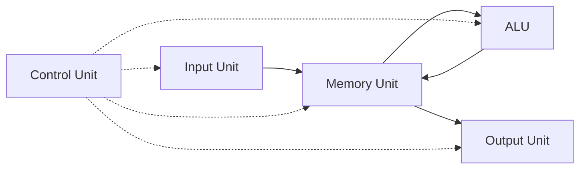

**For Exam**

A basic computer has five functional units. The input unit brings data and programs into the system. Memory stores instructions, data and results. ALU performs arithmetic and logical operations. The control unit coordinates all activities by issuing control signals. The output unit presents results to the user. The CPU comprises ALU, control unit and registers. Units are linked by buses for data, address and control exchange.

**Previously Asked Questions**

- **Q11** (1 mark, Apr 2025) — Memory units stores ……. and …….
  - *Answer:* **programs (code/instructions) and data** (also intermediate/final results of computations).

- **Q36** (15 marks, SLM Model Set 1) — Explain the functional units of a computer according to the Neumann model. Discuss how each unit contributes to the overall functioning of a computer.
  - *Answer:*  
    **Introduction.** According to John von Neumann’s stored-program model, a computer has five main **functional units** that work together through buses: **Input unit, Output unit, Memory unit, Arithmetic and Logic Unit (ALU), and Control unit**. The CPU comprises the control unit, ALU and registers. Programs and data are stored in the same memory and executed under sequential control.
    
    **1. Input unit:** Accepts data and programs from the outside world (keyboard, mouse, scanner, disk, etc.) and converts them into binary form suitable for the processor and memory. Without input, the system has nothing to process.
    
    **2. Memory unit:** Stores instructions to be executed, data to be processed, and intermediate/final results. It has **primary memory** (fast ROM/RAM — programs must reside here during execution) and **secondary memory** (bulk permanent storage such as disks). Memory feeds the CPU and receives results for later output or reuse.
    
    **3. Arithmetic and Logic Unit (ALU):** Performs all arithmetic operations (+, −, ×, ÷) and logical/comparison operations. It is the computational “work area” of the CPU; results may return to registers or memory.
    
    **4. Control unit:** Acts as the **nerve centre**. It fetches and interprets instructions, generates **control signals** and timing for data transfers among input, memory, ALU and output, and decides what happens at every step of the instruction cycle.
    
    **5. Output unit:** Presents processed results to the user via monitors, printers, plotters, speakers, etc., converting internal binary results into human-usable form.
    
    **How they work together:** Input brings programs/data into memory → Control unit sequences fetch–decode–execute → ALU processes operands → results are written back to memory and sent to output. Buses carry data, addresses and control signals among units. Thus each unit has a distinct role, but only their coordinated operation realises a complete computing system.
    
    *(Draw the von Neumann block diagram: Input ↔ Memory ↔ Output, with CPU = ALU + CU + registers.)*

**Diagram (refer SLM):** Fig. 1.1.2 Functional Units of a Computer.


#### 1.1.2.1 Input Unit

**Theory**

The input unit converts external input into binary form before it reaches the CPU/memory. It provides access to data and programs from sources such as keyboard, mouse, disks, scanners and cameras.

**Important Points**

- Keyboard: controller sends a code to CPU/memory for each key-press
- Mouse / trackball / touchpad: select menus, draw/paint; joystick for games
- Scanners and cameras: digitise images
- Encoded information from input is sent to the processor

**For Exam**

The input unit converts human/machine input into binary impulses and supplies data and programs to the computer. Common devices: keyboard, mouse, joystick, scanner, camera, trackball, touchpad. Input may also come from magnetic/optical disks.


#### 1.1.2.2 Memory Unit

**Theory**

The memory unit stores program instructions to be executed, data to be processed, and results of computations. It has two classes: **primary memory** and **secondary memory**.

**Important Points**

| Type | Nature | Role | Examples |
|------|--------|------|----------|
| **ROM** (primary) | Non-volatile | Firmware: BIOS, POST, I/O drivers | Read-only system programs |
| **RAM** (primary) | Volatile, expensive, fast | Run-time instructions and data | User/read-write memory |
| **Secondary** | Non-volatile, cheaper, slower | Bulk/auxiliary storage | Hard disk, optical disk, semiconductor storage |

- Access time of secondary memory > primary memory
- Programs must reside in main memory during execution for electronic-speed processing

**For Exam**

Memory stores code, data and results. Primary memory (ROM + RAM) is fast semiconductor storage; ROM is non-volatile firmware storage, RAM is volatile run-time memory. Secondary memory is cheaper, permanent and slower (disks, etc.) and supplements primary storage.

**Previously Asked Questions**

- **Q26** (4 marks, SLM Model Set 1) — Explain the difference between primary and secondary memory.
  - *Answer:*  

    | Point | Primary memory | Secondary memory |
    |-------|----------------|------------------|
    | Nature | Fast semiconductor storage directly accessible by the CPU | Bulk/auxiliary storage on disks, optical media, etc. |
    | Volatility | RAM is **volatile** (lost on power-off); ROM is non-volatile firmware | Generally **non-volatile** — data retained without power |
    | Speed / cost | Faster access; more expensive per bit | Slower access; cheaper for large capacity |
    | Role | Holds currently running programs, data and intermediate results | Permanent/long-term storage of programs and files |
    | Examples | ROM (BIOS/firmware), RAM | Hard disk, optical disk, semiconductor secondary storage |
    | During execution | Program **must reside** in primary (main) memory for electronic-speed processing | Used as backing store; contents may be loaded into primary when needed |

    **Summary:** Primary memory is the working memory of the CPU (fast but limited and often volatile); secondary memory is large, permanent and slower storage that supplements primary memory. Access time of secondary memory is greater than that of primary memory.


#### 1.1.2.3 Arithmetic and Logic Unit (ALU)

**Theory**

ALU is digital circuitry inside the CPU that performs **arithmetic** (add, subtract, multiply, divide) and **logical** operations (comparisons: equal, less than, greater than) using circuits such as adders and comparators. It is an indispensable building block of the CPU.

**Important Points**

- Arithmetic unit: +, −, ×, ÷
- Logic unit: comparisons and logical decisions
- Work area for mathematical/logical data manipulation

**For Exam**

ALU performs arithmetic and logical operations on data. It contains adder, comparator and related circuits and is a core part of the CPU.

**Previously Asked Questions**

- **Q16** (2 marks, SLM Model Set 1) — Explain the role of the Arithmetic and Logic Unit (ALU) in a computer.
  - *Answer:* The **ALU** is digital circuitry inside the CPU that performs all **arithmetic** operations (addition, subtraction, multiplication, division) and **logical** operations (comparisons such as equal, less than, greater than, and related logic). It uses circuits such as adders and comparators and acts as the computational work area of the processor. Under control-unit supervision, operands from registers/memory are processed in the ALU and results are written back to registers or memory.


#### 1.1.2.4 Control Unit

**Theory**

The control unit is the **nerve centre** of the computer. It coordinates activities of input, output, ALU and memory. It interprets instructions and issues **control signals** that govern data transfers and provide timing for operations.

**Important Points**

- Overall coordination of all units
- Issues control signals for data transfer and timing
- Decides the operation/action at every instance
- Together with ALU and registers forms the CPU

**For Exam**

The control unit is the nerve centre that interprets instructions and generates control signals to coordinate input, output, memory and ALU operations with correct timing.

**Previously Asked Questions**

- **Q1** (1 mark, SLM Model Set 1) — What is the primary function of the Control Unit in a computer?
  - *Answer:* To **coordinate / control** all units of the computer by interpreting instructions and issuing **control signals** (and timing) for data transfers and operations.

- **Q1** (1 mark, SLM Model Set 2) — What are the two types of control signals generated by the control unit?
  - *Answer:* **Timing signals** and **Command signals** (as stated in the SLM: Control Signals = Timing signal and Command signal).


#### 1.1.2.5 Output Unit

**Theory**

After processing, the computer returns results and messages through output units. The standard output device is the monitor (CRT, LCD/TFT, LED). Other devices include printers, projectors, plotters and speakers.

**Important Points**

- Monitor types: CRT, LCD/TFT, LED
- Other outputs: printer, projector, plotter, speaker

**For Exam**

The output unit presents computation results to the user via devices such as monitors, printers, plotters, projectors and speakers.


#### 1.1.3 Basic Operational Concepts

**Theory**

An instruction has two parts: **opcode** (operation to perform — e.g., ADD, load, store) and **operand(s)** (data, register or memory address). Example: `ADD A, 5` — ADD is opcode; A and 5 are operands.

Steps for `ADD (Address of D), R0`:

1. Fetch instruction from main memory into the processor  
2. Fetch operand at address D from memory  
3. Add memory operand to contents of R0  
4. Store sum in R0  

Overall computer operation: program resides in main memory → CPU fetches/decodes/executes instructions via ALU → results go to output → control unit monitors all activity.

**Important Points**

- Opcode = what to do; Operand = data/location
- Instruction cycle involves fetch, decode, execute (and often store)
- Program Counter tracks next instruction; Control Unit manages sequencing

**For Exam**

Instructions contain opcode and operands. The CPU fetches instructions from memory, decodes them, executes operations in the ALU, and stores results, all under control-unit supervision.

**Previously Asked Questions**

- **Q19** (2 marks, SLM Model Set 1) — Mention the various phases in executing an instruction.
  - *Answer:* The main phases of the instruction cycle are: **(1) Fetch** — bring the instruction from memory into the processor (IR); **(2) Decode** — interpret the opcode and addressing information; **(3) Fetch operands** (if needed) from registers/memory; **(4) Execute** — perform the operation in the ALU or transfer unit; **(5) Store / Write-back** — write the result to a register or memory; and often **(6) Interrupt check** — handle pending interrupts before the next fetch. (A short form accepted in exams is Fetch → Decode → Execute → Store.)


#### 1.1.4–1.1.5 Bus Structures and Bus Types

**Theory**

A **bus** is a group of wires / shared transmission medium connecting multiple devices for communication. Bus width (e.g., 16-bit) determines how many bits transfer at once and affects addressing capacity (e.g., 16-bit address bus → 2¹⁶ = 64K locations).

Instead of separate wires between every pair of units, a **common bus** is used. Buses are:

1. **Internal bus (system bus):** connects CPU with internal circuitry, memory and I/O units  
2. **External bus:** connects external peripherals (keyboard, mouse, scanner) to the CPU  

**System bus** has three groups:

| Bus | Direction | Function |
|-----|-----------|----------|
| **Data bus** | Bi-directional | Carry data between CPU, memory, ports (8/16/32+ lines) |
| **Address bus** | Unidirectional | Carry address of source/destination (16/20/24+ lines) |
| **Control bus** | Control signals | Read/write, interrupt, timing, coordination |

**Sending data:** obtain bus control → place address → place data → send control signals → wait for acknowledgement.  
**Requesting data:** obtain bus → place address → send read → wait → receive data from data bus.

**Single-bus structure:** one bus connects CPU, memory and I/O — usual organisation for connecting I/O devices (common pathway).

**Dedicated vs multiplexed:**

- **Dedicated:** lines permanently assigned to a function (separate address and data lines)
- **Multiplexed:** same lines used for different purposes at different times (e.g., multiplexed address/data with Address Valid control) — **time multiplexing**

```
        +--------+     System Bus      +--------+
        |  CPU   |=====================| Memory |
        +---+----+   Data | Addr | Ctrl +---+----+
            |                               |
            +-------------+-----------------+
                          |
                    +-----+------+
                    | I/O units  |
                    +------------+
```

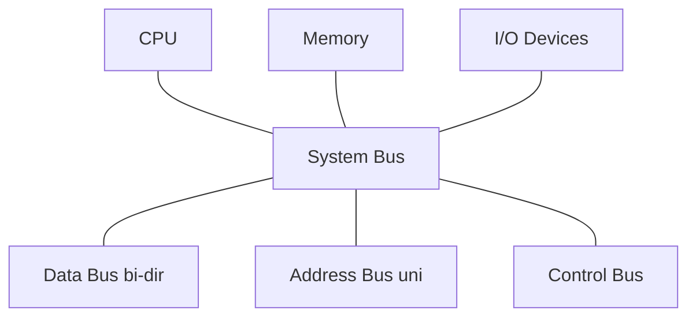

**For Exam**

A bus is a shared set of lines for communication among CPU, memory and peripherals. The system bus has a bi-directional data bus, unidirectional address bus and control bus. Internal buses connect CPU internals; external buses connect peripherals. Bus lines may be dedicated or multiplexed. A single (common) bus structure is commonly used to connect I/O devices.

**Previously Asked Questions**

- **Q19** (2 marks, Apr 2025) — Explain different bus types.
  - *Answer:* Buses interconnect units for exchange of data, address and control information. **Internal (system) bus** connects processor, memory and I/O. **External bus** connects peripherals such as keyboard and mouse to the CPU. The system bus has three types of lines: **data bus** (bi-directional data path), **address bus** (unidirectional addresses) and **control bus** (read/write and other control signals). Bus lines may also be **dedicated** (permanently assigned to one function) or **multiplexed** (shared over time for address and data).

- **Q4** (1 mark, Apr 2025) — What is the usual BUS structure used to connect the I/O devices?
  - *Answer:* **Single bus structure** (common / single bus connecting CPU, memory and I/O). *(SLM objective answer)*

**Diagram (refer SLM):** Fig. 1.1.3 System Bus.


### Unit 2: Timing and Control

#### 1.2.1 Building Blocks — Flip-flops, Registers, Decoder, Latches, Clock

**Theory**

Instruction execution is a sequence of cycles (fetch, decode, execute, store), each made of **micro-operations** (register transfers, ALU ops, bus transfers). The control unit’s two primary functions are **sequencing** (step through micro-operations in order) and **execution** (cause each micro-operation to run) using control signals.

**Flip-flops:** bistable devices storing one bit (0/1); edge-triggered; used in registers, counters, SRAM cells, state machines. Types: SR, D, JK, T.

**Registers:** small high-speed CPU storage for data, addresses, instructions and status. Faster than RAM because they sit inside the CPU.

| Register | Use |
|----------|-----|
| ACC | Intermediate arithmetic/logic results |
| PC | Address of next instruction |
| IR | Current instruction being decoded/executed |
| DR | Temporary data to/from memory or I/O |
| MAR | Address of memory location to access |
| MBR | Data/instruction buffer with memory |
| SP | Top of stack |
| Index / Status / Control | Indexed addressing; flags; CPU control |

**Decoder:** translates encoded inputs into control signals / one-of-n lines. Used for instruction decoding, address decoding and control-signal generation. Types: binary (e.g., 2-to-4), BCD, address decoder, instruction decoder.

**Latches:** level-sensitive bistable storage (SR, D, JK, T); building blocks of flip-flops and timing circuits.

**Clock:** circuit emitting precise pulses that synchronise digital devices. Clock cycle = interval between corresponding edges of consecutive pulses. Crystal oscillator sets frequency (e.g., 100 MHz–4 GHz). Secondary delayed clocks give finer timing edges within a cycle.

**Important Points**

- Control unit → sequencing + execution via control signals
- Flip-flop = 1-bit storage; Register = group of flip-flops
- Decoder converts opcode/address into select/control lines
- **Clock is used for synchronisation of digital devices**

**For Exam**

Timing and control rely on flip-flops, registers, decoders, latches and a master clock. The clock synchronises all registers. Decoders convert opcodes and sequence-counter outputs into timing/control signals. Registers hold addresses, data, instructions and status for fast CPU operation.

**Previously Asked Questions**

- **Q1** (1 mark, Apr 2025) — What is used for synchronization of digital devices?
  - *Answer:* **Clock** (clock pulses / master clock generator).

- **Q20** (2 marks, Apr 2025) — What is the use of decoder?
  - *Answer:* A decoder translates encoded binary inputs into a specific output line or set of control signals. In the CPU it **decodes the instruction opcode** into control signals that direct ALU, registers and buses. It is also used for **address decoding** to select the correct memory or I/O device, and for converting sequence-counter outputs into distinct **timing signals** (e.g., 4-to-16 decoder producing T0–T15).

- **Q21** (2 marks, Apr 2025) — What is a registers and mention the use of registers?
  - *Answer:* A **register** is a small, fast storage location inside the CPU made of flip-flops, holding binary data temporarily. Uses: hold intermediate results (accumulator), next instruction address (PC), current instruction (IR), memory address (MAR), data buffer (MBR/DR), stack top (SP), index values, and status/flags. Registers provide much faster access than main memory and are essential for instruction execution and data transfer.

- **Q4** (1 mark, SLM Model Set 1) — Name the register typically used to hold an address for the memory unit.
  - *Answer:* **MAR** (Memory Address Register).

- **Q2** (1 mark, SLM Model Set 2) — What does the Program Counter (PC) keep track of?
  - *Answer:* The **address of the next instruction** to be fetched from memory (normally incremented after each fetch for sequential execution).


#### 1.2.2 Timing and Control — Hardwired and Microprogrammed

**Theory**

A **master clock generator** synchronises timing for all registers. Clock pulses change a register’s state only when its control signal is enabled. Control organisations are of two types:

**1. Hardwired control**

Control logic is built from gates, flip-flops, decoders and other digital circuits — fast but hard to modify (rewiring needed). A basic hardwired CU includes:

- Instruction Register (IR) — segments: I bit (bit 15), 3-bit opcode (bits 14–12), address bits 0–11  
- **3×8 decoder** for opcode → D0–D7  
- Flip-flop for I bit  
- **4-bit sequence counter** + **4×16 decoder** → timing signals **T0–T15**  
- Control logic gates combining decoder, timing and IR bits  

**2. Microprogrammed control**

Control information is stored as microinstructions in **control memory (usually ROM)**. Changing design means updating the microprogram — easier to modify, can handle complex instructions, but slower and cheaper than hardwired.

| Hardwired | Microprogrammed |
|-----------|------------------|
| Logic circuits generate signals | Microinstructions generate signals |
| Faster | Slower |
| Hard to modify | Easy to modify |
| More expensive | More affordable |
| Complex instructions hard | Complex instructions easier |
| Limited instructions | Many instructions |

**For Exam**

The timing and control unit generates timing and control signals for instruction execution. Hardwired control uses digital circuits (IR, decoders, sequence counter, logic gates) and is fast but inflexible. Microprogrammed control stores control words in ROM and is slower but easier to change. Both drive micro-operations of registers, ALU and buses under a master clock.

**Diagram (refer SLM):** Fig. 1.2.1 Clock and timing; Fig. 1.2.2 Hardwired Control Unit; Fig. 1.2.3 Microprogrammed Control; Table 1.2.1 comparison.

**Previously Asked Questions**

- **Q16** (2 marks, SLM Model Set 2) — What is the purpose of the Control Memory Address Register (CMAR) in a micro-programmed control unit?
  - *Answer:* **CMAR (Control Memory Address Register)** holds the **address of the next microinstruction** in **control memory (ROM)**. The microinstruction at that address is fetched and its control bits generate the control signals for the current micro-operation; CMAR is then updated (next sequential address, branch, or map from the opcode) so the microprogram can continue.

- **Q26** (4 marks, SLM Model Set 2) — What are the key components of a hardwired control unit? Briefly describe their functions.
  - *Answer:* A **hardwired control unit** generates control signals using fixed digital logic circuits. Typical key components are:
    
    1. **Instruction Register (IR)** — holds the current instruction (I-bit, opcode, address fields) for the control logic.  
    2. **Opcode decoder** (e.g. **3×8 decoder**) — decodes the opcode into distinct operation select lines (D0–D7).  
    3. **I-bit flip-flop** — stores the indirect-addressing bit from the instruction.  
    4. **Sequence counter (SC)** (e.g. 4-bit) — advances through timing states under the master clock.  
    5. **Timing decoder** (e.g. **4×16 decoder**) — produces timing signals **T0–T15**.  
    6. **Control logic gates** — combine decoder outputs, timing signals and IR bits to form the final control signals for registers, ALU, bus and memory.  
    7. **Master clock** — synchronises the sequence counter and register updates.
    
    Hardwired control is **fast** but **inflexible** — changing the design usually requires rewiring the logic.


#### 1.2.3 Timing Signals and Sequence Counter

**Theory**

A sequence counter (SC) is incremented by the clock to produce successive timing states. Its outputs are decoded into timing signals T0, T1, T2, … used by control logic. Example: generate T0–T4; at T4 clear SC so the next cycle starts at T0 (`D3T4: SC ← 0`). SC is positive-edge triggered. If not cleared early, a 4-bit SC continues through T5…T15 then back to T0.

A **4-bit sequence counter** counts from **0 through 15** (i.e., 0 to 2⁴−1), and with a 4-to-16 decoder can generate **16 timing signals** (T0–T15). *(SLM objective answer: 16.)*

**Important Points**

- Timing signals sequence micro-operations within the instruction cycle
- CLR resets SC when the last needed timing state is reached
- Decoder converts SC binary count → one-hot timing lines
- Clock alone is not enough — **control signals** must also enable register changes

**For Exam**

Timing signals are produced by a sequence counter whose outputs are decoded. They enable successive micro-operations. A 4-bit sequence counter counts 0–15 and can generate 16 timing signals T0–T15.

**Previously Asked Questions**

- **Q2** (1 mark, Apr 2025) — How many timing signals could be generated by a 4 bit sequence counter?
  - *Answer:* **16** (counts from 0 to 2⁴−1 = 15, producing timing signals T0 through T15).

**Diagram (refer SLM):** Fig. 1.2.4 Example of Control Timing Signal (Mano).


### Unit 3: Addressing Modes

#### 1.3.1 Addressing Modes — Need and Types

**Theory**

An instruction set is the collection of machine instructions a CPU supports. Each instruction has an **opcode** (operation) and **operand(s)** (data). Operands may be immediate values, CPU registers, or memory locations. **Addressing modes** are the different formats/methods for specifying where operands are found. Different computers support different modes; choice depends on architecture.

**Need for addressing modes (advantages):**

- Provide pointers to memory addresses  
- Support counters for loop control  
- Enable indexing of data (arrays)  
- Support program relocation  
- Reduce number of bits in the address field of instructions  
- Let programmers write more efficient, flexible assembly programs (fewer instructions / less execution time)

```
 Instruction:  [ OPCODE ][ OPERAND / ADDRESS FIELD ]
                      |
        +-------------+--------------+
        |  How is operand located?   |
        |  → Addressing Mode         |
        +----------------------------+
```

**For Exam**

Addressing modes specify how the CPU finds the operand(s) for an instruction — in the instruction itself, in a register, or in memory (directly, indirectly, or via indexing). They are needed for flexible, compact and efficient programming (pointers, loops, arrays, relocation, shorter address fields).

**Previously Asked Questions**

- **Q26** (4 marks, Apr 2025) — What is the need for addressing mode in computer architecture?
  - *Answer:* Addressing modes are methods of specifying the location of operands for CPU instructions. Their need/advantages are:
    
    1. **Pointers:** allow instructions to refer to memory through address pointers rather than only fixed locations.  
    2. **Loop control:** support counters so loops can step through data efficiently.  
    3. **Indexing:** enable access to array/table elements using base + index.  
    4. **Program relocation:** help programs run from different memory starting addresses.  
    5. **Shorter instructions:** reduce bits needed in the address field by using registers or relative forms.  
    6. **Efficiency and flexibility:** let assembly programmers write programs with fewer instructions and better execution time.
    
    Without multiple addressing modes, every operand reference would be rigid and inefficient, making compilers and system software harder to implement.

- **Q27** (4 marks, SLM Model Set 1) — Define addressing modes and explain why they are important in computer architecture.
  - *Answer:* **Addressing modes** are the different formats/methods by which an instruction specifies **where its operand(s) are located** — in the instruction itself, in a CPU register, or in memory (directly, indirectly, indexed, etc.).
    
    **Importance / why needed:**  
    1. Provide **pointers** to memory addresses.  
    2. Support **counters** for loop control.  
    3. Enable **indexing** of arrays and tables.  
    4. Support **program relocation**.  
    5. **Reduce** the number of bits required in the address field.  
    6. Allow more **efficient and flexible** assembly programs (fewer instructions / less execution time).
    
    Without addressing modes, operand access would be inflexible and instruction encoding would be inefficient, making architecture and programming much harder.


#### Implied (Implicit) Mode

**Theory**

Operands are specified **implicitly** by the instruction definition — often the accumulator. Zero-address (stack) instructions also belong here. Instruction may contain only opcode and no operand field.

**Examples:** `CLC` (clear carry), `INCA` / `DECA`, `NOP`, `RRC`, `RLC`.

**Diagram (refer SLM):** Fig. 1.3.1 Implied Addressing Mode.


#### Immediate Mode

**Theory**

The operand field contains the **actual data** to use. Convenient for initialising registers. Not a true memory-addressing mode.

**Examples:** `ADD 6`; `ADD 07`; `MOV AX, 40H`; `MVI B, 47`; `MOV AL, 30H`; `JMP 30021`.

**Diagram (refer SLM):** Fig. 1.3.2 Immediate Mode.

**Previously Asked Questions**

- **Q2** (1 mark, SLM Model Set 1) — Which addressing mode directly includes the operand as part of the instruction?
  - *Answer:* **Immediate addressing mode**.


#### Direct Addressing Mode

**Theory**

The address field contains the **address of the operand** in memory. Effective address = address part of instruction. In branch instructions, address field is the branch target.

**Examples:** `ADD AL,[0301]`; `LDA 2050`; `LHLD 3010`; `IN 45`.

**Diagram (refer SLM):** Fig. 1.3.3 Direct Addressing Mode.


#### Register Mode

**Theory**

Operand is in a **CPU general-purpose register** named in the instruction. Fast — no memory access for the operand.

**Examples:** `MOV DX, TAX RATE`; `MOV COUNT, CX`; `MOV EAX, EBX`; `ADD R1, R2`.

**Diagram (refer SLM):** Fig. 1.3.4 Register Addressing Mode.


#### Register Indirect Mode

**Theory**

Instruction refers to a **register that holds the effective address** of the operand in memory. Needs one memory reference to fetch the operand. Uses fewer bits than stating a full memory address. Offset often in BX, SP, SI, DI (x86-style examples in SLM).

**Examples:** `MOV A, M`; `LDAX B`; `ADD R` → Accumulator ← Accumulator + M[R].

**Diagram (refer SLM):** Fig. 1.3.5 Register Indirect Addressing Mode.


#### Auto-increment / Auto-decrement Mode

**Theory**

Like register indirect, but the address register is **automatically incremented or decremented** before or after memory access — useful for walking through tables/arrays.

**Example:** `Add R1, (R2)` → R1 ← R1 + M[R2]; then R2 ← R2 + d.  
Effective address = content of register (with auto update).


#### Indirect Addressing Mode

**Theory**

The address field gives the **address of a memory location that holds the effective address** of the operand (pointer to pointer). Requires extra memory access.

**Examples:** `ADD @200H` → AC ← AC + [[200H]]; `LOAD R1, @1005`.

**Diagram (refer SLM):** Fig. 1.3.6 Indirect Addressing Mode.


#### Indexed Addressing Mode

**Theory**

Effective address = **base/displacement + content of index register** (SI/DI etc.). Symbolic form: `X(R)` with EA = X + (R). Base stays fixed; index changes to scan an array.

**Examples:** `Load R4, 4(R2)`; `MOV AX, [SI+05]`; `ADD AX, [BX+SI]`.  
If base = 2800H and index = 01H → EA = 2801H.

**Diagram (refer SLM):** Fig. 1.3.7 Indexed Addressing Mode.


```
Mode summary (exam cheat):

Implied     : operand fixed by opcode (ACC/stack)
Immediate   : data in instruction
Direct      : EA = address in instruction
Register    : operand in named register
Reg Indirect: EA = content of register
Auto ±      : reg-indirect + auto update
Indirect    : EA = M[address in instruction]
Indexed     : EA = base + index register
```

**Previously Asked Questions**

- **Q36** (15 marks, Apr 2025) — Explain different addressing modes with examples.
  - *Answer:* Addressing modes are ways of specifying operand locations for CPU instructions. Common modes in the SLM are:
    
    **1. Implied (Implicit) mode:** Operand is understood from the instruction itself (often accumulator); may have only opcode. Examples: `CLC`, `INCA`, `NOP`, `RRC`. Zero-address stack instructions also use implied mode.
    
    **2. Immediate mode:** Actual operand is part of the instruction. Example: `MOV AX, 40H` — constant 40H loaded into AX; `ADD 07` adds 7 to accumulator. Useful for initialising registers.
    
    **3. Direct addressing mode:** Instruction address field contains the memory address of the operand. EA = address field. Example: `LDA 2050` loads contents of location 2050 into accumulator; `ADD AL,[0301]`.
    
    **4. Register mode:** Operand is in a CPU register named in the instruction. Example: `MOV EAX, EBX`; `ADD R1, R2`. Very fast because no memory fetch is needed for the operand.
    
    **5. Register indirect mode:** A register holds the effective address of the operand in memory. Example: `MOV A, M` (memory pointed by HL); `ADD R` means AC ← AC + M[R]. Saves address bits in the instruction.
    
    **6. Auto-increment / Auto-decrement mode:** Like register indirect, but the address register is automatically updated after/before access — suited to sequential table access. Example: add via `(R2)` then R2 ← R2 + d.
    
    **7. Indirect addressing mode:** Instruction gives the address of a location that stores the effective address. Example: `ADD @200H` → AC ← AC + [[200H]]; requires an extra memory access.
    
    **8. Indexed addressing mode:** EA = base address + index register content. Example: `MOV AX, [SI+05]`; `Load R4, 4(R2)`. Useful for arrays: base fixed, index varies.
    
    **Need:** addressing modes support pointers, loops, indexing, relocation, shorter address fields and efficient programming. Different architectures implement subsets of these modes.

- **Q35** (4 marks, SLM Model Set 1) — Explain the difference between Direct and Indirect Addressing Modes.
  - *Answer:*  

    | Point | Direct Addressing | Indirect Addressing |
    |-------|-------------------|---------------------|
    | Meaning | Address field of the instruction contains the **address of the operand** in memory | Address field gives the **address of a memory location that holds the effective address** of the operand (pointer to pointer) |
    | Effective address (EA) | EA = address part of the instruction | EA = content of the memory location whose address is in the instruction, i.e. EA = M[address field] |
    | Memory references for operand | Typically **one** memory access to fetch the operand | Needs an **extra** memory access to get EA, then another to get the operand |
    | Speed | Faster | Slower (extra memory access) |
    | Example | `LDA 2050` — load contents of location 2050 into accumulator; `ADD AL,[0301]` | `ADD @200H` → AC ← AC + [[200H]]; `LOAD R1, @1005` |

    **Summary:** In direct mode the instruction points straight to the operand; in indirect mode the instruction points to a location that stores the operand’s address, giving more flexibility (e.g. dynamic pointers) at the cost of an extra memory reference.

- **Q35** (4 marks, SLM Model Set 2) — What is the significance of Indexed Addressing Mode, and how does it function?
  - *Answer:* In **indexed addressing**, the effective address is formed as **EA = base/displacement + contents of an index register** (form `X(R)`).
    
    **Function:** The instruction provides a fixed base (or displacement) and names an index register. The CPU adds the index-register value to the base to get the memory address of the operand. The base often stays fixed while the index changes in a loop to visit successive elements of an array or table.
    
    **Significance:** Ideal for **arrays, tables and repetitive data access** without rewriting the address field for every element. Examples: `Load R4, 4(R2)`; `MOV AX, [SI+05]`. If base = 2800H and index = 01H, then EA = 2801H.


### Unit 4: Program Control

#### 1.4.1 Program Control Instructions — Overview

**Theory**

Programs are stored in consecutive memory locations. The **Program Counter (PC)** holds the address of the next instruction and normally increments after each fetch for sequential execution. Instructions are of three broad kinds: **data transfer**, **data manipulation**, and **program control**.

**Program control instructions** change the PC (and thus flow of execution) — branching, skipping, calling subroutines, halting, or handling interrupts. They are needed whenever execution must leave sequential order (conditions, loops, calls, interrupts).

**Program Status Word (PSW)** holds condition flags (zero, carry, parity, etc.) used by conditional branches.

**Types of program control instructions (SLM):**

1. Conditional branch / skip  
2. Unconditional branch / skip / jump  
3. Subroutines (CALL / RET)  
4. Halting (NOP, HALT)  
5. Interrupt instructions (RESET, TRAP, INTR)

**Important Points**

- After data transfer/manipulation, control returns to fetch via PC  
- Branch/Jump/Skip may be conditional or unconditional  
- Skip has no address field — simply skips the next instruction  
- Compare (`CMP`) sets flags without storing arithmetic result; often followed by conditional branch

**For Exam**

Program control instructions alter the normal sequential flow by changing the PC. Types include unconditional and conditional branch/skip/jump, subroutine call/return, halt/NOP, and interrupt-related instructions. Conditional forms use PSW flags.

**Previously Asked Questions**

- **Q22** (2 marks, Apr 2025) — Mention the types of program control instructions.
  - *Answer:* The main types are: (1) **Unconditional** branch/jump/skip instructions (e.g., JMP, BR, SKP); (2) **Conditional** branch/skip instructions (e.g., JE, BNZ, SZA); (3) **Subroutine** instructions (CALL, RET); (4) **Halting** instructions (NOP, HALT); (5) **Interrupt** instructions (RESET, TRAP, INTR).

**Diagram (refer SLM):** Fig. 1.4.1 Program Status Word; Table 1.4.1–1.4.2 program control / conditional branch examples.


#### 1.4.2 Unconditional Branch Instruction

**Theory**

An unconditional branch always transfers control to a new address (or skips the next instruction) without testing flags. Branch/Jump are typically one-address instructions: `BR ADR` / `JUMP ADR` loads ADR into the PC.

**Examples:** `JUMP L2`; `BR ADR`; `SKP` (skip next instruction unconditionally). After `SKP`, the following instruction is not executed.

**Previously Asked Questions**

- **Q16** (2 marks, Apr 2025) — Explain unconditional branch instructions.
  - *Answer:* Unconditional branch instructions change the flow of program execution **without testing any condition**. They load a new address into the program counter (or skip the next instruction), so the next fetch is from the target location. Examples: `JMP` / `JUMP L2`, `BR ADR`, and unconditional `SKP`. Unlike conditional branches, they always divert control when executed.


#### 1.4.3–1.4.4 Compare and Conditional Branch

**Theory**

`CMP R1, R2` subtracts for comparison but does not store the result; it updates PSW flags. A following conditional branch tests those flags. If the condition is true: PC ← Effective Address; else PC ← PC + 1 (sequential continue).

Examples: `JE address1`; `BC address1` (branch if carry); skip forms `SKI`, `SKO`, `SPA`, `SNA`, `SZA`, `SZE`.

**Previously Asked Questions**

- **Q25** (2 marks, SLM Model Set 1) — Explain the role of conditional branch instructions in program control.
  - *Answer:* **Conditional branch** instructions change the program counter **only if a specified condition is true** (usually based on PSW flags set by a previous compare or arithmetic operation). If the condition holds, PC ← effective/branch address and execution jumps; otherwise PC continues sequentially (PC ← PC + 1). They enable decision-making in programs — if/else paths, loops, and skips — without which only straight-line sequential execution would be possible. Examples: `JE`, `BNZ`, `BC`, `SZA`.


#### 1.4.5 Subroutines

**Theory**

A **subroutine** is a program fragment that performs a well-defined task. It is invoked by a calling program (`CALL`) which transfers control to the subroutine; at the end, `RETURN`/`RET` restores control to the instruction after the call.

**Previously Asked Questions**

- **Q12** (1 mark, Apr 2025) — What is a subroutine?
  - *Answer:* A **subroutine** is a self-contained program fragment that performs a well-defined task; it is called by another program and returns control to the caller when finished (typically via CALL and RET).


#### 1.4.6–1.4.7 Halting and Interrupt Instructions

**Theory**

**NOP:** no operation — advances PC only; used for timing/wait. Implied mode.  
**HALT:** stops the processor into idle until interrupt/reset/external action; often used to end a program. Implied mode.

**Interrupt instructions:** mechanism for I/O or an instruction to suspend normal execution for service.

| Instruction | Nature |
|-------------|--------|
| RESET | Initialise processor / PC to start |
| TRAP | Non-maskable, highest priority, vectored |
| INTR | Level-triggered, maskable, lowest priority |

**Previously Asked Questions**

- **Q3** (1 mark, SLM Model Set 1) — What happens when a HALT instruction is executed?
  - *Answer:* The processor **stops** (enters an idle/halted state) until an interrupt, reset, or other external action resumes operation. (Often used to end a program.)

- **Q17** (2 marks, SLM Model Set 1) — Describe the purpose of the NOP instruction.
  - *Answer:* **NOP** (No Operation) performs **no data operation**; it only advances the program counter to the next instruction. It is used for **timing delays**, padding, alignment, or temporary placeholders during debugging/development. It is typically an implied-mode instruction.

- **Q25** (2 marks, SLM Model Set 2) — Describe the purpose of the NOP instruction.
  - *Answer:* **NOP (No Operation)** does not change data or flags meaningfully; it only **advances the PC** to the next instruction. Purpose: introduce **delays/timing**, pad code for alignment, or act as a temporary placeholder. It is an implied-mode program-control instruction.


## Block 2: I/O and DMA

### Unit 1: Register Transfer Languages (RTL)

#### 2.1.1–2.1.2 Introduction and Key Concepts

**Theory**

A digital system is built from modules (registers, decoders, ALU elements, control logic) interconnected by data and control paths. Operations on register data are **microoperations**. **Register Transfer Language (RTL)** is a symbolic low-level notation describing transfers and operations among registers — concise specification of internal organisation and a tool for hardware design.

Internal organisation is defined by: (1) set of registers and their functions, (2) sequence of microoperations, (3) control that initiates them.

**Key concepts:**

| Concept | Meaning | Example |
|---------|---------|---------|
| Register | Fast flip-flop storage in CPU | R1, MAR, PC, IR |
| Transfer | Copy data between registers | R1 ← R2 |
| Operation | Arithmetic/logic on registers | R3 ← R1 + R2 |
| Control signal | Enables transfer when active | if (Enable) then R1 ← R2 |
| Conditional transfer | Transfer only if condition true | if (C=1) then R1 ← R2 |
| Sequential / Parallel | One after another / same clock | R1←R2; R3←R1  vs  R2←R1, R1←R2 |

**Register types:** Accumulator; general-purpose; special-purpose — **MAR** (memory address), **MBR** (memory buffer), **PC** (next instruction address), **IR** (current instruction).

**Important Points**

- Replacement operator ← means destination gets source; source unchanged  
- Control function written as `P: R2 ← R1` (transfer only if P = 1)  
- Clock edge assumed — clock not written in RTL statements  
- Comma separates simultaneous microoperations  

**Basic RTL symbols (exam table):**

| Symbol | Meaning | Example |
|--------|---------|---------|
| Letters/numbers | Register names | R1, MAR, PC |
| ← | Transfer | R2 ← R1 |
| ( ) | Part of register | PC(0-7), R2(L) |
| , | Simultaneous ops | R2 ← R1, R1 ← R2 |
| +, −, etc. | Arithmetic | R3 ← R1 + R2 |
| AND/OR/NOT/XOR | Logic | R3 ← R1 ∨ R2 |
| <<, >> | Shift | R1 ← R1 << 1 |
| if () | Condition | if (C=1) then R1 ← R2 |
| BUS, M[addr] | Bus / memory | R1 ← M[100] |

**For Exam**

RTL (Register Transfer Language) is symbolic notation for microoperations that move and process data among registers. Example: `R3 ← R1 + R2` adds R1 and R2 into R3. Controlled transfer: `P: R2 ← R1`. RTL is used in hardware design, logic synthesis and microarchitecture specification.

**Previously Asked Questions**

- **Q3** (1 mark, Apr 2025) — What does RTL stand for?
  - *Answer:* **Register Transfer Language** (also described as Register Transfer Language / register transfer notation for microoperations).

- **Q3** (1 mark, SLM Model Set 2) — What does the term "RTL" stand for in digital circuits?
  - *Answer:* **Register Transfer Language**.

- **Q27** (4 marks, SLM Model Set 2) — Describe how RTL can be used to represent the transfer of data between two registers with an example.
  - *Answer:* RTL represents a register-to-register transfer with the **replacement operator ←**:
    
    **Destination ← Source**
    
    meaning the contents of the source are copied into the destination (source unchanged).
    
    **Example:** `R2 ← R1` transfers the value in R1 into R2.
    
    A **conditional transfer** is written `P: R2 ← R1` (transfer only when control condition **P = 1**). Simultaneous micro-operations in one clock are separated by commas, e.g. `R2 ← R1, R3 ← R4`. RTL is used to specify micro-operations that define the CPU’s data path and control.


**Diagram (refer SLM):** Fig. 2.1.1 Block diagram of registers; Fig. 2.1.2 Transfer R1→R2 when P=1; Table 2.1.1 symbols.


#### 2.1.4 Bus and Memory Transfers; Micro-operations

**Theory**

A **common bus** (via multiplexers or tri-state buffers) selects which register drives the shared lines. For k registers of n bits: need **n** multiplexers of size **k×1**. Selection lines S1 S0 choose register A/B/C/D. Notation: `BUS ← C, R1 ← BUS` or simply `R1 ← C` if bus is implied.

**Micro-operation execution cycle stages:** Fetch → Decode → Fetch operands → Execute → Memory access → Write-back → Interrupt handling (if needed).

**Types of micro-operations:** Data transfer; Arithmetic; Logical; Shift.

**Fetch example in RTL:**

```
MAR ← PC
MBR ← Memory[MAR]
IR ← MBR
PC ← PC + 1
```

**For Exam**

Common-bus RTL describes how registers share pathways under select controls. Micro-operations are elementary CPU steps (transfer, arithmetic, logic, shift) composing the instruction cycle.

**Previously Asked Questions**

- **Q18** (2 marks, SLM Model Set 1) — Describe what happens during the "Fetch Cycle" of micro-operations.
  - *Answer:* During the **fetch cycle**, the CPU brings the next instruction from memory into the processor. Typical micro-operations are: **MAR ← PC** (place next instruction address on the address path); **MBR ← Memory[MAR]** (read the instruction word); **IR ← MBR** (load instruction into the Instruction Register); **PC ← PC + 1** (point to the following instruction). After fetch, the instruction is decoded and executed.

- **Q37** (15 marks, SLM Model Set 1) — Describe the architecture of a common bus system using multiplexers, explaining how data is transferred between multiple registers and how control signals determine the selected register.
  - *Answer:*  
    **Need for a common bus.** Connecting every register to every other register with dedicated wires is costly and complex. A **common bus** is a shared set of lines that any selected register can drive (or receive from), under control signals, so many registers communicate through one pathway.
    
    **Architecture using multiplexers.** Consider *k* registers each of *n* bits (e.g. four registers A, B, C, D). To build an *n*-bit common bus:  
    - Use **n multiplexers**, each of size **k×1** (one MUX per bit position).  
    - Bit *i* of every register feeds input *i* of the corresponding MUX.  
    - Common **selection lines** (e.g. S1 S0) choose which register’s bits appear on the bus outputs.  
    - For 4 registers, S1S0 = 00, 01, 10, 11 select A, B, C or D respectively.  
    - Bus outputs feed the data inputs of registers (often via load-enable gates). Alternatively, **tri-state buffers** can implement the same shared-bus idea.
    
    **Data transfer between registers.** To transfer C → R1:  
    1. Set select lines so the multiplexers place register **C** on the bus (`BUS ← C`).  
    2. Assert the **load** control of destination **R1** so on the clock edge `R1 ← BUS`.  
    In RTL this is written `BUS ← C, R1 ← BUS`, or simply `R1 ← C` when the bus is implied. Only one source should drive the bus at a time; the destination(s) that have load enabled receive the bus contents.
    
    **Memory transfers.** For memory, MAR holds the address; MBR buffers data. Read: place address in MAR, issue read, MBR ← Memory[MAR]. Write: place address in MAR and data in MBR, issue write.
    
    **Advantages:** fewer interconnection lines; flexible register-to-register and register-memory transfers; clear control via select and load signals. **Trade-off:** only one transfer source on the bus at a time (unless multiple buses are provided).
    
    *(Draw: registers → k×1 MUXes → common bus → register load inputs; show S1 S0.)*

- **Q17** (2 marks, SLM Model Set 2) — What is the role of a multiplexer in a common bus system?
  - *Answer:* A **multiplexer** selects which register drives the **common bus** at a given time. For *k* registers of *n* bits, **n** multiplexers of size **k×1** are used; selection lines (e.g. S1 S0) choose the source register whose bits appear on the bus, enabling transfers such as `BUS ← C` then `R1 ← BUS` without dedicated wires between every pair of registers.

**Diagram (refer SLM):** Fig. 2.1.1 Block diagram of registers; related common-bus multiplexer figures in SLM.


### Unit 2: Input-Output Organization

#### 2.2.1–2.2.2 Peripheral Devices and ASCII

**Theory**

The I/O subsystem communicates between the central system and the outside world. CPU is very fast; slow keyboard input would idle the processor — hence bulk data is prepared on disks/tapes and transferred at high rate. Devices under direct computer control are **on-line**; attached I/O devices are **peripherals** (keyboard, display, printer, disk, tape).

**ASCII (American Standard Code for Information Interchange):** 7-bit code for 128 characters (94 printable + 34 control). Example: letter A = 1000001.

**Previously Asked Questions**

- **Q14** (1 mark, Apr 2025) — Expansion of ASCII is ……….
  - *Answer:* **American Standard Code for Information Interchange**.

- **Q4** (1 mark, SLM Model Set 2) — How many bits are used in ASCII code?
  - *Answer:* **7 bits** in standard ASCII (128 characters). An **8th bit** may be used as **parity**, or in **8-bit extended ASCII**.


#### 2.2.3 I/O Interface — Functions, Types, Components

**Theory**

Peripherals differ from the CPU in technology (electro-mechanical vs electronic), speed, data format and operating modes. **Interface units** resolve these differences between the processor bus and each peripheral.

**Functions of I/O interface:**

1. **Data transfer** between CPU and I/O devices  
2. **Control signal management** to coordinate I/O  
3. **Data conversion** (format/signal compatibility)  
4. **Synchronisation** to prevent loss/corruption due to speed mismatch  

**Types (overview):** Memory-mapped I/O; Isolated (port-mapped) I/O; Programmed I/O (polling); Interrupt-driven I/O; DMA; Synchronous / Asynchronous I/O; Serial / Parallel I/O.

**Polling (Programmed I/O):** CPU repeatedly checks device status flags until ready, then transfers data. Simple but wastes CPU time.

**Components:** data/address/control buses, I/O ports, controllers, buffers/latches, interrupt lines, clock/timing, control logic, power management.

**For Exam**

An I/O interface links CPU and peripherals, handling data transfer, control, format conversion and synchronisation. Interfaces may be memory-mapped or isolated; transfer may use polling, interrupts or DMA.

**Previously Asked Questions**

- **Q33** (4 marks, Apr 2025) — Mention the functions of IO interface.
  - *Answer:* The I/O interface mediates between the CPU and peripheral devices so they can communicate despite differences in speed, format and operation. Its main functions are:
    
    1. **Data Transfer:** Moves data between the CPU (or memory path) and I/O devices through interface registers/ports.  
    2. **Control Signal Management:** Interprets and manages control signals that start, stop and coordinate peripheral operations (control, status, data-in, data-out commands).  
    3. **Data Conversion:** Converts signal levels and data formats between electronic CPU/memory and electro-mechanical peripherals.  
    4. **Synchronisation:** Matches timing between fast CPU and slower devices so data is not lost or corrupted (status checking, handshaking, buffering).
    
    Without an interface, each peripheral’s different behaviour would make direct CPU connection impractical.

- **Q23** (2 marks, Apr 2025) — What is polling?
  - *Answer:* **Polling** is a programmed I/O method in which the processor **continuously (or repeatedly) checks the status flags** of an I/O device to see whether it is ready for data transfer. When the device is ready, the CPU performs the transfer under program control. It is simple to implement but inefficient because the CPU wastes time waiting/checking instead of doing useful work.

- **Q28** (4 marks, SLM Model Set 1) — Explain the difference between synchronous and asynchronous I/O.
  - *Answer:*  

    | Point | Synchronous I/O | Asynchronous I/O |
    |-------|-----------------|------------------|
    | Timing | Transfer is coordinated by a **common clock** / fixed timing between CPU (or controller) and device | Transfer uses **handshaking** / status signals; no shared continuous clock requirement for each data word |
    | Coordination | Both sides operate in lock-step with clocked intervals | Device indicates ready/busy; CPU or interface responds when ready |
    | Speed match | Suited when device and interface speeds are matched to the clock | Better when devices are slower or have variable response times |
    | CPU involvement (typical use) | May still use programmed timing windows | Often combined with status checking, interrupts, or DMA so the CPU need not wait idle for every slow device cycle |
    | Risk | Timing errors if clocking is wrong | Needs correct handshake protocol to avoid lost/duplicated data |

    **Summary:** Synchronous I/O relies on shared clocked timing for transfers; asynchronous I/O relies on handshake/status signalling so units with different speeds can communicate safely. Interfaces provide synchronisation as one of their main functions.

- **Q5** (1 mark, SLM Model Set 2) — Name two types of I/O interfaces.
  - *Answer:* **Memory-mapped I/O** and **Isolated (port-mapped) I/O**. (Other valid pairs: serial/parallel; programmed/interrupt-driven; synchronous/asynchronous.)

- **Q37** (15 marks, SLM Model Set 2) — Analyze the role of the I/O interface in managing data transfer, control signals, data conversion, and synchronization between the CPU and peripherals, using examples from different types of I/O systems.
  - *Answer:*  
    **Introduction.** Peripheral devices differ from the CPU in technology (electro-mechanical vs electronic), speed, data format and operating modes. An **I/O interface** sits between the processor bus and each peripheral and makes communication possible despite these differences.
    
    **1. Data transfer.** The interface moves data between the CPU/memory path and the device through interface registers/ports (data-in / data-out).  
    *Example:* Keyboard scan codes are placed in an input data register; the CPU reads that port. A printer receives characters written by the CPU into an output data register.
    
    **2. Control signal management.** The interface interprets commands (control, status, data input, data output) and generates device-specific control signals to start, stop and coordinate operations.  
    *Example:* A disk interface may issue seek/start-read commands; a display controller is told to refresh or clear.
    
    **3. Data conversion.** Converts signal levels and formats between CPU/memory electronics and the peripheral.  
    *Example:* Parallel CPU data ↔ serial line for a UART; digital levels ↔ motor drive signals for a printer.
    
    **4. Synchronisation.** Matches timing between the fast CPU and slower devices using status flags, handshaking and buffering so data is not lost or corrupted.  
    *Example:* CPU checks a “ready” status bit (polling) or waits for an interrupt before reading the next keyboard character; buffers hold a block until the device catches up.
    
    **Conclusion.** Without an I/O interface, each peripheral’s different behaviour would make direct CPU connection impractical. Interfaces enable reliable **data transfer, control, conversion and synchronisation** between system and peripherals.


#### 2.2.4–2.2.5 I/O Bus, Commands, Isolated vs Memory-Mapped I/O

**Theory**

I/O bus has **data, address and control lines**. Each peripheral has an interface that decodes address/control, synchronises data and talks to the device controller. Processor places device address on address lines; matching interface responds to the **I/O command**.

**Four command types:** Control | Status | Data output | Data input.

**Three bus organisations for memory & I/O:**

1. Separate buses for memory and I/O (e.g., with I/O processor / data channel)  
2. One common bus, separate control lines  
3. One common bus, common control lines  

**Isolated I/O:** distinct I/O address space; special IN/OUT instructions; separate I/O read/write lines.  
**Memory-mapped I/O:** interface registers in memory address space; ordinary load/store used for I/O; no separate I/O instructions; reduces available memory addresses.

**Usual structure to connect I/O devices:** **single bus structure**.

**Diagram (refer SLM):** Fig. 2.2.1 I/O bus to devices; Fig. 2.2.2–2.2.3 I/O Interface Unit.

**Previously Asked Questions**

- **Q18** (2 marks, SLM Model Set 2) — What is the purpose of a status command in an I/O interface?
  - *Answer:* A **status command** asks the I/O interface to report the **current state of the device** (e.g. ready/busy, error, buffer full/empty). The CPU (or controller) uses this information to decide whether it is safe to transfer data, avoiding lost or overwritten data. Status checking is central to programmed I/O / polling.


### Unit 3: Priority Interrupts

#### 2.3.1–2.3.2 Priority Interrupt Concept and Types of Interrupts

**Theory**

Rare, unpredictable events (keystroke, disk ready, network packet) need fast response. Polling every program is expensive; **interrupts** transfer control to a service routine on demand, then return.

With many devices, several may request service at once. A **priority interrupt** system decides **which request is serviced first** and which interrupts may interrupt an already running service. Fast devices (e.g., magnetic disk) get **high priority**; slow devices (keyboard) get **low priority**.

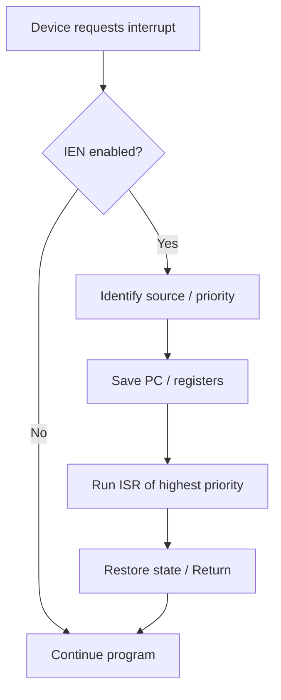

**Establishing priority:** software (**polling**) or hardware (**daisy-chain** / **parallel priority**).

**Types of interrupts (hardware / software):**

| Class | Subtype | Meaning |
|-------|---------|---------|
| Hardware | Maskable | Can be delayed for higher-priority interrupt |
| Hardware | Non-maskable | Must be handled immediately |
| Software | Normal | Caused by software instructions |
| Software | Exception | Unplanned (e.g., divide by zero) |

**For Exam**

A priority interrupt system ranks interrupt sources so the most urgent device is served first when requests arrive together. Priority may be set by software polling or by hardware (daisy chain or parallel encoder). Interrupts may be hardware or software, maskable or non-maskable; exceptions are unplanned software interrupts.

**Previously Asked Questions**

- **Q17** (2 marks, Apr 2025) — Explain priority interrupt.
  - *Answer:* A **priority interrupt** is an interrupt system that assigns priority levels to interrupt sources so that when two or more devices request service simultaneously, the **highest-priority request is recognised and serviced first**. It can also decide whether a new interrupt may interrupt a service routine already in progress. Typically, high-speed devices (disk) get higher priority than slow devices (keyboard).

- **Q35** (4 marks, Apr 2025) — Explain types of interrupts.
  - *Answer:* Interrupts can be classified as follows:
    
    **1. Hardware interrupts:** Generated by external devices (e.g., key press).  
    - **Maskable:** may be delayed when a higher-priority interrupt occurs.  
    - **Non-maskable:** cannot be delayed; must be processed immediately.
    
    **2. Software interrupts:** Generated by internal system/software activity.  
    - **Normal software interrupts:** caused deliberately by software instructions (e.g., system calls / interrupt instructions).  
    - **Exceptions:** unplanned interrupts during execution (e.g., division by zero).
    
    In I/O organisation one also distinguishes **interrupt-driven I/O** (device interrupts CPU when ready) from polling. Vectored interrupts supply an address leading directly to the service routine. Priority interrupt hardware further ranks simultaneous requests (daisy chain or parallel priority encoder).

```
ASCII flow — Priority interrupt service:

 Device1 (High) ----\
 Device2            --> Priority logic --> CPU INT --> Save PC --> ISR --> Return
 Device3 (Low)  ----/
```

**Diagram (refer SLM):** Fig. 2.3.1 Servicing Interrupts; Fig. 2.3.2 Daisy-chain; Fig. 2.3.3 Daisy stage; Fig. 2.3.4 Parallel priority hardware; Fig. 2.3.5 ISR programs in memory.


#### 2.3.3–2.3.6 Polling, Daisy-Chaining, Parallel Priority, Encoder

**Theory**

**Polling (software priority):** On interrupt, ISR tests devices in priority order (highest first). Simple but slow if many devices.

**Daisy-chaining (serial hardware):** Devices in a chain; interrupt request line shared. CPU sends INTACK to first device; if it is not requesting, it passes acknowledge to the next (PI/PO). Highest-priority requesting device blocks PO and places its **vector address (VAD)** on the data bus.

**Parallel priority:** Interrupt register bits set by devices; **mask register** enables/disables each; AND gates feed a **priority encoder** that outputs vector bits and sets IST. IEN allows program to enable/disable interrupts globally.

**Interrupt cycle microoperations (when IEN and IST = 1):**

```
SP ← SP − 1
M[SP] ← PC
INTACK ← 1
PC ← VAD
IEN ← 0
→ fetch next instruction (start of ISR)
```

**Software routines:** each device has an ISR reached via JMP at its vector address; stack holds return address. Prologue/epilogue manage mask, IST, IEN and saved registers.


### Unit 4: Direct Memory Access (DMA)

#### 2.4.1–2.4.4 DMA Concept, Working, Modes, Advantages

**Theory**

In programmed I/O the CPU handles every data word, often idling while waiting — inefficient for large/high-speed transfers. **Direct Memory Access (DMA)** lets peripherals transfer blocks of data **directly between I/O device and main memory** with **minimal CPU intervention**. The **DMA controller (DMAC)** acts as bus master for the transfer.

**DMA controller components:** address unit (addresses + device select), control unit, data count (blocks transferred / direction). After completion it interrupts the CPU.

**Working summary:**

1. I/O device issues DMA request (or CPU sets up transfer)  
2. DMAC raises **bus request**; CPU returns **bus grant** → DMAC becomes bus master  
3. CPU provides memory address, count, direction, then resumes other work  
4. DMAC transfers data between memory and device  
5. On completion: release bus, interrupt CPU  

**Transfer modes:**

| Mode | Behaviour |
|------|-----------|
| **Burst** | DMA keeps bus until entire block done; CPU waits if it needs bus |
| **Cycle stealing** | DMA transfers one byte (or word) then returns bus; repeats |
| **Transparent** | DMA uses bus only when CPU does not need it |

```
  CPU ---- bus request/grant ---- DMA Controller ----> Memory
                                      ^
                                      |
                                   I/O Device
```

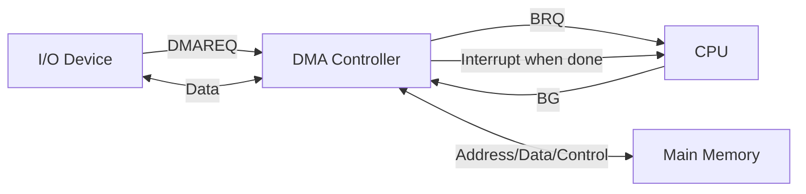

**DMA process:** Request → Grant → Transfer → Completion (interrupt).

**Advantages of DMA:**

1. **Efficient data transfer** — faster than CPU byte-by-byte I/O  
2. **CPU offloading** — CPU free for other tasks → better multitasking  
3. **Higher throughput** — large volumes moved quickly (disks, NIC, audio, graphics)

**Disadvantages (for balance):** bus contention; extra hardware complexity; data coherency issues if CPU and DMA access same memory unsafely.

**Applications:** disk/SSD, network cards, sound cards, graphics transfers.

**For Exam**

DMA allows I/O devices to transfer data directly to/from memory using a DMA controller that temporarily becomes bus master. The CPU only sets up the transfer and is interrupted when done. Modes: burst, cycle stealing, transparent. Advantages: speed, less CPU overhead, high throughput for bulk transfers.

**Previously Asked Questions**

- **Q9** (1 mark, Apr 2025) — DMA stands for ……..
  - *Answer:* **Direct Memory Access**.

- **Q5** (1 mark, SLM Model Set 1) — What does DMA stand for in I/O systems?
  - *Answer:* **Direct Memory Access**.

- **Q37** (15 marks, Apr 2025) — Explain the concept of Direct Memory Access (DMA). Discuss the advantages of using DMA in a computer system.
  - *Answer:*
    
    **Concept of DMA:**  
    Direct Memory Access is a technique that allows peripheral devices to transfer data **directly to or from main memory without continuous involvement of the CPU** for each byte. A special hardware unit called the **DMA controller** manages addresses, word count and bus control. This is essential because the CPU is much faster than many I/O paths, yet programmed I/O would keep the CPU busy or idle waiting, reducing system efficiency.
    
    **Need:** For high-speed devices (disk, network, multimedia), moving large blocks under CPU program control is too slow and wasteful. DMA acts as a “station master” for block transfers.
    
    **Working:**  
    1. Device (or CPU setup) requests DMA.  
    2. DMA controller requests the system bus (**bus request**); CPU grants it (**bus grant**) and may suspend its own memory use.  
    3. CPU initialises DMAC with starting memory address, number of words/blocks and transfer direction.  
    4. DMAC becomes **bus master** and transfers data between memory and I/O directly.  
    5. CPU can continue other instructions (depending on mode).  
    6. When count reaches zero, DMAC releases the bus and **interrupts** the CPU to signal completion.
    
    **DMA transfer modes:**  
    - **Burst mode:** bus held until whole block finishes.  
    - **Cycle stealing:** bus returned after each byte/word.  
    - **Transparent mode:** transfer only when CPU does not need the bus.
    
    **Block path:** I/O device ↔ DMA controller ↔ system bus ↔ main memory (CPU not on the data path for each word).
    
    **Advantages:**  
    1. **Efficient / high-speed transfer** compared with CPU-driven programmed I/O.  
    2. **CPU offloading** — processor free for computation/multitasking while DMA moves data.  
    3. **Higher throughput** for bulk data — ideal for disks, NICs, sound and graphics.  
    4. Reduces interrupt frequency versus interrupting the CPU per byte (interrupt-driven I/O still needs CPU per event; DMA moves a block then one completion interrupt).
    
    **Brief note:** DMA needs extra hardware and careful synchronisation to avoid bus contention and inconsistent memory views, but for large transfers its performance benefits dominate.
    
    *(Refer SLM Figs. 2.4.1–2.4.3 for DMA controller architecture and data path.)*

- **Q28** (4 marks, SLM Model Set 2) — How does Direct Memory Access (DMA) improve system performance in data transfer operations?
  - *Answer:* **DMA** lets devices transfer blocks of data **directly between I/O and main memory** with a DMA controller as bus master, so the CPU need not move each byte itself.
    
    **Performance gains:**  
    1. **Faster bulk transfer** than programmed I/O.  
    2. **CPU offloading** — processor continues useful work while DMA moves data → better multitasking.  
    3. **Higher I/O throughput** for disks, NICs, audio/graphics.  
    4. **Fewer interrupts** — one completion interrupt per block instead of per byte.
    
    Modes (burst, cycle stealing, transparent) trade bus occupancy vs CPU progress, but overall system throughput rises for large transfers.

**Diagram (refer SLM):** Fig. 2.4.1 DMA Controller Architecture; Fig. 2.4.2 Block diagram of DMA Controller; Fig. 2.4.3 Data transfer by DMA.


## Block 3: Parallel Computer Structures

### Unit 1: Introduction to Parallel Processing

#### 3.1.1 Parallel Processing Concepts / Serial vs Parallel

**Theory**

A computer takes data as input, processes it under a set of instructions, and produces output stored in memory. Instructions can be executed **sequentially** or **in parallel**. In the sequential (serial) approach, the CPU fetches and executes one instruction at a time: instruction 1, then 2, then 3, and so on. This slows overall performance because the system waits for each instruction to finish before starting the next.

**Parallel processing** enhances processing capability and increases data-processing throughput. Several processing units work together so multiple tasks or instructions can run concurrently. Parallelism aims to boost performance and improve availability as hardware costs fall.

**Serial data processing:** one task is completed at a time; the processor executes all tasks in sequence.

**Parallel data processing:** different processors (or processing elements) complete multiple tasks at the same time.

**Real-life analogy (SLM):** One billing counter with three queues = serial processing (long wait). Three billing counters operating together = parallel processing (shorter wait).

**Definition (Hwang & Faye):** Parallel processing is an efficient form of information processing that emphasises exploitation of concurrent events in the computing process. Parallel events may occur at the same instant and demand concurrent execution of many programs.

**Important Points**

- Serial = one-by-one execution; Parallel = concurrent execution
- Goal of parallel processing: speed up computation and increase throughput
- Parallel architecture configurations: (1) Pipeline computers (2) Array processors (3) Multiprocessor systems
- Parallel programming is more complex / harder to implement than serial
- Parallel processing suits massive / big-data computational work

**For Exam**

Serial computing executes instructions one after another on a single flow of control, so it takes more time. Parallel computing uses multiple processing units to execute multiple tasks or instructions simultaneously, improving performance and throughput. Parallel architectures include pipeline computers, array processors, and multiprocessor systems.

**Diagram (refer SLM):** Fig 3.1.1 Serial Vs Parallel Processing; Fig 3.1.5 Serial processing (one billing counter); Fig 3.1.6 Parallel processing (multiple counters)

**Previously Asked Questions**

- **Q7** (1 mark, SLM Model Set 2) — In which type of processing are several instructions executed simultaneously?
  - *Answer:* **Parallel processing** (also achieved by **pipelining**, where multiple instructions overlap in different stages).


#### 3.1.2–3.1.3 Data Processing Cycle

**Theory**

The data processing cycle converts raw data into usable information. Stages are:

1. **Data collection** — gather raw data  
2. **Data preparation** — manipulate data into desired form  
3. **Data entry** — insert verified data via input devices  
4. **Data processing** — process using methodologies  
5. **Data interpretation** — derive meaningful information  
6. **Data storage** — store instructions/information for future use  

**Important Points**

- Six stages: Collection → Preparation → Entry → Processing → Interpretation → Storage
- Raw data → processed information stored in memory

**For Exam**

Data processing cycle: collect raw data, prepare it, enter it into the system, process it, interpret results, and store them for later use.

**Diagram (refer SLM):** Fig 3.1.2 Data Processing Cycle; Fig 3.1.3 Data transfer I/O→CPU; Fig 3.1.4 Steps in Data Processing


#### 3.1.7 Pipeline Computers (Intro in Unit 1)

**Theory**

**Pipeline computers** arrange CPU hardware so overall performance increases. Multiple instructions execute in a **pipeline fashion**: the output of one stage is the input of the next. Each segment typically has an input register and a combinational circuit; a common clock advances data one step at a time.

Example: compute \(A_i \times B_i + C_i\) for \(i = 1 \ldots 7\) in three segments (input multiply operands → multiply + input \(C_i\) → add). After the pipeline fills (3 clock pulses for first result), each subsequent clock produces a new result.

For a **k-segment** pipeline with clock \(t_p\) and **n** tasks: total time = \([k + (n-1)] \, t_p\) (or \(k + (n-1)\) clock cycles).

**Important Points**

- Stages overlap; multiple instructions in flight
- Space-time diagram shows segment utilisation over clock cycles
- First result after \(k\) cycles; then one result per cycle (ideally)

**For Exam**

Pipelining divides instruction/computation into stages so several instructions overlap. After fill time, throughput approaches one result per clock cycle. Time for n tasks on k stages ≈ \(k + (n-1)\) cycles.

**Diagram (refer SLM):** Fig 3.1.7 Hardware arrangements; Fig 3.1.8 \(A_i B_i + C_i\); Fig 3.1.9 Four-segment pipeline; Fig 3.1.10 Space-Time Diagram


#### 3.1.8–3.1.9 Array Processors and Multiprocessing (Intro)

**Theory**

An **array processor** is a multiprocessor-style organisation where a **single instruction** controls simultaneous execution on many processing elements—suited to arithmetic on arrays/vectors of floating-point numbers. Often an auxiliary processor attached to a general-purpose host for vector computation (pipelined or parallel ALU).

A **multiprocessing system** has more than one CPU sharing main memory and peripherals (tightly coupled). Types by address space:

1. **Shared-memory** multiprocessor — processors share a physical address space  
2. **Private-memory** multiprocessor — each has private, non-shared address space  

**Interconnection structures:** Time-shared common bus; Multiport memory; Crossbar switch; Multistage switching network (e.g. Omega); Hypercube (\(N = 2^n\) nodes; neighbours differ by one address bit).

**Characteristics of multiprocessing:** two or more similar processors; share memory and I/O; equal memory access time via bus/interconnect; same functions; OS controls interaction.

**Important Points**

- Array processor ≈ SIMD-style vector/array arithmetic
- Multiprocessor = multiple CPUs, often shared memory
- Interconnects: bus, multiport, crossbar, multistage, hypercube

**For Exam**

Array processors apply one instruction to many data elements (arrays/vectors). Multiprocessors use multiple CPUs sharing memory/peripherals to process large volumes quickly. Interconnection choices (bus, multiport, crossbar, multistage, hypercube) affect bandwidth and contention.

**Diagram (refer SLM):** Fig 3.1.11 Vector Addition; Fig 3.1.12 Multiprocessing system; Fig 3.1.13–3.1.18 Bus / Multiport / Crossbar / Omega / Hypercube

**Previously Asked Questions**

- **Q24** (2 marks, Apr 2025) — Difference between parallel and serial computing.
  - *Answer:* In **serial computing**, instructions/tasks are executed one at a time in sequence on a single execution flow. The CPU completes instruction 1 fully before starting instruction 2, so total time is the sum of individual times and performance is slower for large workloads. In **parallel computing**, multiple processing units work together so multiple instructions or data items can be processed **simultaneously**. Work is divided among processors, which increases throughput and reduces wall-clock time for large or computationally heavy tasks. Serial solutions are simpler to implement; parallel solutions are harder to program but better suited to big-data and high-performance applications. Parallel organisations include pipeline computers, array processors, and multiprocessor systems.


### Unit 2: Architectural Classification (Flynn’s and Related)

#### 3.2.1–3.2.2 Classification Schemes Overview

**Theory**

Parallel computers execute multiple instructions/calculations concurrently by splitting large problems. Three classical schemes:

| Scientist | Year | Basis |
|-----------|------|--------|
| **Flynn** | 1966 | Multiplicity of instruction & data streams |
| **Feng** | 1972 | Degree of parallelism (bit/word level) |
| **Handler** | 1977 | Pipelining & parallelism at PCU / ALU / BLC levels |

Also: coupling (loose vs tight) and memory access mode (UMA vs NUMA).

**Important Points**

- Flynn is the most widely used exam taxonomy
- Instruction stream = sequence of instructions; Data stream = data traffic between memory and processing unit

**For Exam**

Architectural classification schemes group computers by how instructions and data flow, how bits/words are processed in parallel, and how processors are coupled or access memory. Flynn’s taxonomy (SISD/SIMD/MISD/MIMD) is the standard exam answer.


#### 3.2.3 Flynn’s Classification (SISD / SIMD / MISD / MIMD)

**Theory**

M. J. Flynn (1966) classified architectures by whether the **instruction stream** and **data stream** are **single** or **multiple**:

1. **SISD** — Single Instruction, Single Data  
2. **SIMD** — Single Instruction, Multiple Data  
3. **MISD** — Multiple Instruction, Single Data  
4. **MIMD** — Multiple Instruction, Multiple Data  

**SISD:** Conventional uniprocessor von Neumann machine. One instruction stream and one data stream per clock cycle. One CPU executes one instruction on one data item at a time. Example: traditional personal computers / early sequential machines.

**SIMD:** One control unit broadcasts the same instruction to many identical processing elements (processor array), each operating on different data. Shared memory often modular so all PEs can interact. Synchronous, deterministic. Examples: array processors, vector/array machines (e.g. ILLIAC IV style), GPU-like SIMD workloads.

**MISD:** Multiple processors execute **different** instruction streams on the **same** data stream (data flows through a linear array of processors). Rare in commercial machines; Flynn predicted it but few pure MISD systems were built. Sometimes associated with specialised pipelined/fault-tolerant designs.

**MIMD:** Multiple processors with multiple memory modules connected by an interconnection network. Each PE can run different instructions on different data; execution may be sync/async, deterministic or not. Examples: modern multiprocessors, multicore SMPs, clusters (loosely coupled MIMD).

**Diagram — Flynn’s classification:**

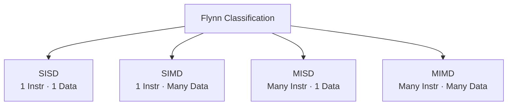

```text
                    Instruction Stream
                 Single          Multiple
              +-------------+--------------+
    Single    |    SISD     |     MISD     |
 Data         | (uniproces- | (rare /      |
 Stream       |  sor / von  |  specialised)|
              |  Neumann)   |              |
              +-------------+--------------+
    Multiple  |    SIMD     |     MIMD     |
              | (array /    | (multi-CPU / |
              |  vector PE) |  multicore)  |
              +-------------+--------------+
```

**Structure sketch (SISD / SIMD / MISD / MIMD):**

```text
SISD:  CU ──► PE ──► Memory     (one stream each)

SIMD:  CU ──► PE1 PE2 … PEn
              │   │      │
              M1  M2 …   Mn     (same instr, different data)

MISD:  CU1→PE1 ┐
       CU2→PE2 ┼── same data stream
       CUk→PEk ┘

MIMD:  CU1→PE1↔M1
       CU2→PE2↔M2   via interconnection network
       CUn→PEn↔Mn
```

**Important Points**

- SISD = traditional serial computer  
- SIMD = one instruction, many data (array/vector)  
- MISD = many instructions, one data (least common)  
- MIMD = many instructions, many data (general multiprocessors)  
- Not all Flynn classes are “parallel”; SISD is serial  

**For Exam**

Flynn classifies computers by instruction-stream and data-stream multiplicity into SISD, SIMD, MISD and MIMD. SISD is the classic single-CPU von Neumann machine. SIMD uses one control unit and many PEs on different data (array processors). MISD feeds one data stream through multiple instruction streams (rare). MIMD runs multiple independent instruction and data streams (multiprocessors/multicores). Draw the 2×2 taxonomy and give one example for each.

**Diagram (refer SLM):** Fig 3.2.2 Instruction and data stream; Fig 3.2.3 Taxonomy of Flynn’s Classification; Fig 3.2.4 SISD; Fig 3.2.5 SIMD; Fig 3.2.6 MISD; Fig 3.2.7 MIMD

**Previously Asked Questions**

- **Q38** (15 marks, Apr 2025) — Explain Flynn’s computer system classification with examples.
  - *Answer:*  
    **Introduction.** In 1966, Michael J. Flynn proposed a taxonomy of computer architectures based on the multiplicity of **instruction streams** and **data streams**. An instruction stream is the sequence of instructions executed by the processing unit; a data stream is the flow of operands between memory and the processor. Each dimension may be single or multiple, giving four classes: SISD, SIMD, MISD and MIMD.  

    **1. SISD (Single Instruction Single Data).** A uniprocessor von Neumann machine executes one instruction on one data item per clock cycle. All instructions and data reside in primary memory. **Example:** Conventional PCs and early sequential computers. **Advantages:** Simple to implement; one instruction and one data stream active per cycle.  

    **2. SIMD (Single Instruction Multiple Data).** A front-end control unit issues one instruction that many identical, synchronised processing elements apply to different data simultaneously. Memory is often modular so all PEs can be served. Execution is synchronous and deterministic. **Example:** Array processors / vector-oriented machines such as ILLIAC IV; modern data-parallel / GPU-style SIMD workloads. **Advantages:** Same instruction on many data elements; suited to parallel numerical work on arrays.  

    **3. MISD (Multiple Instruction Single Data).** Several processors execute different instruction streams on the **same** data stream (data passes through a pipeline of different operations). **Example:** Few commercial pure MISD machines exist; it is mainly a theoretical category (Flynn predicted it). Sometimes linked to specialised/fault-tolerant or cascaded processing ideas. **Advantages:** Multiple independent instruction streams on one data path.  

    **4. MIMD (Multiple Instruction Multiple Data).** Multiple processors and memory modules communicate over an interconnection network. Each processor can run a different program on different data; operation may be synchronous or asynchronous. **Example:** Shared-memory multiprocessors, multicore CPUs, and loosely coupled clusters. **Advantages:** Flexible general-purpose parallelism; multiple instruction and data streams.  

    **Conclusion.** Flynn’s classification is the standard architectural taxonomy for exams. SISD is serial; SIMD and MIMD dominate practical parallel systems; MISD remains rare. Always define instruction/data streams, list all four classes with diagrams, and give clear examples.

- **Q7** (1 mark, SLM Model Set 1) — What does SIMD stand for?
  - *Answer:* **Single Instruction Multiple Data**.

- **Q6** (1 mark, SLM Model Set 2) — What are uniprocessing computing devices called?
  - *Answer:* **SISD** machines / **uniprocessors** (single instruction stream, single data stream — conventional single-CPU computers).

- **Q36** (15 marks, SLM Model Set 2) — Evaluate Flynn's classification of parallel processing with necessary diagrams.
  - *Answer:*  
    **Introduction.** M. J. Flynn (1966) classified computers by multiplicity of **instruction streams** and **data streams**, giving four classes: **SISD, SIMD, MISD, MIMD**.
    
    **Taxonomy (draw 2×2):**
    
    ```text
                        Instruction Stream
                     Single            Multiple
                  +---------------+---------------+
        Single    |     SISD      |     MISD      |
     Data Stream  |  (uniproces-  |  (rare /      |
                  |   sor)        |   specialised)|
                  +---------------+---------------+
        Multiple  |     SIMD      |     MIMD      |
                  |  (array /     |  (multi-CPU / |
                  |   vector)     |   multicore)  |
                  +---------------+---------------+
    ```
    
    **1. SISD — Single Instruction, Single Data.** One CPU executes one instruction on one data item at a time (von Neumann uniprocessor). **Example:** traditional PC.  
    *Sketch:* `CU → PE → Memory` (one stream each).
    
    **2. SIMD — Single Instruction, Multiple Data.** One control unit broadcasts the same instruction to many PEs, each on different data. **Example:** array processors, ILLIAC IV, GPU-style SIMD.  
    *Sketch:* `CU → PE1…PEn` with separate data/memories.
    
    **3. MISD — Multiple Instruction, Single Data.** Different instruction streams operate on the same data stream (rare commercially).  
    *Sketch:* multiple CU/PE stages on one data path.
    
    **4. MIMD — Multiple Instruction, Multiple Data.** Multiple processors run different instructions on different data via an interconnection network. **Example:** multiprocessors, multicore SMPs, clusters.  
    *Sketch:* `CU1→PE1↔M1 … CUn→PEn↔Mn` linked by a network.
    
    **Conclusion.** Draw the taxonomy and one structure diagram per class; give examples. SISD is serial; SIMD/MIMD dominate practical parallelism; MISD is uncommon.


#### 3.2.4 Feng’s Classification

**Theory**

Feng (1972) classifies by **word** and **bit-slice** parallelism:

1. **WSBS** — Word Serial Bit Serial (bit-serial; one bit at a time)  
2. **WPBS** — Word Parallel Bit Serial (bit-slice; m-bit slice at a time)  
3. **WSBP** — Word Serial Bit Parallel (word-slice; one n-bit word at a time — most conventional computers)  
4. **WPBP** — Word Parallel Bit Parallel (fully parallel; \(n \times m\) bit array at once)  

**Important Points**

- Full parallelism degree = max binary digits processable per unit time  
- Plot bits vs words processed in parallel  

**For Exam**

Feng’s scheme: WSBS, WPBS, WSBP, WPBP based on serial/parallel processing of words and bits. WPBP is fully parallel.

**Diagram (refer SLM):** Fig 3.2.8 Processor classified according to Feng’s Classification


#### 3.2.5 Handler’s Classification / Coupling / UMA–NUMA

**Theory**

**Handler (1977)** describes parallelism and pipelining at three levels: **PCU** (processor/CPU), **ALU/PE**, **BLC** (bit-level circuits). Notation uses pairs of integers for counts and pipeline depths — more abstract than Flynn.

**Coupling:**

- **Loosely coupled** — local memories; communicate via network; scalable distributed computing  
- **Tightly coupled** — shared common memory; high-speed interconnect; high inter-processor communication  

**Memory access:**

- **UMA** — all processors see shared memory with equal access time (typical SMP)  
- **NUMA** — local memory faster than remote; better scalability, more complex programming  

**Important Points**

- Loose = distributed; Tight = shared memory  
- UMA = uniform latency; NUMA = non-uniform  

**For Exam**

Handler models PCU/ALU/BLC pipelining. Loosely coupled systems use private memory + network; tightly coupled share memory. UMA gives equal memory latency; NUMA makes local access faster than remote.

**Diagram (refer SLM):** Fig 3.2.9 Loosely coupled; Fig 3.2.10 Tightly coupled

**Previously Asked Questions**

- **Q29** (4 marks, SLM Model Set 2) — Compare UMA and NUMA multiprocessors.
  - *Answer:*  

    | Point | UMA (Uniform Memory Access) | NUMA (Non-Uniform Memory Access) |
    |-------|-----------------------------|-----------------------------------|
    | Memory view | All processors see **shared memory with equal access time** | Access time **depends on location** — local memory faster than remote |
    | Typical system | Symmetric multiprocessors (SMP) with shared bus/crossbar to common memory | Scalable multiprocessors with distributed memory modules |
    | Latency | Uniform / predictable | Non-uniform; remote accesses cost more |
    | Scalability | Harder to scale to many CPUs (bus/memory contention) | Better scalability for large systems |
    | Programming | Simpler shared-memory model | More complex (locality-aware placement helps performance) |
    | Coupling | Usually tightly coupled shared memory | Distributed shared memory / ccNUMA variants |

    **Summary:** UMA offers equal memory latency for all CPUs (simpler, limited scale). NUMA makes local access faster than remote, improving scalability at the cost of programming complexity.


### Unit 3: Pipelining

#### 3.3.1–3.3.2 Introduction to Pipelining

**Theory**

**Pipelining** organises concurrent activity like a factory assembly line or water flowing through a pipe: new work enters while earlier work advances through later stages. Multiple instructions **overlap** in execution.

Typical **five-stage** view: Fetch → Decode → Compute → Memory → Write. Each instruction still takes several cycles, but ideally **one instruction completes per cycle** after the pipeline fills.

A **data hazard** occurs when operand data is not available.

**Advantages:** higher instruction throughput; more stages → more overlapping instructions; faster ALU design; higher clock frequencies; better overall CPU performance.  

**Disadvantages:** complex design; increased instruction latency; harder-to-predict throughput; longer pipelines worsen branch hazards.

**Important Points**

- Pipelining ≠ multiple independent CPUs; it overlaps stages of instruction/computation
- Factors affecting pipeline construction: level of processing; pipeline configuration; type of instruction/data

**For Exam**

Pipelining overlaps stages of instruction execution so several instructions are in progress at once, increasing throughput. After fill time, completion rate approaches one instruction per cycle, subject to hazards (especially branches and data dependencies).

**Diagram (refer SLM):** Fig 3.3.1 Water pipe analogy

**Previously Asked Questions**

- **Q10** (1 mark, Apr 2025) — What do you mean by pipelining?
  - *Answer:* Pipelining is an implementation technique in which the execution of multiple instructions is **overlapped**. Instruction processing is divided into stages (e.g. fetch, decode, execute, memory, write-back) so that while one instruction is in one stage, another can be in a later or earlier stage, improving instruction throughput.

- **Q8** (1 mark, SLM Model Set 1) — "Cycle time of the processor is reduced" is one of the disadvantages of Pipelining. True/False
  - *Answer:* **False.** Reducing processor cycle time / improving throughput is an **advantage** of pipelining. Disadvantages include more complex design, hazards (data/control), pipeline bubbles/stalls, and increased difficulty with branches.

- **Q29** (4 marks, SLM Model Set 1) — What is pipelining? Define processor cycle in pipelining.
  - *Answer:* **Pipelining** is a technique that organises concurrent activity so that the execution of successive instructions (or arithmetic sub-operations) **overlaps**. Instruction processing is split into stages (e.g. Fetch → Decode → Execute → Memory → Write-back). After the pipeline fills, ideally one instruction completes every clock cycle, greatly increasing throughput.
    
    A **processor cycle** (pipeline cycle / clock period \(t_p\)) in pipelining is the time taken for a task to advance **one stage** in the pipeline — typically determined by the slowest stage plus latch overhead. In each processor cycle, every occupied stage performs its micro-operation and results move forward one segment. For a *k*-segment pipeline processing *n* tasks, total time ≈ \([k + (n-1)] \, t_p\).
    
    **Note:** Pipelining improves instruction rate but does not eliminate hazards; branches and data dependencies can insert stalls.

- **Q30** (4 marks, SLM Model Set 1) — State the need for Instruction Level Parallelism.
  - *Answer:* **Instruction Level Parallelism (ILP)** means executing (or overlapping) multiple instructions from a single instruction stream concurrently. **Need:**  
    1. **Higher performance** from a single processor without waiting for full sequential completion of each instruction.  
    2. **Better utilisation** of CPU functional units (ALU, memory ports, etc.) that would otherwise idle.  
    3. **Increased throughput** — more instructions completed per unit time (via pipelining, superscalar issue, etc.).  
    4. Exploitation of **independent instructions** that compilers/hardware can schedule together.  
    5. Essential for modern high-speed CPUs where clock speed alone cannot keep raising performance — ILP techniques (pipelining, multiple issue) extract more work per cycle.  
    Without ILP, processors remain limited to one instruction completing only after all its stages finish serially, wasting potential concurrency.

- **Q19** (2 marks, SLM Model Set 2) — What is meant by the pipeline bubble?
  - *Answer:* A **pipeline bubble** (stall / no-op slot) is an empty stage cycle inserted into the pipeline when an instruction **cannot advance** (e.g. due to a data hazard, control/branch hazard, or structural conflict). That stage does no useful work for one or more clocks, reducing effective throughput until the hazard clears.


#### 3.3.3 Classification by Level of Processing

**Theory**

**1. Instruction Execution Pipeline**

Like an assembly line for instructions. Simplest form: two stages — **fetch** and **execute** (instruction prefetch / fetch overlap). While one instruction executes, the next can be fetched during idle memory cycles.

Richer six-stage model (common exam list):

1. **IF** — Instruction Fetch  
2. **ID** — Instruction Decode  
3. **AG** — Address Generator  
4. **DF** — Data Fetch  
5. **EX** — Execution  
6. **WB** — Write-back  

Alternative six-phase breakdown (Stallings-style in SLM): FI, DI, CO, FO, EI, WO. A six-stage pipeline can cut time for many instructions dramatically (SLM example: 9 instructions from 54 to 14 time units) unless a **conditional branch** flushes useless instructions and stalls the pipeline.

**2. Arithmetic Operation Pipeline**

Used for floating-point ops, fixed-point multiply, etc. Floating-point add/subtract in **four segments**:

1. Compare exponents  
2. Align mantissas  
3. Add/subtract mantissas  
4. Produce normalised result  

**Diagram — Pipeline stages (instruction):**


```text
Clock →  1    2    3    4    5    6    7
I1:     IF → ID → AG → DF → EX → WB
I2:          IF → ID → AG → DF → EX → WB
I3:               IF → ID → AG → DF → EX → WB
```

**Important Points**

- Instruction pipeline overlaps fetch/decode/execute of successive instructions  
- Arithmetic pipeline overlaps sub-operations of numeric computation  
- Branches and interrupts need special pipeline logic  

**For Exam**

Instruction pipelines overlap successive instructions across stages (IF–ID–AG–DF–EX–WB). Arithmetic pipelines overlap floating-point substeps (compare exponents, align, add/subtract, result). Prefetch helps, but unequal stage times and branches limit ideal 2× speedup.

**Diagram (refer SLM):** Fig 3.3.2 Two-stage pipeline; Fig 3.3.3 Timing diagram; Fig 3.3.4 Conditional branch effect; Fig 3.3.5 Six-stage CPU instruction pipeline; Fig 3.3.6 FP add/sub pipeline


#### 3.3.4–3.3.5 Configuration and Instruction/Data Types

**Theory**

**By configuration:**

- **Unifunction pipeline** — fixed dedicated function throughout  
- **Multifunction pipeline** — different functions at different times  

**By instruction/data type:**

- **Scalar pipelines** — repeated scalar instructions on individual operands  
- **Vector pipelines** — vector instructions over vector operands (arrays)  

**Important Points**

- Unifunction = specialised; Multifunction = flexible  
- Scalar vs Vector relates to operand structure  

**For Exam**

Pipelines may be unifunction or multifunction, and may process scalar or vector operands. Vector pipelines are key to high-performance numerical computing.

**Previously Asked Questions**

- **Q20** (2 marks, SLM Model Set 1) — Mention the various types of pipelining.
  - *Answer:* Pipelines are classified in several ways:  
    **(1) By level of processing:** Instruction execution pipeline; Arithmetic operation pipeline.  
    **(2) By configuration:** Unifunction pipeline (fixed function); Multifunction pipeline (different functions at different times).  
    **(3) By instruction/data type:** Scalar pipeline; Vector pipeline.  
    (Also commonly: two-stage fetch–execute vs multi-stage IF–ID–EX–MEM–WB style instruction pipelines.)


### Unit 4: Vector Processing and Array Processors

#### 3.4.1 Vector Processing

**Theory**

A **vector** is a one-dimensional ordered collection of data items, e.g. \(V = [V_1, V_2, \ldots, V_n]\). A **vector processor** is a CPU whose instruction set operates on such arrays (often floating-point). Operating on multiple data with one instruction is also called **SIMD / vector (array) instructions**, stored in vector registers; the same operation repeats over different data.

**Scalar processor:** processes one item at a time (integers/floats) sequentially — slower for large arrays.  
**Vector processor:** aggregates many data points and applies the same operation efficiently — can stress other system parts if memory cannot keep up.

**Applications:** long-range weather forecasting, petroleum exploration, medical diagnosis, aerodynamics simulations, AI/expert systems, image processing.

**Matrix multiply** is a classic heavy vector workload (\(n \times n\) matrices need many inner products / multiply-add operations). Pipeline vector processors compute inner products using multiplier and adder pipelines (SLM four-segment example).

**Memory interleaving:** memory split into modules with own AR/DR so multiple simultaneous accesses (instruction + operand, or multiple vector operands) are possible; reduces effective memory cycle time roughly by number of modules.

**Important Points**

- Vector = 1-D array; vector CPU = instructions on vectors  
- Setup time = time to route vector to functional unit  
- Flushing time = time from start of vector instruction until first result leaves the pipeline  
- Interleaved memory feeds pipelines/vector units  

**For Exam**

Vector processing executes the same arithmetic operation on entire arrays/vectors, using vector instructions and often pipelined floating-point units, instead of scalar loops over each element. It is vital for scientific computing (weather, simulation, imaging). Performance depends on setup, flushing, memory bandwidth (interleaving), and compiler/algorithm choices.

**Diagram (refer SLM):** Fig 3.4.1 Vector instruction format; Fig 3.4.2 Inner-product pipeline; Fig 3.4.3 Multiple-module memory

**Previously Asked Questions**

- **Q5** (1 mark, Apr 2025) — What is Vector processing?
  - *Answer:* Vector processing is a parallel data-processing method in which a CPU (vector processor) executes instructions that operate on **one-dimensional arrays (vectors)** of data—typically applying the same operation to many elements—rather than processing only one scalar value at a time.


#### 3.4.4 Performance Measures of Vector Processing

**Theory**

Vector processing has two important time overheads:

1. **Setup time** — time required to route the vector to the functional unit  
2. **Flushing time** — duration from the initial processing level of a vector instruction until the **first result** emerges from the pipeline  

To improve performance, SLM lists four measures/practices:

1. **Improve the vector instruction** — reduce memory access; maximise resource utilisation  
2. **Integrate scalar instructions** — batch scalar instructions of the same type to avoid repeatedly reconfiguring the pipeline  
3. **Algorithm** — choose algorithms that map well to vector pipelines  
4. **Vectorising compiler** — regenerate parallelism from high-level language; development stages: Parallel Algorithm (A) → High-level Language (L) → Efficient Object code (O) → Target Machine code (M)  

Related metric for supercomputers: **FLOPS** (floating-point operations per second); megaflops / gigaflops. Supercomputers combine vector instructions with pipelined FP units (e.g. Cray-1).

**Important Points**

- Setup + flushing are key overheads before steady pipeline throughput  
- Four exam points: better vector instructions, integrate scalars, good algorithm, vectorising compiler  
- A-L-O-M stages of parallelism development  

**For Exam**

Performance of vector processing is limited by setup and flushing times. Measures: improve vector instructions (less memory traffic, better utilisation), batch similar scalar work, select vector-friendly algorithms, and use a vectorising compiler (A→L→O→M). Sustained rate is often quoted in megaflops once the pipeline produces results.

**Previously Asked Questions**

- **Q32** (4 marks, Apr 2025) — Explain the Performance Measures of Vector Processing.
  - *Answer:* Vector processing performance depends on pipeline overheads and how well software/hardware keep the vector units busy.  
    **Overheads:** (i) **Setup time** — time to route the vector operands to the functional unit; (ii) **Flushing time** — time from the start of a vector instruction until the first result leaves the pipeline. Until the pipeline fills, useful results are delayed.  
    **Measures / practices to improve performance:**  
    1. **Improving the vector instruction** — reduce memory accesses and maximise use of functional units/registers so each vector instruction does more useful work.  
    2. **Integrating scalar instructions** — group scalar instructions of the same type so the pipeline is not repeatedly reconfigured, cutting overhead.  
    3. **Algorithm selection** — prefer algorithms that expose long vectors and regular operations suited to pipelined vector hardware.  
    4. **Vectorising compiler** — a compiler that recovers parallelism from high-level code; parallelism development is often described as Parallel Algorithm (A) → High-level Language (L) → Efficient Object code (O) → Machine code (M).  
    Together these reduce idle pipeline time and increase sustained floating-point throughput (often measured in FLOPS/megaflops on supercomputers).


#### 3.4.5–3.4.8 Supercomputers and Array Processors

**Theory**

A **supercomputer** commercially combines vector instructions and pipelined floating-point arithmetic for high-speed scientific work (weather, seismic analysis, space research). Dense packaging and cooling are critical. Example: **Cray-1** (1976) — vector processing, 12 functional units, ~80 megaflops peak through the pipeline.

**Array processor:** computes on large arrays; also called multiprocessor/vector processor in SLM usage. Two types:

1. **Attached array processor** — peripheral to a host general-purpose computer; I/O interface + local memory; accelerates numerical/vector work with pipelined FP units  
2. **SIMD array processor** — one control unit + many PEs with local memories; one instruction stream, multiple data streams (e.g. ILLIAC IV)

**Why use array processors?** Higher instruction processing speed; often async from host → better capacity; local memory adds capacity.

**Limitation:** if data items depend on each other (A must finish before B), they cannot run fully in parallel — dependency limits array parallelism.

**Important Points**

- Attached AP vs SIMD AP  
- Dependency is the major limitation of array processing  

**For Exam**

Array processors speed large array/matrix computations either as attached accelerators or as SIMD machines under one control unit. They fail to parallelise when data dependencies force sequential order.

**Diagram (refer SLM):** Fig 3.4.4 Attached array processor; Fig 3.4.5 SIMD array processor organisation

**Previously Asked Questions**

- **Q6** (1 mark, SLM Model Set 1) — Who is considered the father of vector processing and supercomputing?
  - *Answer:* **Seymour Cray**.


## Block 4: Basic Concepts of Operating Systems

### Unit 1: OS Components and Design

#### 4.1.1 Operating System — Definition, Design Goals, Components

**Theory**

An **operating system** is a system program that controls computer resources and provides a platform for application programs. It acts as an **interface between applications and hardware** — the “manager” of the computer. It does not do end-user tasks itself; it creates an environment where programs can do useful work.

**System software** (OS, compiler, assembler) manages resources, written in low-level languages, required for the machine to run. **Application software** (Word, Chrome, VLC) performs specific user tasks and needs the OS.

**Design requirements:** User (convenient, easy, reliable, safe, fast) and System (easy to design, implement, maintain).

**Design goals:** concurrent systems; security & privacy; resource sharing; adaptability to future HW/SW; portability; backward compatibility; generality for users.

**OS components:**

1. Process Management  
2. Memory Management  
3. File-System Management  
4. Mass-Storage Management  
5. I/O System Management  
6. Protection and Security  

**Process vs program (preview):** A program is passive (file on disk); a **process** is a program in execution (active). OS process duties: schedule CPUs/threads; create/delete processes; suspend/resume; synchronisation; communication.

**Memory management duties:** track who uses which memory; decide what to move in/out; allocate/deallocate.

**File management duties:** create/delete files & directories; primitives; map to secondary storage; backup.

**Disk management:** free-space management; storage allocation; disk scheduling.

**Important Points**

- OS = resource manager + hardware–software interface  
- Six major components listed above  
- Process = running program  

**For Exam**

The OS controls hardware resources and lets application programs run conveniently and safely. Its components manage processes, memory, files, mass storage, I/O, and protection/security.

**Diagram (refer SLM):** Fig 4.1.1 Operating System Structure; Fig 4.1.2 Design Goals

**Previously Asked Questions**

- **Q30** (4 marks, SLM Model Set 2) — Explain how the operating system performs process management.
  - *Answer:* **Process management** is the OS component that creates, schedules and terminates processes and coordinates them. The OS:
    
    1. **Creates and deletes** processes (allocates a PCB, loads the program, assigns PID and resources).  
    2. **Schedules** processes onto CPU(s) using long-term, short-term and medium-term schedulers and a dispatcher (context switch).  
    3. **Suspends and resumes** processes (ready ↔ waiting ↔ running; swapping when needed).  
    4. Provides **synchronisation** so cooperating processes do not corrupt shared data (mutexes, semaphores, etc.).  
    5. Provides **communication (IPC)** among processes (pipes, messages, shared memory, sockets).  
    6. Handles **termination** and reclaiming of CPU, memory and open files.
    
    A **process** (program in execution) is represented by a **PCB** holding state, PC, registers, scheduling and memory info. Thus the OS manages the full lifecycle of processes in a multiprogramming system.


#### 4.1.3 Booting

**Theory**

**Booting** is the process of starting the computer by **loading the operating system into main memory**. When first powered on, RAM is empty, so the OS must be loaded before normal operation.

**Boot flow (SLM):**

1. Motherboard **BIOS** (Basic Input/Output System) initialises — low-level I/O (keyboard, display, disk).  
2. Checks RAM, keyboard, and fundamental devices; scans buses (PCI/PCIe); configures new devices.  
3. Selects **boot device** from CMOS list (often CD/USB then hard disk).  
4. Reads **first sector** (boot sector) into memory and executes it; finds active partition; loads **secondary boot loader**.  
5. Loader loads the OS from the active partition and starts it.  
6. OS queries BIOS for configuration, loads **device drivers**, initialises tables, starts background processes, then login/GUI.

The **kernel** is the first major OS program loaded into memory and remains until shutdown.

**Important Points**

- Booting = load OS into main memory to start the computer  
- BIOS → boot device → boot sector → loader → OS/kernel → drivers → login  

**For Exam**

Booting is loading the OS into main memory when the computer starts. BIOS initialises hardware, finds a boot device, loads the boot loader/OS, which then loads drivers and starts the user environment.

**Previously Asked Questions**

- **Q6** (1 mark, Apr 2025) — What is booting?
  - *Answer:* Booting is the process of starting a computer by loading the operating system into the main memory (so the system can initialise hardware and begin normal operation).

- **Q9** (1 mark, SLM Model Set 1) — What is the first program that runs when a computer starts?
  - *Answer:* The **bootstrap loader** (boot loader / bootstrap program), typically started via **BIOS**/firmware, which then loads the operating system.

- **Q20** (2 marks, SLM Model Set 2) — What is the Booting Process?
  - *Answer:* **Booting** is starting the computer by **loading the OS into main memory**. Typical steps: **BIOS/firmware** initialises hardware and runs POST; selects a **boot device**; loads the **boot sector / boot loader**; the loader loads the **OS kernel**; the OS loads **device drivers**, initialises system tables/processes, then presents login/GUI. Until booting finishes, normal application programs cannot run.


#### 4.1.5 Types of Operating Systems

**Theory**

SLM lists four evolutionary types:

1. **Serial Processing** — programmer interacts directly with hardware; users run one after another (no modern OS). Analogy: cook rice completely before curry on one burner.  
2. **Simple Batch System** — operator groups similar jobs into batches (historically on punched cards); a **monitor** (early OS) runs each job in sequence. Harder to debug; operator expertise required.  
3. **Multiprogrammed Batch System** — CPU switches among jobs when one waits for I/O so the processor stays busy (**multiprogramming / multitasking**). Central idea of modern OS.  
4. **Time-Sharing System** — CPU time divided into **time slices (quanta)** among interactive users (e.g. airline reservation). Each user feels sole ownership of the CPU. Issues: reliability, security, integrity, communication.

**Important Points**

- Serial → Batch → Multiprogrammed → Time-sharing (exam list)  
- Multiprogramming keeps CPU busy during I/O waits  
- Time slice / quantum = short CPU attention period per user  

**For Exam**

Types of OS (as per SLM): serial processing, simple batch, multiprogrammed batch, and time-sharing. Batch groups similar jobs; multiprogramming overlaps CPU work of several jobs; time-sharing shares CPU interactively via time slices.

**Diagram (refer SLM):** Fig 4.1.3 Serial Processing; Fig 4.1.4 Simple batch system; Fig 4.1.5 Time-sharing system

**Previously Asked Questions**

- **Q18** (2 marks, Apr 2025) — Mention different types of OS.
  - *Answer:* According to the SLM evolution of operating systems, the main types are: (1) **Serial Processing** — users/jobs handled one after another with direct hardware interaction; (2) **Simple Batch System** — similar jobs grouped into batches and executed under a monitor; (3) **Multiprogrammed Batch System** — CPU switches among multiple jobs (especially during I/O waits) to improve utilisation; (4) **Time-Sharing System** — CPU time is shared among interactive users using time slices/quanta so each user gets a responsive share of the processor.

- **Q31** (4 marks, SLM Model Set 2) — What is time sharing operating system?
  - *Answer:* A **time-sharing OS** is a multiprogramming system that shares the CPU among **interactive users** by giving each a short **time slice (quantum)**. The short-term scheduler switches rapidly among ready processes so each user gets a responsive share and feels as if they have sole use of the machine (e.g. airline reservation terminals).
    
    **Features:** interactive response; multiprogramming in memory; frequent context switches; fair CPU sharing.  
    **Issues (SLM):** reliability, security, integrity and communication among users/processes.  
    It evolved from batch/multiprogrammed systems to support many simultaneous interactive sessions.


#### 4.1.6 Operating System Structure (Simple / Layered / Microkernel)

**Theory**

OS is a large program; structure matters for correctness and modification.

**1. Simple structure (e.g. MS-DOS):** grew without clean module boundaries; interfaces poorly separated → user-program faults can crash the system. Early UNIX: separable **kernel** + **system programs**.

**2. Layered approach:** OS divided into layers; **layer 0 = hardware**, **layer N = user interface**; each layer built only on lower layers, with defined inputs/outputs/functions (like a layered cake).

**3. Microkernel (e.g. Mach):** only essential mechanisms in kernel (address spaces, threads, IPC); user services in separate address spaces; communication via message passing. More reliable/secure; faults in drivers less likely to kill whole system. Contrast **monolithic kernel** where almost all OS runs in kernel space.

**Kernel role:** interface between hardware and software; memory, process, task, disk management; first program loaded at boot.

**Diagram — Layered OS structure:**

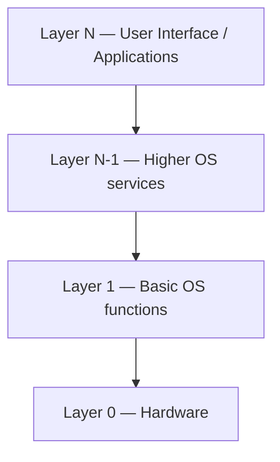

```text
  +----------------------------------+
  |  Layer N : User interface        |
  +----------------------------------+
  |  Layer ... : OS services         |
  +----------------------------------+
  |  Layer 1 : Core OS functions     |
  +----------------------------------+
  |  Layer 0 : Hardware              |
  +----------------------------------+
```

**Important Points**

- Simple / Layered / Microkernel — three structures in SLM  
- Layered: hardware at bottom, UI at top  
- Microkernel = minimal kernel + message passing  

**For Exam**

OS structures: simple (MS-DOS — poor separation), layered (each level uses only lower levels; hardware at layer 0, UI at top), and microkernel (Mach — minimal kernel, services as user modules communicating by messages). Layered design aids modularity and maintenance.

**Diagram (refer SLM):** Fig 4.1.6 A layered operating system

**Previously Asked Questions**

- **Q30** (4 marks, Apr 2025) — Explain the layered structure of the operating system.
  - *Answer:* In the **layered structure**, the operating system is divided into a number of levels (layers), each built on top of the lower ones. **Layer 0** is the **hardware**; the highest layer (**layer N**) is the **user interface**. Each layer has carefully defined inputs, outputs and functions, and may use only the services of layers below it.  
    This is like baking a layered cake: each layer is prepared separately and stacked, which is easier to manage than one huge unstructured cake. Advantages include modularity, easier debugging/modification (a change can often be confined to one layer), and clearer abstraction — higher layers need not know hardware details. Lower layers hide complexity from upper layers.  
    Contrast: a **simple structure** (e.g. MS-DOS) lacks well-separated interfaces, so failures propagate easily. A **microkernel** keeps only minimal mechanisms in the kernel and moves services to user space. The layered model is a standard textbook design for building a large OS systematically.


### Unit 2: OS Services

#### 4.2.1 Common Operating System Services

**Theory**

OS services make program execution convenient for users and programmers. Common services:

1. **User Interface** — CLI/CUI (text commands, e.g. MS-DOS), GUI (windows/icons/menus), AUI (voice).  
2. **Program execution** — load program from secondary to primary memory, create process, initialise I/O/files/resources.  
3. **Resource allocation** — allocate/deallocate CPU, memory, devices among concurrent processes.  
4. **I/O operations** — mediate device access (users cannot control devices directly for protection/efficiency).  
5. **File-system manipulation** — create/delete/read/write files & directories; permissions.  
6. **Communication** — IPC (shared memory, message passing) on same machine or network.  
7. **Error detection** — monitor and report faults (e.g. keyboard issues).  
8. **Accounting** — track resource usage, errors, performance (e.g. response time).  
9. **Protection and security** — integrity, confidentiality, availability; defend against unauthorised access, viruses, worms.

**Layered view of computer system:** end-user ↔ applications; programmer ↔ OS & utilities; OS designer ↔ hardware.

**Important Points**

- Nine services (memorise the list)  
- UI types: CLI, GUI, AUI  
- Utilities help system performance (antivirus, backup, etc.)  

**For Exam**

OS services include user interface, program execution, resource allocation, I/O, file manipulation, communication, error detection, accounting, and protection/security. They hide hardware complexity and support safe concurrent use of resources.

**Diagram (refer SLM):** Fig 4.2.1 Layers and Views of a Computer System

**Previously Asked Questions**

- **Q21** (2 marks, SLM Model Set 1) — Mention the different operating system services.
  - *Answer:* Common OS services are: (1) **User Interface** (CLI/GUI/AUI); (2) **Program execution**; (3) **Resource allocation**; (4) **I/O operations**; (5) **File-system manipulation**; (6) **Communication** (IPC/network); (7) **Error detection**; (8) **Accounting**; (9) **Protection and security**.


#### 4.2.2 System Calls

**Theory**

**System calls** are the interface through which a user-level process requests services from the OS **kernel** — the only entry points into the kernel. Programs usually reach them via an **API**.

**Five categories:**

| Category | Examples |
|----------|----------|
| Process Control | `fork()`, `exit()`, `wait()`, `abort()` |
| File Management | `open()`, `close()`, `read()`, `write()` |
| Device Management | `request/release device()`, `read/write()`, get/set attributes |
| Information Maintenance | get/set system data, get/set time or date |
| Communication | create/delete connection, send/receive message, attach/detach remote devices |

**Important Points**

- System call = process ↔ kernel service request  
- Five categories above  

**For Exam**

System calls let programs ask the kernel for OS services. They are grouped into process control, file management, device management, information maintenance, and communication.

**Previously Asked Questions**

- **Q21** (2 marks, SLM Model Set 2) — What happens during the fork() system call?
  - *Answer:* **`fork()`** creates a **new child process** that is a nearly identical copy of the calling (parent) process. The child gets its own PCB and address space (often with copy-on-write sharing initially). On success, `fork()` returns **0** to the child and the **child’s PID** to the parent, so both can continue from the instruction after the call along different paths.

- **Q24** (2 marks, SLM Model Set 2) — Explain different system calls used for process control.
  - *Answer:* **Process-control** system calls manage process creation and termination. Common examples:
    
    - **`fork()`** — create a new child process (copy of parent).  
    - **`exec()` family** — replace the current process’s memory image with a new program.  
    - **`wait()` / `waitpid()`** — parent waits for a child to finish and collects its exit status.  
    - **`exit()` / `_exit()`** — terminate the calling process and return a status code.  
    - **`abort()`** — abnormal termination.
    
    Together these let programs create subprocesses, run new programs, synchronise on child completion, and end cleanly.


### Unit 3: Process Scheduling

#### 4.3.1–4.3.3 Process, Process States, PCB

**Theory**

A **process** is a **program in execution** — includes code (text), current activity (PC + registers), stack (temps), data (globals), and possibly a heap. Example: opening Microsoft Word creates a Word process that runs, waits (e.g. for I/O), and terminates when closed.

**Program vs Process:** Program is a **static/passive** entity (file on disk). Process is a **dynamic/active** entity existing in time with state and resources. Same program can have multiple processes (distinct execution sequences). Multithreaded process has multiple program counters.

**Process states:**

- **New** — being created  
- **Ready** — waiting to be assigned to a CPU  
- **Running** — instructions executing  
- **Waiting (Blocked)** — waiting for an event (I/O, signal)  
- **Terminated** — finished execution  

**Process Control Block (PCB):** OS representation of a process — process state, PID, program counter, CPU registers, scheduling info (priority, queues), memory-management info, accounting, I/O status (open files, devices).

**Diagram — Process state diagram (critical for Q39):**

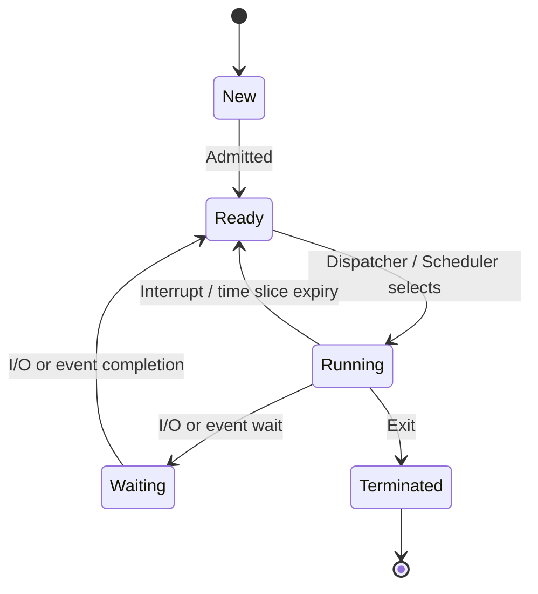

```text
                 admit
        New ------------► Ready ◄------------+
                               │             │
                    dispatch   │             │ interrupt /
                               ▼             │ time-slice end
                            Running ---------+
                               │
                    I/O or     │     I/O or event
                    event wait │     completion
                               ▼
                            Waiting
                               │
        Running ──exit──► Terminated
```

**Important Points**

- Five states: New, Ready, Running, Waiting, Terminated  
- Ready → Running via short-term scheduler/dispatcher  
- Running → Waiting on I/O; Waiting → Ready when I/O done  
- Running → Ready on interrupt/preemption  

**For Exam**

A process moves among New, Ready, Running, Waiting and Terminated. Only one process runs on a CPU at a time (per core); others wait in ready or device queues. The PCB stores all information needed to pause and resume a process.

**Diagram (refer SLM):** Fig 4.3.1 Process in memory; Fig 4.3.2 PCB

**Previously Asked Questions**

- **Q31** (4 marks, Apr 2025) — Difference between a process and a program.
  - *Answer:*  

    | Aspect | Program | Process |
    |--------|---------|---------|
    | Nature | Passive / passive entity | Dynamic / active entity |
    | Storage | Stored as a file on disk (secondary memory) | Exists in execution in main memory with resources |
    | Definition | Set of instructions written to perform a task | A **program in execution** |
    | Components | Code (source/object) | Code + PC + registers + stack + data (+ heap) + state |
    | Lifetime | Remains until deleted as a file | Created, scheduled, may wait, then terminates |
    | Multiplicity | One program file | Many processes can run from the same program |

    Example: the Word executable on disk is a program; each time you open Word, the OS creates a **process** with its own memory image and state (running while you type, waiting while loading a file, terminated when you quit). System calls can create subprocesses for concurrent work. Thus: **program = passive code; process = active execution of that code with state and resources.**

- **Q39** (15 marks, Apr 2025) — Explain the process state diagram.
  - *Answer:*  
    **Introduction.** As a process executes, it changes **state**. The state reflects the current activity of the process. In a multiprogramming OS, many processes coexist; the CPU runs one at a time while others wait. The process state diagram shows legal transitions among states.  

    **States.**  
    1. **New** — process is being created (OS allocates PCB and resources).  
    2. **Ready** — process is loaded and waiting to be assigned to a processor; sits in the **ready queue**.  
    3. **Running** — instructions are being executed on the CPU.  
    4. **Waiting (Blocked)** — process cannot proceed until an event occurs (I/O completion, signal, child termination); placed in a **device/I/O queue**.  
    5. **Terminated** — process has finished; OS reclaims reusable resources.  

    **Transitions (draw clearly in the answer).**  
    - New → Ready: process is **admitted** (long-term scheduler / job admission).  
    - Ready → Running: **short-term (CPU) scheduler** selects it; **dispatcher** context-switches to it.  
    - Running → Ready: **interrupt** or **time-slice expiry** (preemption) — process still runnable.  
    - Running → Waiting: process issues **I/O request** or waits for an event.  
    - Waiting → Ready: event/I/O **completes**; process becomes runnable again.  
    - Running → Terminated: process **exits** (normal or abort).  

    **Link to scheduling queues.** Job queue holds all processes; ready queue holds ready processes; each device has a device queue. The PCB’s state field identifies which queue a process belongs to. Throughout its life a process **migrates** among these queues.  

    **Context switch.** When the CPU switches from one running process to another, the OS saves the old process’s state (PC, registers) into its PCB and loads the new process’s PCB — a **context switch** (no useful user work during CST).  

    **Conclusion.** The process state diagram is fundamental to understanding multiprogramming: it shows how the OS keeps the CPU busy by always having a ready process while others wait for I/O, and how preemption and blocking create the Ready ↔ Running ↔ Waiting cycles. *(Draw the five-state diagram with labelled arrows; mention PCB and queues for full marks.)*

- **Q11** (1 mark, SLM Model Set 1) — What does the PCB stand for?
  - *Answer:* **Process Control Block**.

- **Q22** (2 marks, SLM Model Set 1) — Explain the purpose of the "Program Counter" field in a PCB.
  - *Answer:* The **Program Counter (PC)** field in the PCB stores the **address of the next instruction** to be executed for that process. When the process is preempted or blocked, the OS saves the current PC into the PCB; when the process is resumed, the saved PC is reloaded so execution continues from the correct instruction. It is essential for correct **context switching**.

- **Q8** (1 mark, SLM Model Set 2) — What is the name of a program in execution?
  - *Answer:* A **process** (a program in execution).

- **Q32** (4 marks, SLM Model Set 2) — Illustrate the lifecycle of a process using a state diagram. Include all major states and transitions.
  - *Answer:* A process moves through five main states during its life:
    
    1. **New** — being created.  
    2. **Ready** — waiting for CPU assignment.  
    3. **Running** — executing on the CPU.  
    4. **Waiting (Blocked)** — waiting for I/O or an event.  
    5. **Terminated** — finished; resources reclaimed.
    
    **State diagram (draw this):**
    
    ```text
                     admit
            New ------------► Ready ◄------------+
                                   │             │
                        dispatch   │             │ interrupt /
                                   ▼             │ time-slice end
                                Running ---------+
                                   │
                        I/O or     │     I/O or event
                        event wait │     completion
                                   ▼
                                Waiting
                                   │
            Running ──exit──► Terminated
    ```
    
    **Transitions:** New→Ready (admit); Ready→Running (short-term scheduler/dispatcher); Running→Ready (preemption/time slice); Running→Waiting (I/O wait); Waiting→Ready (event done); Running→Terminated (exit). The **PCB** stores state so the process can be paused and resumed.


#### 4.3.4–4.3.10 Schedulers, Queues, Criteria, Preemptive vs Non-preemptive

**Theory**

**Process scheduling:** removing the current running process and selecting another according to a strategy — essential in multiprogramming.

**Queues:** Job queue (all processes); Ready queue (ready processes); Device queue (per I/O device).

**Schedulers:**

| Scheduler | Also called | Role |
|-----------|-------------|------|
| Long-term | Job scheduler | Selects which jobs enter memory / multiprogramming set (runs less often) |
| Short-term | CPU scheduler | Selects which ready process gets the CPU (runs very often) |
| Medium-term | Swapper | Swaps suspended processes out/in; adjusts degree of multiprogramming |

**Context switch:** save old process state, load new; CST is overhead.

**Scheduling criteria:** CPU utilisation ↑, Throughput ↑, Turnaround time ↓, Waiting time ↓, Response time ↓.  
- TAT = CT − AT  
- WT = TAT − BT  

**Non-preemptive:** once running, process keeps CPU until it blocks or finishes. Examples: **FCFS**, **SJF**. SLM analogy: AVR booked in request order with **no priority interruption**.

**Preemptive (priority-based in SLM wording):** scheduler may **interrupt a low-priority running process** when a **high-priority** process becomes ready. Examples: **SRTF**, **Round Robin** (time quantum).

**Diagram — Priority vs non-priority scheduling sketch:**

```text
NON-PRIORITY / NON-PREEMPTIVE (e.g. FCFS)
  Ready: P1 P2 P3
  CPU:   [==== P1 ====][== P2 ==][= P3 =]
         (no interruption for a “more important” job)

PRIORITY / PREEMPTIVE
  t0: P_low running
  t1: P_high arrives → preempt P_low
  CPU: [P_low..][==== P_high ====][..P_low resumes..]
```

**Important Points**

- Long / Short / Medium schedulers  
- Non-preemptive ≈ no mid-run interruption for priority  
- Preemptive ≈ priority can seize CPU  
- FCFS, SJF vs SRTF, RR  

**For Exam**

Schedulers decide which process runs when. Non-preemptive algorithms (FCFS, SJF) do not interrupt a running process for a higher-priority arrival; preemptive/priority algorithms (SRTF, RR) can. Criteria: utilise CPU, maximise throughput, minimise TAT/WT/RT.

**Diagram (refer SLM):** Fig 4.3.3 Queuing diagram; Fig 4.3.4–4.3.15 Gantt charts for FCFS/SJF/SRTF/RR

**Previously Asked Questions**

- **Q27** (4 marks, Apr 2025) — Compare priority vs non-priority scheduling.
  - *Answer:*  

    | Point | Non-priority (Non-preemptive) scheduling | Priority (Preemptive) scheduling |
    |-------|------------------------------------------|----------------------------------|
    | Basic idea | Once a process enters the **running** state, it is **not interrupted** for another ready process until it finishes its CPU burst or blocks for I/O | Scheduler may **interrupt (preempt)** a **low-priority** running process when a **higher-priority** process enters the ready state |
    | Priority use | No priority-based seizing of the CPU; order by arrival (FCFS) or shortest job (SJF) without mid-run takeover for “importance” | Selection and preemption driven by **priority** (or remaining time / time slice treated as fairness priority) |
    | Examples (SLM) | **FCFS**, **SJF** | **SRTF**, **Round Robin** |
    | Analogy (SLM) | AVR room booked in request order; current booking runs its slot without being expelled for another department | University executives’ urgent meeting can **interrupt** a lower-priority department’s AVR booking |
    | Advantage | Simple; no unexpected preemption; lower context-switch rate from priority interrupts | Better response for urgent/interactive/high-priority work; can favour short remaining jobs (SRTF) or fair shares (RR) |
    | Disadvantage | Long / low-urgency jobs can delay important ones (**convoy effect** in FCFS) | More context switches; risk of **starvation** of low-priority processes if not careful |

    **Summary:** Non-priority/non-preemptive scheduling lets a running process keep the CPU until it blocks or completes. Priority/preemptive scheduling allows a more important (or shorter-remaining / next-quantum) process to take the CPU immediately, improving responsiveness at the cost of complexity and possible starvation.

- **Q31** (4 marks, SLM Model Set 1) — Differentiate preemptive and non preemptive scheduling algorithms.
  - *Answer:*  

    | Point | Non-preemptive scheduling | Preemptive scheduling |
    |-------|---------------------------|------------------------|
    | Basic idea | Once a process gets the CPU, it **keeps** it until it finishes its CPU burst or **blocks** (e.g. for I/O) | A running process **can be interrupted** and moved back to ready so another process runs |
    | When switch happens | Only on voluntary yield: terminate or wait for I/O/event | Also on higher-priority arrival, shorter remaining time, or time-quantum expiry |
    | Examples | **FCFS**, **SJF** | **SRTF**, **Round Robin**, many priority algorithms |
    | Context switches | Fewer (lower overhead) | More frequent (higher overhead) |
    | Responsiveness | May delay short/urgent jobs (e.g. convoy effect in FCFS) | Better response for interactive/urgent work |
    | Starvation risk | Long jobs can delay others | Low-priority processes may starve if not careful |

    **Summary:** Non-preemptive algorithms never forcibly take the CPU from a running process; preemptive algorithms may seize the CPU based on priority, remaining time or time slice to improve fairness/responsiveness.

- **Q38** (15 marks, SLM Model Set 1) — Consider the following table. And find average waiting time using the FCFS algorithm. Process(P) AT BT — P1: 0,4; P2: 2,5; P3: 3,3; P4: 4,2; P5: 5,1.
  - *Answer:*  
    **FCFS (First-Come-First-Served)** schedules processes in order of **arrival time**. A process runs to completion of its CPU burst once selected (non-preemptive).
    
    **Given:**

    | Process | Arrival Time (AT) | Burst Time (BT) |
    |---------|-------------------|-----------------|
    | P1 | 0 | 4 |
    | P2 | 2 | 5 |
    | P3 | 3 | 3 |
    | P4 | 4 | 2 |
    | P5 | 5 | 1 |
    
    **Step 1 — Order of execution (by arrival):** P1 → P2 → P3 → P4 → P5
    
    **Step 2 — Gantt chart / completion times:**  
    - P1 arrives at 0, starts at **0**, runs 4 → finishes at **4**.  
    - P2 arrives at 2, waits until P1 done, starts at **4**, runs 5 → finishes at **9**.  
    - P3 arrives at 3, starts at **9**, runs 3 → finishes at **12**.  
    - P4 arrives at 4, starts at **12**, runs 2 → finishes at **14**.  
    - P5 arrives at 5, starts at **14**, runs 1 → finishes at **15**.
    
    ```
    Gantt: |--P1--|----P2----|--P3--|-P4-|-P5|
           0      4          9      12   14  15
    ```
    
    **Step 3 — Waiting time** for each process:  
    \(WT = \text{Start time} - AT\) (equivalently \(WT = TAT - BT\), where \(TAT = CT - AT\)).
    
    | Process | Start | AT | WT = Start − AT | CT | TAT = CT − AT |
    |---------|-------|----|-----------------|----|---------------|
    | P1 | 0 | 0 | **0** | 4 | 4 |
    | P2 | 4 | 2 | **2** | 9 | 7 |
    | P3 | 9 | 3 | **6** | 12 | 9 |
    | P4 | 12 | 4 | **8** | 14 | 10 |
    | P5 | 14 | 5 | **9** | 15 | 10 |
    
    **Step 4 — Average waiting time:**  
    \[
    \text{Avg WT} = \frac{0 + 2 + 6 + 8 + 9}{5} = \frac{25}{5} = \mathbf{5}
    \]
    
    **Answer:** Average waiting time = **5 time units**.  
    *(Also state Avg TAT = (4+7+9+10+10)/5 = 40/5 = 8 if asked.)*

- **Q9** (1 mark, SLM Model Set 2) — Which scheduler is invoked every time the CPU requires a new process for execution?
  - *Answer:* The **short-term scheduler** (also called the **CPU scheduler**).

- **Q10** (1 mark, SLM Model Set 2) — Which scheduler helps in swapping?
  - *Answer:* The **medium-term scheduler** (swapper) — it swaps processes out of / into memory to adjust the degree of multiprogramming.

- **Q39** (15 marks, SLM Model Set 2) — Consider the following table. And find the average waiting time using the SJF algorithm. Process(P) AT BT — P1: 1,7; P2: 2,5; P3: 3,1; P4: 4,2; P5: 5,8.
  - *Answer:*  
    Assume each process is given as **(Arrival Time, Burst Time)**. Use **non-preemptive SJF** (Shortest Job First): among ready processes, choose the one with the **smallest burst time**.
    
    | Process | AT | BT |
    |---------|----|----|
    | P1 | 1 | 7 |
    | P2 | 2 | 5 |
    | P3 | 3 | 1 |
    | P4 | 4 | 2 |
    | P5 | 5 | 8 |
    
    **Step 1 — Schedule:**  
    - At t = 1 only **P1** is ready → run P1 for 7 → finishes at **t = 8** (WT = 0).  
    - At t = 8, ready: P2(BT=5), P3(BT=1), P4(BT=2), P5(BT=8). Shortest = **P3** → runs 1 → finishes at **t = 9** (WT = 8 − 3 = 5).  
    - Next ready: P2(5), P4(2), P5(8). Shortest = **P4** → runs 2 → finishes at **t = 11** (WT = 9 − 4 = 5).  
    - Next: P2(5), P5(8). Shortest = **P2** → runs 5 → finishes at **t = 16** (WT = 11 − 2 = 9).  
    - Last: **P5** → runs 8 → finishes at **t = 24** (WT = 16 − 5 = 11).
    
    ```
    Gantt: |--idle--|------P1------|-P3-|-P4-|----P2----|------P5------|
           0        1              8    9   11         16             24
    ```
    
    **Step 2 — Waiting times:**
    
    | Process | Start | AT | WT = Start − AT |
    |---------|-------|----|-----------------|
    | P1 | 1 | 1 | **0** |
    | P2 | 11 | 2 | **9** |
    | P3 | 8 | 3 | **5** |
    | P4 | 9 | 4 | **5** |
    | P5 | 16 | 5 | **11** |
    
    **Step 3 — Average waiting time:**  
    \[
    \mathrm{Avg\ WT} = \frac{0 + 9 + 5 + 5 + 11}{5} = \frac{30}{5} = \mathbf{6}
    \]
    
    **Answer:** Average waiting time = **6 time units**.


### Unit 4: Multiple Processor Scheduling

#### 4.4.1–4.4.2 Multiprocessor Scheduling Approaches

**Theory**

A **multiprocessor** has several processors. Categories:

- **Loosely coupled / distributed** — independent processors, own memory and I/O  
- **Functionally specialised** — master general-purpose CPU controls specialised processors  
- **Tightly coupled** — integrated OS control, **shared memory**, common bus/peripherals (homogeneous processors); used for bulk data (satellite, weather, etc.)

**Multiple-processor scheduling** designs the scheduling function when there is more than one CPU. Load is shared so processes can run simultaneously; more complex than uniprocessor scheduling. Systems may be **homogeneous** or **heterogeneous**.

**Two main approaches:**

1. **Asymmetric Multiprocessing (Master–Slave)** — one **master server** CPU handles all scheduling decisions and I/O; other CPUs execute only user code. Simple; less data sharing.  
2. **Symmetric Multiprocessing (SMP)** — each processor is **self-scheduling**; common ready queue or per-CPU private queues; each scheduler picks a ready process.

**Processor affinity:** keep a process on the same CPU to reuse warm cache.  
- **Soft affinity** — OS tries but does not guarantee  
- **Hard affinity** — process restricted to a CPU subset (e.g. Linux `sched_setaffinity`)

**Load balancing** (needed with per-CPU queues):  
- **Push migration** — balancer moves tasks from busy to idle CPUs  
- **Pull migration** — idle CPU pulls a waiting task from a busy CPU  

**Multicore:** multiple cores on one chip; OS sees separate processors. **Memory stall** (e.g. cache miss) wastes time; hardware multithreading helps:  
- **Coarse-grained** — switch on long-latency event (expensive pipeline refill)  
- **Fine-grained** — switch at instruction-cycle granularity (cheap)

**SMP contentions:** locking, shared data consistency, **cache coherence**.

**Virtualization & threading:** hypervisor presents virtual CPUs to guest OSes; guests think they own the CPU but share physical cycles — can break assumptions of time-sharing quanta and clock accuracy.

**Important Points**

- Asymmetric = master schedules; Symmetric = each CPU self-schedules  
- Affinity (soft/hard); Load balancing (push/pull)  
- Multicore + memory stall + coarse/fine multithreading  
- Virtualization layers scheduling and can hurt guest OS timing  

**For Exam**

Multiprocessor scheduling shares load across CPUs. Asymmetric: one master does OS scheduling/I/O. Symmetric: every CPU schedules itself from shared or private ready queues. Affinity preserves cache warmth; load balancing prevents idle/busy imbalance. Multicore and virtualization add further scheduling complexity.

**Diagram (refer SLM):** Fig 4.4.1 Approaches; Fig 4.4.2 Processor affinity types; Fig 4.4.3 Load balancing; Fig 4.4.4 Multithreading ways; Fig 4.4.5 Master–Slave; Fig 4.4.6 Types of multiprocessors

**Previously Asked Questions**

- **Q10** (1 mark, SLM Model Set 1) — Which multiprocessor system contains a master slave relationship?
  - *Answer:* **Asymmetric multiprocessing (AMP)** / master–slave multiprocessor system.


## Block 5: Process Synchronization

### Unit 1: Interprocess Communication

#### 5.1.1 Process — Concept and Structure

**Theory**

A **process** is a **program in execution**. A program stored on disk is a passive entity; when its executable is loaded into RAM, it becomes an active process with its own resources and execution state. In memory, a process typically has four segments: **text** (code + PC/registers activity), **data** (global/static variables), **heap** (dynamic allocation), and **stack** (temporary data — parameters, return addresses, locals).

| Aspect | Program | Process |
|--------|---------|---------|
| Nature | Passive set of instructions | Active execution instance |
| Storage | Secondary memory | Exists in time in main memory |
| Resources | None by itself | Needs CPU, memory, I/O |
| Control | No PCB | Has Process Control Block (PCB) |

**Important Points**

- Process = program in execution
- Segments: text, data, heap, stack
- Same program can create multiple processes (separate data/heap/stack; shared text possible)
- Background service processes are called **daemons**

**For Exam**

A process is a program in execution. Unlike a static program on disk, a process is dynamic, has a PCB, and needs CPU, memory and I/O. Its memory image includes text, data, heap and stack segments.

**Diagram (refer SLM):** Fig. 5.1.1 A process in memory


#### 5.1.2 Process States and PCB

**Theory**

As a process executes it moves through states: **New → Ready → Running → Waiting → Terminated** (plus suspended ready/wait when swapped out). Transitions include Admitted, Scheduler Dispatch, I/O wait, I/O completion, Interrupt, Exit. The OS stores process details in a **Process Control Block (PCB)** / task control block: identifier, state, priority, program counter, memory pointers, context data, I/O status, accounting information.

**Important Points**

- Five main states: New, Ready, Running, Waiting, Terminated
- Only one process runs on a processor at an instant; many may be ready/waiting
- PCB fields: PID, state, priority, PC, memory pointers, context, I/O, accounting
- Creation: boot, `fork()`, user request, batch job
- Termination: normal exit, error exit, fatal error, killed by another process, parent exit, etc.

**For Exam**

Process states track activity from creation to completion. The PCB is the OS data structure that represents a process and holds its identity, state, PC, registers/context and resource info so the OS can switch and resume correctly.

**Diagram (refer SLM):** Fig. 5.1.2 Process State Diagram; Fig. 5.1.3 Simplified PCB


#### 5.1.5 Interprocess Communication (IPC)

**Theory**

Processes are **independent** (execution of one does not affect another) or **cooperating** (execution can affect/be affected by others). Cooperating processes need **IPC** — a mechanism to communicate and synchronise actions.

**Purposes of IPC:** data transfer, sharing data, event notification, resource sharing, synchronization, process control.

**Two broad models**

1. **Shared memory** — cooperating processes share a memory region; they read/write that region.
2. **Message passing** — processes exchange messages (often via queues); no need to share address space.

**IPC methods (as in SLM)**

1. **Pipes** — unidirectional flow between related processes (write end → read end).
2. **Named pipes (FIFO)** — bidirectional; usable by unrelated processes that know the pipe name.
3. **Message queuing** — messages stored until the receiver retrieves them (asynchronous; like a mailbox).
4. **Semaphores** — synchronisation integers used with shared memory access.
5. **Shared memory** — fastest data exchange via a defined memory area (needs sync).
6. **Sockets** — client–server communication over a network; OS/computer independent.

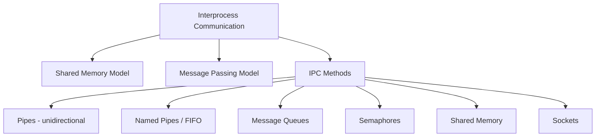

**ASCII overview**

```
  Process A ----pipe/named pipe----> Process B
  Process A ----message queue------> Process B
  Process A <=== shared memory ====> Process B   (+ semaphore lock)
  Process A <======= socket =======> Process B (often over network)
```

**Important Points**

- Independent vs cooperating processes
- Shared memory = read/write common region; Message passing = send/receive messages
- Pipe = one direction; Named pipe = two-way, unrelated processes OK
- Message queue: sender/receiver need not meet in time
- Shared memory usually needs semaphore/mutex for safe access
- Sockets: network client–server IPC

**For Exam**

IPC lets processes exchange data and synchronise. Main approaches are shared memory and message passing. Concrete methods include pipes, named pipes (FIFO), message queues, semaphores, shared memory and sockets. Shared memory is fast but needs synchronisation; message queues store messages until retrieved; sockets suit networked client–server communication.

**Diagram (refer SLM):** Fig. 5.1.5 Pipe within one process

**Previously Asked Questions**

- **Q28** (4 marks, Apr 2025) — Explain different inter process communications.  
  - *Answer:* Interprocess communication (IPC) allows processes to exchange information and synchronise. Two main models are **shared memory** (processes read/write a common memory region) and **message passing** (processes exchange messages, often via queues). Common methods: **(1) Pipes** — unidirectional data flow between related processes; **(2) Named pipes (FIFO)** — bidirectional communication even between unrelated processes that know the pipe name; **(3) Message queues** — messages stored until the receiver retrieves them; sender and receiver need not be active together; **(4) Shared memory** — processes exchange data through a defined memory area (usually protected by semaphores); **(5) Semaphores** — integer synchronisers used with shared resources; **(6) Sockets** — standard connection for client–server communication over a network, independent of OS. Purposes include data transfer, sharing, event notification, resource sharing, synchronisation and process control.

- **Q39** (15 marks, SLM Model Set 1) — Explain the various methods of Inter-Process Communication (IPC) in detail. Explain how the Dining Philosophers Problem demonstrates a deadlock situation.
  - *Answer:*  
    **Part A — IPC methods in detail**
    
    Interprocess Communication (IPC) lets **cooperating processes** exchange data and synchronise. Two broad models: **shared memory** and **message passing**. Concrete methods:
    
    **1. Pipes:** Unidirectional byte stream between **related** processes (typically parent–child). One process writes to the write end; the other reads from the read end. Simple and efficient for producer–consumer style flow on one machine, but only one direction and limited to related processes.
    
    **2. Named pipes (FIFO):** Appear as a named special file in the filesystem. Processes that know the name can communicate even if **unrelated**; communication can be treated as bidirectional (open for read and write). Useful for local IPC beyond parent–child.
    
    **3. Message queues:** Messages are stored in a kernel-managed queue until the receiver retrieves them. Sender and receiver need **not** meet in time (asynchronous). Supports typed/prioritised messages; good when buffering and decoupling are needed.
    
    **4. Shared memory:** Processes map a common memory region into their address spaces and read/write directly — usually the **fastest** IPC for bulk data. Requires explicit **synchronisation** (mutex/semaphore) to avoid race conditions.
    
    **5. Semaphores:** Integer synchronisation objects accessed by atomic **wait()** and **signal()**. Used with shared memory or resources to enforce mutual exclusion and ordering (not primarily for transferring large data payloads).
    
    **6. Sockets:** Endpoints for communication, often over a **network** (client–server). OS-independent interface; support connection-oriented or datagram styles. Essential for distributed IPC.
    
    **Purposes:** data transfer, sharing, event notification, resource sharing, synchronisation, process control.
    
    **Part B — Dining Philosophers and deadlock**
    
    **Problem:** Five philosophers sit around a table with five chopsticks (one between each pair). Each needs **two** chopsticks (left and right) to eat; otherwise thinks.
    
    **Deadlock scenario:** If every philosopher picks up the **left** chopstick simultaneously, each holds one chopstick and waits forever for the right one held by the neighbour. All four Coffman conditions hold:  
    - **Mutual exclusion** — a chopstick is held by at most one philosopher.  
    - **Hold and wait** — holds left while waiting for right.  
    - **No preemption** — chopsticks are not forcibly taken.  
    - **Circular wait** — P0 waits for P1’s chopstick … P4 waits for P0’s.  
    
    Thus the system deadlocks and nobody eats. Solutions include: pick up both chopsticks only if both free (monitor/`test`), asymmetric picking (odd/even different order), or allowing at most four philosophers to try at once — breaking circular wait / hold-and-wait.
    
    *(Draw philosophers and chopsticks in a circle for the answer booklet.)*

- **Q11** (1 mark, SLM Model Set 2) — What does IPC stand for?
  - *Answer:* **Inter-Process Communication** (Interprocess Communication).


#### 5.1.6 IPC Issues — Race Condition, Critical Section, Mutual Exclusion

**Theory**

IPC raises three issues: how to pass information; how to avoid processes interfering in critical activity; how to ensure correct sequencing when there are dependencies.

A **race condition** occurs when two or more processes read/write shared data and the final result depends on *who runs when* (timing/order). Classic example: Alice and Bob withdraw ₹500 from a ₹1000 joint account concurrently; without locks both read ₹1000 and both write ₹500 → wrong final balance ₹500 instead of ₹0.

**Mutual exclusion** ensures that if one process is using a shared variable/file, others are excluded from doing the same.

The **critical section (critical region)** is the part of the program that accesses shared memory/resources. A solution must satisfy:

1. **Mutual exclusion** — only one process in its critical section at a time  
2. **Progress** — decision of who enters next cannot be postponed indefinitely if CS is free  
3. **Bounded waiting** — a limit on how many times others may enter before a waiting process’s request is granted  

**Important Points**

- Race condition → unpredictable shared-data outcome
- Critical section = shared-resource access code
- Three requirements: mutual exclusion, progress, bounded waiting
- Solution idea: prohibit simultaneous read/write of shared memory

**For Exam**

Mutual exclusion means only one process may use a shared resource (critical section) at a time. Without it, concurrent updates cause race conditions and inconsistent results. Any correct critical-section solution must also ensure progress and bounded waiting.

**Previously Asked Questions**

- **Q7** (1 mark, Apr 2025) — What is Mutual exclusion?  
  - *Answer:* Mutual exclusion is a synchronisation principle that ensures if one process is using a shared variable or file (critical section), no other process can use that same shared resource at the same time.


### Unit 2: Introduction to Process Synchronization (Mutual Exclusion)

#### 5.2.1–5.2.2 Need for Synchronization

**Theory**

**Process synchronisation** manages cooperating processes that share memory/resources so that data stays consistent — only one process may modify shared data at a time (via locks, semaphores, hardware support, etc.).

| Type | Meaning |
|------|---------|
| **Competition synchronisation** | Processes compete for the same non-simultaneously usable resource |
| **Cooperation synchronisation** | One process must wait for another’s task to finish before proceeding |

Lack of synchronisation may cause **inconsistency**, **loss of data**, or **deadlock**.

**Important Points**

- Independent processes need no sync; cooperative processes do
- Competition vs cooperation synchronisation
- Failures without sync: inconsistency, data loss, deadlock

**For Exam**

Process synchronisation controls concurrent access to shared resources so results remain consistent. Competition sync handles exclusive resource use; cooperation sync enforces ordering (P2 waits for P1).


#### 5.2.3 Critical Section Structure

**Theory**

A critical section is a code segment accessing shared variables that must execute as an **atomic** action. Structure of a process:

```
do {
  // Entry section   (request permission — e.g. wait)
  // Critical section
  // Exit section    (release — e.g. signal)
  // Remainder section
} while (TRUE);
```

Entry uses **wait()**-style logic; exit uses **signal()**-style logic.


**ASCII — mutual exclusion idea**

```
  Process Pi                Shared resource                Process Pj
      |                          |                              |
   Entry: lock ----------------->|  BUSY                        |
      |                     CRITICAL SECTION                    |
   Exit: unlock ---------------->|  FREE                        |
      |                          |<---------------------- Entry |
```

**Important Points**

- Only one process in CS at a time
- Entry / Critical / Exit / Remainder
- Requirements: Mutual Exclusion, Progress, Bounded Waiting

**For Exam**

The critical-section problem requires that among cooperating processes, only one executes its critical section at a time. Entry and exit protocols enforce mutual exclusion, progress and bounded waiting.

**Diagram (refer SLM):** Fig 5.2.1 Mutex Lock; Fig 5.2.2 Semaphore


#### 5.2.4 Solutions — Peterson, Hardware, Mutex, Semaphores

**Theory**

**Peterson’s solution** (software, typically 2 processes): shared `flag[i]` and `turn`. Process sets its flag, gives turn to the other, then spins while the other wants CS and turn is the other’s. Satisfies all three CS requirements but uses **busy waiting**, limited to 2 processes, not suited to modern CPUs.

**Synchronisation hardware:** disable interrupts on uniprocessors while modifying shared data; not practical on multiprocessors (message delay, efficiency loss).

**Mutex locks:** mutual exclusion object; only one thread holds the lock and enters CS; releases on exit.

**Semaphores:** integer variable accessed only via atomic **wait()** / **signal()** (P/V). Binary (0/1 ≈ mutex) or counting (resource pool).

**Classical problems:** Producer–Consumer (bounded buffer), Readers–Writers, Dining Philosophers (can deadlock if all pick one chopstick — circular wait).

**Important Points**

- Peterson: flag + turn; busy wait; 2 processes
- Mutex: lock before CS, unlock after
- Semaphore: wait decrements (block if ≤0), signal increments
- Classical problems demonstrate sync needs / deadlock risk

**For Exam**

Critical-section solutions include Peterson’s algorithm, interrupt disabling, mutex locks and semaphores. Mutex/binary semaphore ensure exclusive access. Classical problems (producer–consumer, readers–writers, dining philosophers) show why careful synchronisation is required.

**Diagram (refer SLM):** Fig. 5.2.3 Dining Philosophers


### Unit 3: Semaphores and Monitors

#### 5.3.1 Semaphores

**Theory**

A **semaphore S** is an integer variable (apart from initialisation) accessed only through atomic operations:

```
wait(S)  { while (S <= 0);  S--; }   // P — may busy-wait / block
signal(S){ S++; }                   // V
```

Modifications must be **indivisible** (atomic).

| Type | Range | Use |
|------|-------|-----|
| **Binary semaphore** | 0 or 1 | Mutual exclusion (like mutex) |
| **Counting semaphore** | unrestricted | Control access to N instances of a resource |

**Ordering example:** To ensure S2 in P2 runs only after S1 in P1: initialise `synch = 0`; after S1 do `signal(synch)`; before S2 do `wait(synch)`.

**Bounded-buffer (producer–consumer) with semaphores**

- `mutex = 1` — mutual exclusion on buffer  
- `empty = n` — empty slots  
- `full = 0` — filled slots  

Producer: `wait(empty); wait(mutex);` … add item … `signal(mutex); signal(full);`  
Consumer: `wait(full); wait(mutex);` … remove item … `signal(mutex); signal(empty);`

**Important Points**

- Semaphore = integer + wait/signal only
- Binary ≈ mutex; Counting = N resources
- Incorrect use (swap wait/signal, omit one) → mutual exclusion violation or **deadlock**
- Bounded buffer needs mutex + empty + full

**For Exam**

A semaphore is an integer synchronisation variable accessed only by atomic wait() and signal(). Binary semaphores provide mutual exclusion; counting semaphores manage limited resource pools. The bounded-buffer problem uses mutex, empty and full semaphores so producer and consumer never corrupt the shared buffer.

**Previously Asked Questions**

- **Q12** (1 mark, SLM Model Set 1) — What are the two atomic operations permissible on semaphores?
  - *Answer:* **wait()** and **signal()** (also called **P** and **V**).

- **Q13** (1 mark, SLM Model Set 1) — What is the purpose of the wait() operation in semaphores?
  - *Answer:* **wait()** (P) **decrements** the semaphore; if the value would become negative (or is ≤ 0 before wait in blocking implementations), the calling process is **blocked** until a later **signal()** makes the resource available.

- **Q12** (1 mark, SLM Model Set 2) — What does the signal() operation do in semaphores?
  - *Answer:* **signal()** (V) **increments** the semaphore value and may **wake a waiting process** that was blocked on that semaphore.


#### 5.3.2 Monitors

**Theory**

Incorrect semaphore use causes hard-to-reproduce timing bugs. A **monitor** is a high-level ADT that packages shared data with operations and **automatically ensures only one process is active inside the monitor** at a time.

**Condition variables** (`condition x`): `x.wait()` suspends the caller until another process does `x.signal()`. Unlike semaphore signal, if no one is waiting, condition `signal()` has no effect.

**Signal policies:** Signal-and-wait vs Signal-and-continue (who runs next after signal).

**Dining philosophers with monitor:** states THINKING / HUNGRY / EATING; philosopher picks up chopsticks only if **both** available (`test(i)`); prevents neighbouring eaters and avoids deadlock (starvation still possible).

**Important Points**

- Monitor = mutual exclusion built into the language construct
- Condition wait/signal for extra synchronisation
- Safer than raw semaphores for many CS problems
- Monitor dining solution: both chopsticks or none

**For Exam**

A monitor is a high-level synchronisation construct (ADT) that guarantees mutual exclusion among its procedures. Condition variables let processes wait for and signal specific events. Monitors reduce programming errors common with semaphores.


### Unit 4: Deadlock

#### 5.4.1–5.4.2 Deadlock Definition and Four Conditions

**Theory**

**Resources** (CPU, memory, I/O, drivers, semaphores, monitors, …) are requested, used, then released. A **deadlock** is a situation where a set of processes is blocked forever because each holds a resource and waits for a resource held by another process in the set — none can proceed.

**Four necessary conditions** (all must hold simultaneously):

1. **Mutual exclusion** — at least one resource is non-shareable  
2. **Hold and wait** — process holds ≥1 resource while waiting for others  
3. **No pre-emption** — resources cannot be forcibly taken; released voluntarily  
4. **Circular wait** — circular chain P0 waits for P1’s resource … Pn waits for P0’s  

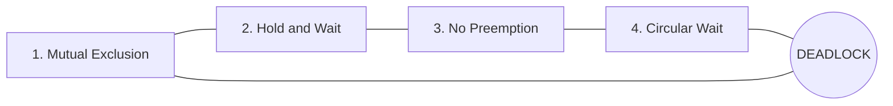

**Resource-allocation sketch (ASCII)**

```
     Request edge:  Pi -----> Rj   (Pi waiting for Rj)
  Assignment edge:  Rj -----> Pi   (Rj allocated to Pi)

  Example cycle (deadlock):
     P1 → R1 → P2 → R3 → P3 → R2 → P1
```

**Important Points**

- Deadlock = circular blocking on resources
- All four Coffman conditions required
- Resource-allocation graph: cycle ⇒ deadlock (single-instance resources); with multi-instance, cycle is necessary but not always sufficient
- Handling: prevent, avoid, detect & recover, or ignore (ostrich)

**For Exam**

Deadlock occurs when processes wait indefinitely for resources held by each other. It arises only if mutual exclusion, hold-and-wait, no pre-emption and circular wait all hold. Breaking any one condition prevents deadlock.

**Diagram (refer SLM):** Fig 5.4.1–5.4.4 Deadlock / Resource Allocation Graph

**Previously Asked Questions**

- **Q25** (2 marks, Apr 2025) — What do you mean by deadlock?  
  - *Answer:* Deadlock is a situation in which a set of processes is permanently blocked because each process holds at least one resource and is waiting for a resource that is held by another process in the set, so none of the processes can proceed.

- **Q23** (2 marks, SLM Model Set 1) — Explain the 'hold and wait' condition.
  - *Answer:* **Hold and wait** means a process **holds at least one resource** while **waiting** to acquire additional resources that are currently held by other processes. It is one of the four necessary conditions for deadlock. (Prevention approaches: require all resources to be requested at once, or force a process to release held resources before requesting new ones.)

- **Q32** (4 marks, SLM Model Set 1) — Explain the concept of deadlock with an example.
  - *Answer:* **Deadlock** is a permanent blocking of a set of processes where each holds some resources and waits for resources held by another in the set, so none can proceed. It occurs only when all four conditions hold together: mutual exclusion, hold and wait, no preemption, and circular wait.
    
    **Example:** Process P1 holds tape drive T and requests printer Pr; process P2 holds printer Pr and requests tape T.  
    - P1 → waits for Pr (held by P2)  
    - P2 → waits for T (held by P1)  
    Neither can finish or release what the other needs → **deadlock** (circular wait).
    
    Another classic example is the **Dining Philosophers**: if each picks one chopstick and waits for the second, all wait forever.
    
    **Note:** Breaking any one Coffman condition prevents deadlock.


#### 5.4.3 Deadlock Prevention, Avoidance, Banker's Algorithm

**Theory**

**Prevention:** ensure at least one of the four conditions never holds (restrict how requests are made — may lower utilisation).

**Avoidance:** OS is told maximum future needs; it grants a request only if the resulting state stays **safe**.

**Safe state:** there exists a **safe sequence** ⟨P1…Pn⟩ such that each Pi’s remaining needs can be satisfied by currently available resources plus those held by earlier processes in the sequence. Safe ⇒ not deadlocked; unsafe may lead to deadlock.

**Banker’s algorithm** (Dijkstra) — avoidance for systems with **multiple instances** of resource types (named like a banker who never lends so much cash that customers’ max claims cannot all be met).

Each process declares **max** need. System tracks:

- **Available** — free instances of each type  
- **Max** / **Allocation** / **Need** (= Max − Allocation)  

**Safety idea (simple):** repeatedly find a process whose Need ≤ Available; pretend it finishes and releases Allocation back to Available; if all processes can finish this way → **safe**; else **unsafe**.

**Resource-request steps:** if Request ≤ Need and Request ≤ Available, tentatively allocate; run safety check; if safe, keep allocation; else restore old state and make process wait.

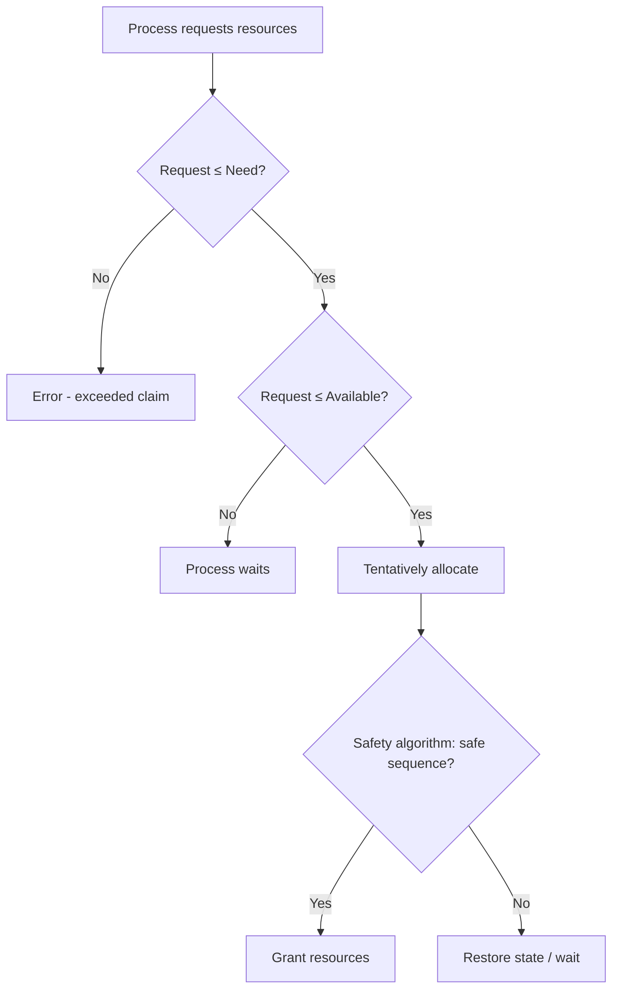

**ASCII — Banker's safety idea**

```
  Available = free pool
  While processes remain:
    Find Pi with Need[i] ≤ Available
    If none → UNSAFE
    Else simulate: Available += Allocation[i]; mark Pi finished
  If all finished → SAFE (safe sequence found)
```

**Important Points**

- Safe sequence ⇒ system can avoid deadlock
- Banker needs Max claims in advance
- Grant only if post-allocation state is safe
- Detection: wait-for graph (single instance) or similar algorithms (multi-instance); recovery: kill process / pre-empt resources

**For Exam**

Banker’s algorithm is a deadlock-avoidance method. Processes declare maximum resource needs. Before granting a request, the OS checks whether the resulting allocation leaves a **safe state** (a safe sequence exists). If yes, allocate; if not, the process waits. This is like a bank never allocating cash so that it cannot still meet every customer’s maximum claim.

**Diagram (refer SLM):** Fig 5.4.5 Safe/unsafe/deadlocked; Fig 5.4.6 Claim-edge RAG

**Previously Asked Questions**

- **Q29** (4 marks, Apr 2025) — Discuss banker's algorithm.  
  - *Answer:* Banker’s algorithm is a **deadlock-avoidance** technique for systems with multiple instances of resource types. When a process enters, it must declare the **maximum** number of instances of each resource it may need. The OS maintains Available, Max, Allocation and Need matrices. When a process requests resources, the system first checks that the request does not exceed Need or Available. It then **tentatively allocates** and runs the **safety algorithm**: if there is a sequence of processes that can all finish with the remaining resources (a safe sequence), the state is safe and the request is granted; otherwise the old state is restored and the process must wait. Thus the system never enters an unsafe state that could lead to deadlock — analogous to a banker who never lends so much that remaining cash cannot cover customers’ maximum claims.

- **Q33** (4 marks, SLM Model Set 1) — Describe the steps involved in the Banker's Resource-Request Algorithm.
  - *Answer:* When process \(P_i\) requests resources (vector Request\(_i\)):
    
    **Step 1:** If Request\(_i\) ≤ Need\(_i\), go to Step 2; else **error** (process has exceeded its maximum claim).
    
    **Step 2:** If Request\(_i\) ≤ Available, go to Step 3; else \(P_i\) must **wait** (resources not free).
    
    **Step 3:** **Tentatively allocate** as if the request were granted:  
    Available ← Available − Request\(_i\)  
    Allocation\(_i\) ← Allocation\(_i\) + Request\(_i\)  
    Need\(_i\) ← Need\(_i\) − Request\(_i\)
    
    **Step 4:** Run the **safety algorithm**. If the resulting state is **safe**, keep the allocation and grant the request; if **unsafe**, **restore** the previous Available/Allocation/Need and make \(P_i\) wait.
    
    Thus resources are granted only when the system remains in a safe state.


## Block 6: Memory Management and File Systems

### Unit 1: Memory Management Strategies

#### 6.1.1–6.1.2 Memory Management Overview

**Theory**

**Memory management** controls and coordinates RAM so running processes get suitable blocks with protection and sharing. Requirements: **Relocation, Protection, Sharing, Logical organisation, Physical organisation**.

- **Real memory management:** manage physical RAM (mono- / multiprogramming).  
- **Virtual memory management:** execute processes even if not fully in RAM (paging, segmentation, paged segmentation) — illusion of larger memory.

**Logical vs physical address:** CPU generates **logical (virtual)** addresses; **MMU** maps them to **physical** addresses in RAM using base/limit (relocation) registers. **Dynamic relocation:** physical = logical + base (checked against limit).

**Address binding:** compile time, load time, or execution time.

**Important Points**

- Primary (volatile RAM) vs secondary (non-volatile disk)
- Logical address space vs physical address space
- Base = start; Limit = size; MMU does mapping
- Binding: compile / load / execution time

**For Exam**

Memory management allocates and protects main memory among processes. The CPU uses logical addresses; the MMU relocates them to physical addresses using base and limit registers so processes stay within their allocated region.

**Diagram (refer SLM):** Fig 6.1.1 Base and Limit; Fig 6.1.2 Relocation

**Previously Asked Questions**

- **Q14** (1 mark, SLM Model Set 1) — What does MMU stand for in the context of memory management?
  - *Answer:* **Memory Management Unit**.

- **Q15** (1 mark, SLM Model Set 1) — What is the primary role of the operating system in memory management?
  - *Answer:* To **keep track of memory**, **allocate and deallocate** memory to processes, and provide **protection** (and sharing) so processes use only their allowed regions.

- **Q33** (4 marks, SLM Model Set 2) — Explain the concept of logical and physical address space in memory management.
  - *Answer:*  
    **Logical (virtual) address space** is the set of addresses generated by the CPU / program — what the process “sees”.  
    **Physical address space** is the set of actual addresses in main memory (RAM).
    
    The **MMU** translates logical addresses to physical addresses (e.g. using base/limit registers, or page/segment tables). With **dynamic relocation**, physical = logical + base (checked against limit). Binding can occur at compile, load or execution time; execution-time binding with an MMU allows processes to be moved in memory and supports virtual memory. Logical and physical spaces need not be the same size — virtual memory makes the logical space appear larger than physical RAM.


#### 6.1.8 Swapping

**Theory**

All runnable/blocked processes need memory, but RAM is limited. **Swapping** temporarily moves a process from main memory to secondary **swap space** (backing store) so another process can use RAM.

- **Swap-out:** RAM → disk  
- **Swap-in:** disk → RAM  

Typically a blocked/low-priority process is swapped out to free space for a ready process.

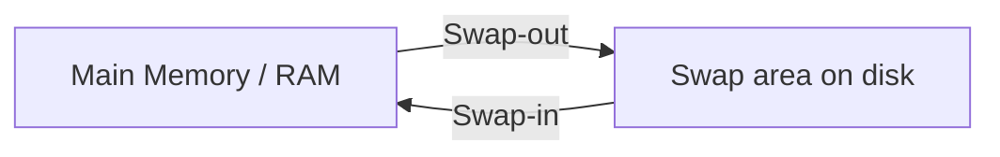

**ASCII — swapping**

```
  Before:  [OS][P1 blocked][P3]     P2 needs space
  Swap-out P1 -----> swap area
  After:   [OS][P2 ready  ][P3]     P1 on disk until needed again
```

**Important Points**

- Improves multiprogramming / memory utilisation
- Swap area = secondary storage region for swapped processes
- Related to suspended ready / suspended wait states

**For Exam**

Swapping is a memory management scheme in which a process is temporarily moved from main memory to secondary storage (swap space) so that memory becomes available for other processes; later it can be swapped back in for execution.

**Diagram (refer SLM):** Fig. 6.1.3 Swapping of two processes

**Previously Asked Questions**

- **Q15** (1 mark, Apr 2025) — What is Swapping?  
  - *Answer:* Swapping is temporarily moving a process from main memory to secondary memory (swap space) so that main memory can be made available for other processes, and later bringing it back when needed.


#### 6.1.8 Contiguous vs Non-contiguous Allocation

**Theory**

| Scheme | Idea | Subtypes / notes |
|--------|------|------------------|
| **Contiguous** | Process gets consecutive locations | Fixed partitioning; Dynamic partitioning |
| **Non-contiguous** | Process parts placed in scattered locations | Paging; Segmentation |

**Fixed partitioning:** RAM divided into fixed partitions → **internal fragmentation**; limited multiprogramming.

**Dynamic partitioning:** partition size = process size → no internal fragmentation, but **external fragmentation** (holes too small/scattered). **Compaction** merges free space (costly).

**Placement algorithms:** First-fit, Next-fit, Best-fit, Worst-fit.

**Disadvantages of contiguous allocation (exam focus):**

- **Internal fragmentation** (fixed partitions / leftover inside allocated block)
- **External fragmentation** (dynamic partitions — enough total free memory but not contiguous)
- Process must fit in one contiguous hole; limited flexibility; compaction overhead

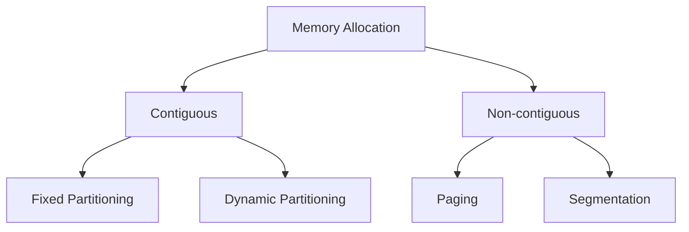

**ASCII — contiguous vs paging**

```
  Contiguous:     [==== Process A ====][==B==][ hole ][==C==]
  Paging:         Frame0: A.2 | Frame1: B.0 | Frame2: A.0 | Frame3: A.1
                  (pages of A not adjacent in physical memory)
```

**Important Points**

- Contiguous = consecutive addresses
- Fixed → internal fragmentation; Dynamic → external fragmentation
- Compaction fights external fragmentation
- Non-contiguous (paging/segmentation) reduces contiguous-fit problems

**For Exam**

In contiguous allocation a process occupies consecutive memory locations (fixed or dynamic partitions). Main disadvantages are **internal and external fragmentation**: wasted space inside allocated blocks or unusable scattered holes. Non-contiguous schemes like paging place process pieces in separate frames.

**Diagram (refer SLM):** Fig 6.1.4 Fixed partition; Fig 6.1.5–6.1.6 Dynamic / external fragmentation

**Previously Asked Questions**

- **Q8** (1 mark, Apr 2025) — What are the disadvantages of contiguous memory allocation?  
  - *Answer:* Contiguous memory allocation suffers from **internal fragmentation** and **external fragmentation** (wasted memory that cannot be used efficiently for new processes).

- **Q34** (4 marks, SLM Model Set 1) — How does the best-fit algorithm work for dynamic memory allocation?
  - *Answer:* **Best-fit** is a placement strategy for **dynamic (variable) partitioning**. When a process of size *n* requests memory, the allocator searches the list of free holes and chooses the **smallest hole that is large enough** to hold the process (i.e. the tightest fit).
    
    **Working steps:**  
    1. Scan available free blocks (holes).  
    2. Among holes with size ≥ *n*, select the one with **minimum leftover** (size − *n* is smallest).  
    3. Allocate that hole (or part of it) to the process.  
    4. Any remaining fragment becomes a new (usually smaller) hole.
    
    **Aim:** Reduce wasted space compared with first-fit by not leaving large unused leftovers in oversized holes.  
    **Drawback:** Tends to leave many **tiny unusable holes** (external fragmentation); searching the whole list can be slower than first-fit.

- **Q23** (2 marks, SLM Model Set 2) — How does the compaction technique address external fragmentation?
  - *Answer:* **Compaction** moves allocated memory blocks together so all free holes are merged into **one large contiguous free region**. After compaction, a new process that previously could not fit in scattered holes can be placed in the combined free space. It reduces **external fragmentation** but is **costly** (requires relocating processes and updating address maps).


### Unit 2: Paging and Segmentation

#### 6.2.1–6.2.3 Paging

**Theory**

**Paging** divides process into fixed-size **pages** and physical memory into same-sized **frames**. Pages may map to non-contiguous frames. A **page table** maps page number → frame number. High paging activity = **thrashing**.

Logical address = **(page number p, page offset d)**. MMU indexes page table with p, concatenates frame number with d → physical address. **PTBR** points to the page table.

**Advantages:** no external fragmentation; non-contiguous placement.  
**Disadvantages:** internal fragmentation (last page); page-table overhead; extra memory access time.

**Important Points**

- Page size = frame size (often power of two)
- Page table entry: page → frame
- Solves external fragmentation; may have internal fragmentation
- Physical address = Frame number + Offset

**For Exam**

Paging is a non-contiguous scheme where processes are split into fixed-size pages and memory into frames. The page table maps logical page numbers to physical frames, allowing a process to be scattered in RAM without external fragmentation.

**Diagram (refer SLM):** Fig 6.2.1–6.2.2 Page table / address translation

**Previously Asked Questions**

- **Q22** (2 marks, SLM Model Set 2) — What is the purpose of a Page Table?
  - *Answer:* A **page table** maps each **logical page number** of a process to the **physical frame number** where that page resides in RAM. The MMU uses it to translate a logical address (page number + offset) into a physical address (frame number + offset), enabling non-contiguous placement of a process in memory.


#### 6.2.4 Segmentation

**Theory**

**Segmentation** divides a program into logical **variable-sized segments** (code, stack, modules). A **segment table** stores **base** and **limit** for each segment; **STBR** points to it. Logical address = **(segment number s, offset d)**. If d ≥ limit → trap; else physical = base + d.

**Advantages:** modular view; less table space than large page tables sometimes; no internal fragmentation.  
**Disadvantages:** segment-table overhead; external fragmentation; unequal segments harder to swap; two memory accesses.

**Important Points**

- Variable-size partitions = segments
- Segment table: base + limit
- Solves internal fragmentation; may have external fragmentation
- Contrast with paging: logical units vs fixed pages

**For Exam**

Segmentation allocates memory in logical variable-sized segments. The segment table holds each segment’s base and length; the MMU checks the offset against the limit and adds the base to form the physical address.

**Diagram (refer SLM):** Segment table figures in SLM Unit 2


#### Page Fault (linked to Unit 2/3)

**Theory**

A **page fault** occurs when a process references a page that is in its address space but **not currently in physical memory** (valid-invalid bit invalid / page on disk). The OS traps, loads the page into a free frame (or replaces a victim), updates the page table, and restarts the instruction.

**Previously Asked Questions**

- **Q13** (1 mark, Apr 2025) — What is Page fault?  
  - *Answer:* A page fault is an exception/trap that occurs when a program tries to access a page that is mapped in its address space but is not currently loaded in physical memory.

- **Q14** (1 mark, SLM Model Set 2) — What does a page fault indicate?
  - *Answer:* That the **needed page is not currently in physical memory** (it must be loaded from disk/swap, or the reference is invalid).

- **Q15** (1 mark, SLM Model Set 2) — What is the term for high paging activity?
  - *Answer:* **Thrashing**.


### Unit 3: Virtual Memory Management

#### 6.3.1–6.3.2 Virtual Memory and Demand Paging

**Theory**

**Virtual memory** separates the programmer’s large **logical address space** from smaller physical RAM, raising multiprogramming and allowing programs larger than memory. Implemented mainly by **demand paging**: load a page only when referenced (**lazy pager**). **Pure demand paging** starts with no pages in memory and faults them in as needed.

Hardware: page table with **valid–invalid bit**; secondary **swap space**. Benefits: shared libraries, shared memory, faster `fork()` via page sharing. **Sparse** address spaces leave holes between heap and stack until needed.

**Page-fault handling steps (sketch)**

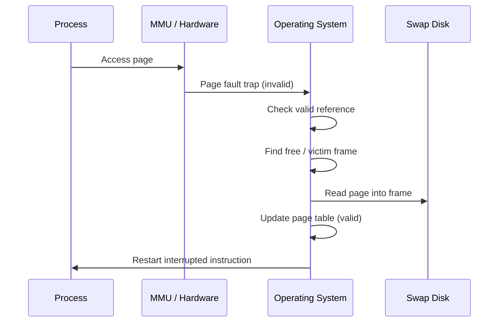

**ASCII — page fault**

```
  1. CPU refs page not in RAM → invalid bit
  2. Trap to OS
  3. Validate address; if illegal → kill process
  4. Get free frame (or replace)
  5. Schedule disk read of page
  6. Update page table; set valid
  7. Restart instruction
```

**Important Points**

- Virtual memory > physical illusion via demand paging
- Page fault = needed page not in RAM
- Locality of reference keeps fault rate acceptable
- Dirty/modified bit avoids unnecessary write-back

**For Exam**

Virtual memory maps a large logical address space onto smaller physical memory using demand paging. Pages are brought in only when needed; a missing page causes a page fault handled by the OS loading the page and resuming the process.

**Diagram (refer SLM):** Fig 6.3.1–6.3.5 Virtual memory / page fault steps

**Previously Asked Questions**

- **Q24** (2 marks, SLM Model Set 1) — How does demand paging improve memory efficiency?
  - *Answer:* **Demand paging** loads a page into RAM **only when it is referenced** (lazy loading), instead of bringing the entire process into memory at once. This improves efficiency because: (1) unused pages stay on disk, freeing frames for other processes; (2) more processes can be multiprogrammed in limited RAM; (3) programs larger than physical memory can run; (4) startup is faster (pure demand paging starts with almost no pages loaded). Locality of reference keeps the page-fault rate acceptable.

- **Q13** (1 mark, SLM Model Set 2) — Name any one technique used for virtual memory management.
  - *Answer:* **Demand paging** (also acceptable: **demand segmentation** / paged segmentation).


#### 6.3.3 Page Replacement

**Theory**

When no free frame exists, a **page-replacement algorithm** selects a victim.

| Algorithm | Rule | Notes |
|-----------|------|-------|
| **FIFO** | Replace oldest page | Simple; may suffer **Belady’s anomaly** |
| **Optimal (OPT/MIN)** | Replace page used farthest in future | Best fault rate; needs future knowledge |
| **LRU** | Replace least recently used | Good practical approximation of OPT |

**Belady’s anomaly:** for some algorithms (e.g. FIFO), more frames can *increase* page faults.

**Important Points**

- Goal: minimise page-fault rate on a reference string
- FIFO easy but not always good; OPT ideal but impractical; LRU widely used
- Modified bit reduces I/O on replacement

**For Exam**

Page replacement frees a frame when memory is full. FIFO replaces the oldest page; Optimal replaces the page not needed for the longest future time; LRU replaces the least recently used page. FIFO can show Belady’s anomaly.

**Diagram (refer SLM):** Fig 6.3.6–6.3.10 Replacement examples

**Previously Asked Questions**

- **Q38** (15 marks, SLM Model Set 2) — a) Compare the memory organization scheme paging and segmentation. b) Calculate the number of page faults for the following reference string with three-page frames using the following algorithms — 9,2,3,4,1,2,3,5,1,0,5,9,9,0,1 — i) FIFO ii) Optimal iii) LRU.
  - *Answer:*  

    **(a) Paging vs Segmentation**

    | Point | Paging | Segmentation |
    |-------|--------|--------------|
    | Division | Fixed-size **pages** / **frames** | Variable-size logical **segments** (code, stack, etc.) |
    | Address | (page number, offset) | (segment number, offset) |
    | Table | Page table: page → frame | Segment table: base + limit |
    | Fragmentation | No external; may have **internal** (last page) | No internal; may have **external** |
    | User view | Invisible fixed blocks | Matches programmer’s logical modules |
    | Sharing | Share pages | Share whole segments easily |

    **(b) Page faults — reference string:** 9, 2, 3, 4, 1, 2, 3, 5, 1, 0, 5, 9, 9, 0, 1 with **3 frames**.

    **FIFO** (replace oldest):

    | Step | Ref | Frames (oldest→) | Fault? |
    |------|-----|------------------|--------|
    | 1 | 9 | [9] | F |
    | 2 | 2 | [9,2] | F |
    | 3 | 3 | [9,2,3] | F |
    | 4 | 4 | [2,3,4] | F |
    | 5 | 1 | [3,4,1] | F |
    | 6 | 2 | [4,1,2] | F |
    | 7 | 3 | [1,2,3] | F |
    | 8 | 5 | [2,3,5] | F |
    | 9 | 1 | [3,5,1] | F |
    | 10 | 0 | [5,1,0] | F |
    | 11 | 5 | [5,1,0] | Hit |
    | 12 | 9 | [1,0,9] | F |
    | 13 | 9 | [1,0,9] | Hit |
    | 14 | 0 | [1,0,9] | Hit |
    | 15 | 1 | [1,0,9] | Hit |

    **FIFO page faults = 11**

    **Optimal** (replace page used farthest in future):

    | Step | Ref | Frames | Fault? | Notes |
    |------|-----|--------|--------|-------|
    | 1–3 | 9,2,3 | [9,2,3] | 3 F | fill |
    | 4 | 4 | [2,3,4] | F | replace 9 (farthest future use) |
    | 5 | 1 | [2,3,1] | F | replace 4 (never again) |
    | 6–7 | 2,3 | [2,3,1] | Hit | |
    | 8 | 5 | [3,1,5] | F | replace 2 (never again) |
    | 9 | 1 | [3,1,5] | Hit | |
    | 10 | 0 | [1,5,0] | F | replace 3 (never again) |
    | 11 | 5 | [1,5,0] | Hit | |
    | 12 | 9 | [1,0,9] | F | replace 5 (never again) |
    | 13–15 | 9,0,1 | [1,0,9] | Hit | |

    **Optimal page faults = 8**

    **LRU** (replace least recently used):

    | Step | Ref | Frames (LRU→MRU) | Fault? |
    |------|-----|------------------|--------|
    | 1–3 | 9,2,3 | 9,2,3 | 3 F |
    | 4 | 4 | 2,3,4 | F (out 9) |
    | 5 | 1 | 3,4,1 | F (out 2) |
    | 6 | 2 | 4,1,2 | F (out 3) |
    | 7 | 3 | 1,2,3 | F (out 4) |
    | 8 | 5 | 2,3,5 | F (out 1) |
    | 9 | 1 | 3,5,1 | F (out 2) |
    | 10 | 0 | 5,1,0 | F (out 3) |
    | 11 | 5 | 1,0,5 | Hit |
    | 12 | 9 | 0,5,9 | F (out 1) |
    | 13 | 9 | 0,5,9 | Hit |
    | 14 | 0 | 5,9,0 | Hit |
    | 15 | 1 | 9,0,1 | F (out 5) |

    **LRU page faults = 12**

    **Summary:** FIFO = **11**, Optimal = **8**, LRU = **12** faults.


### Unit 4: File Allocation and Management

#### 6.4.1–6.4.3 Files and Directories

**Theory**

A **file** is a collection of related information on secondary storage. Attributes typically: name, identifier, type, location, size, protection, time/date/user IDs. **Directories** store file metadata (name, type, address, length, dates, owner, protection) and support search, create, delete, list, rename, traverse.

**Directory types:** single-level (naming/grouping problems); two-level (per-user MFD/UFD); tree-structured (absolute/relative paths, grouping).

**Important Points**

- File = named logical secondary-storage unit
- Directory = special file of metadata
- Tree directories: efficient search + grouping

**For Exam**

The file system maps files onto disk and organises them in directories. Files have attributes (name, size, protection, etc.); directories enable efficient naming and grouping (single-level, two-level, tree).

**Diagram (refer SLM):** Fig 6.4.1–6.4.3 Directory structures


#### 6.4.4 File Allocation Methods

**Theory**

Three major disk-space allocation methods:

**1. Contiguous allocation**  
File occupies consecutive blocks; directory stores start + length. Fast sequential and direct access. **Disadvantages:** external fragmentation; need to declare size at creation; may need compaction.

**2. Linked allocation**  
File = linked list of blocks anywhere on disk; directory points to first (and last). No external fragmentation; size need not be declared. **Disadvantages:** pointer overhead; pointer loss truncates file; mainly **sequential** access; internal fragmentation in last block.

**3. Indexed allocation**  
All block pointers gathered in an **index block**; directory points to index. Supports **direct access** without external fragmentation. **Disadvantage:** index-block overhead (especially for tiny files). Advanced forms: linked index blocks, multilevel index, combined/inode scheme (direct + single/double/triple indirect).

| Method | External frag? | Direct access? | Main drawback |
|--------|----------------|----------------|---------------|
| Contiguous | Yes | Excellent | Holes / size declare |
| Linked | No | Poor | Pointers / sequential |
| Indexed | No | Good | Index overhead |

**Important Points**

- Contiguous = start + length  
- Linked = pointer chain  
- Indexed = index block of addresses  
- Inode combined scheme for large files (Unix-style)

**For Exam**

Disk space is allocated to files by contiguous, linked or indexed methods. Contiguous is simple and fast but fragments externally; linked avoids external fragmentation but hurts random access; indexed collects pointers in an index block to support direct access with some pointer overhead.

**Diagram (refer SLM):** Fig 6.4.4 Contiguous; Fig 6.4.5 Linked; Fig 6.4.6 Indexed; Fig 6.4.7 Advanced indexing / inode

**Previously Asked Questions**

- **Q34** (4 marks, SLM Model Set 2) — Discuss the various file allocation methods: contiguous, linked, and indexed. Include their advantages and disadvantages.
  - *Answer:*  

    **1. Contiguous allocation** — file occupies consecutive disk blocks; directory stores starting block + length.  
    - *Advantages:* simple; excellent sequential and direct access; fast.  
    - *Disadvantages:* **external fragmentation**; must often declare size at creation; may need compaction.

    **2. Linked allocation** — file is a linked list of blocks anywhere on disk; directory points to first (and often last) block.  
    - *Advantages:* no external fragmentation; file can grow easily; size need not be declared upfront.  
    - *Disadvantages:* pointer overhead; pointer loss can truncate file; mainly **sequential** access (poor random access); internal fragmentation in last block.

    **3. Indexed allocation** — all block addresses collected in an **index block**; directory points to the index.  
    - *Advantages:* supports **direct access**; no external fragmentation; flexible growth.  
    - *Disadvantages:* index-block overhead (wasteful for tiny files); index itself may need multilevel schemes for large files.


# Quick Revision Sheets

## Block 1 Quick Revision Sheet
*(Basic Functional Architecture)*

| Must-remember | Cue |
|---------------|-----|
| Architecture vs Organisation | Architecture = attributes affecting logical execution (ISA, data types, I/O, addressing); Organisation = operational units & interconnects |
| von Neumann idea | Stored-program computer: same memory for instructions & data |
| 5 generations | Vacuum tubes → Transistors → ICs → Microprocessors/VLSI → AI |
| Functional units | Input, Memory, Output, ALU, Control Unit (+ registers) |
| System bus | Data bus + Address bus + Control bus |
| ALU / CU | ALU = arithmetic & logic; CU = interprets instructions, issues control signals |
| Instruction cycle | Fetch → Decode → Execute → Store (basic) |
| Timing / control signals | Synchronise transfers; sequence counter can generate timing phases |
| Addressing modes | How operand location is specified (immediate, direct, indirect, register, relative, indexed, …) |
| Need for addressing modes | Flexibility, shorter instructions, support loops/pointers/arrays |
| Program control instructions | Branch, jump, call/return, skip — change sequence of execution |
| Subroutine | Named reusable procedure invoked by call; return restores caller |


## Block 2 Quick Revision Sheet
*(I/O and DMA)*

| Must-remember | Cue |
|---------------|-----|
| RTL | Register Transfer Language — describes microoperations & register transfers |
| Microoperation | Elementary op on register data |
| I/O subsystem | Path between CPU/memory and peripherals |
| I/O bus / interface | Standardises device connection; converts signals/protocols |
| Memory-mapped I/O | Devices addressed in memory address space |
| Isolated / standard I/O | Separate I/O address space & instructions |
| Interrupt | Asynchronous event that forces service routine; returns after |
| Polling | CPU repeatedly checks device status (simple, wasteful for rare events) |
| Priority interrupt | When several IRQs pending, highest priority served first |
| Daisy chain / priority encoder | Hardware ways to establish interrupt priority |
| DMA | Direct Memory Access — device↔memory transfer with minimal CPU |
| Why DMA | Frees CPU from byte-by-byte I/O; higher throughput |
| DMA modes | Burst/block, cycle stealing, transparent (typical classification) |
| Bus types (exam) | Internal/external; data/address/control; synchronous/asynchronous ideas |


## Block 3 Quick Revision Sheet
*(Parallel Computer Structures)*

| Must-remember | Cue |
|---------------|-----|
| Serial vs parallel | One PE vs many PEs working together |
| Flynn’s taxonomy | SISD, SIMD, MISD, MIMD (instruction × data streams) |
| SISD | Conventional uniprocessor |
| SIMD | One instruction, many data (vector/array) |
| MIMD | Multiple instructions, multiple data (multiprocessors) |
| Pipelining | Overlap stages like assembly line / water pipe |
| Pipeline speedup idea | Throughput ↑; latency per instruction still multi-stage |
| Vector processing | Same op on vectors/arrays; vector registers |
| Array processor | Many PEs for parallel data ops |
| Performance measures | Speedup, efficiency, throughput, utilisation (as in SLM) |
| Feng / other classifications | Alternative architectural taxonomies (max parallelism etc.) |
| Superscalar | Multiple instructions issued per cycle |


## Block 4 Quick Revision Sheet
*(Basic Concepts of Operating Systems)*

| Must-remember | Cue |
|---------------|-----|
| OS role | Manager of hardware; interface for users/apps |
| System vs application software | OS/compiler vs Word/Chrome |
| Booting | Loading OS from secondary storage into memory at startup |
| OS structures | Simple, layered, microkernel, modular, … |
| Layered OS | Layers only use lower layers — modularity, easier debug |
| OS services | Process, memory, file, I/O, protection, networking, UI |
| System call | Interface for programs to request OS services |
| Process vs program | Active vs passive (see also Block 5) |
| Schedulers | Long-term (job), medium-term (swap), short-term (CPU) |
| Preemptive vs non-preemptive | Can OS seize CPU mid-run? Yes vs no |
| Scheduling criteria | CPU util, throughput, turnaround, waiting, response |
| Common algorithms | FCFS, SJF, Priority, Round Robin, Multilevel |
| Multiprocessor scheduling | Load sharing; SMP; affinity issues |
| Types of OS | Batch, multiprogramming, time-sharing, RTOS, distributed, … |


## Block 5 Quick Revision Sheet
*(Process Synchronization)*

| Must-remember | Cue |
|---------------|-----|
| Process | Program in execution; PCB; states New/Ready/Run/Wait/Exit |
| IPC models | Shared memory & message passing |
| IPC methods | Pipes, named pipes, message queues, semaphores, shared memory, sockets |
| Race condition | Shared data result depends on timing |
| Critical section | Code accessing shared resource |
| Mutual exclusion | Only one process in CS at a time |
| CS requirements | Mutual exclusion + Progress + Bounded waiting |
| Mutex / binary semaphore | Lock for exclusive access |
| Counting semaphore | Up to N resource instances |
| wait / signal | P decrements (may block); V increments |
| Monitor | High-level ADT with built-in mutual exclusion + conditions |
| Classical problems | Producer–consumer, readers–writers, dining philosophers |
| Deadlock | Circular wait forever on held resources |
| 4 conditions | Mutual exclusion, Hold&Wait, No preemption, Circular wait |
| Safe state | Exists safe sequence to finish all |
| Banker’s algorithm | Avoidance using Max/Need/Available; allocate only if still safe |


## Block 6 Quick Revision Sheet
*(Memory Management and File Systems)*

| Must-remember | Cue |
|---------------|-----|
| MM requirements | Relocation, Protection, Sharing, Logical & Physical organisation |
| Logical vs physical addr | CPU virtual addr → MMU → RAM address |
| Base & limit | Start + size; bounds check |
| Swapping | Process RAM ↔ swap disk |
| Contiguous allocation | Consecutive blocks; fixed/dynamic partitions |
| Contiguous disadvantages | Internal + external fragmentation |
| First/Best/Worst/Next fit | Hole selection strategies |
| Paging | Fixed pages ↔ frames; page table; no external frag |
| Segmentation | Variable logical segments; base+limit table |
| Page fault | Touch page not in RAM → OS loads it |
| Virtual memory | Large logical space on smaller physical via demand paging |
| Page replacement | FIFO, OPT, LRU; Belady’s anomaly (FIFO) |
| File attributes | Name, id, type, location, size, protection, timestamps |
| Directories | Single-level, two-level, tree |
| File allocation | Contiguous / Linked / Indexed (+ multilevel, inode) |
| Contiguous files | Fast access; external fragmentation |
| Linked files | No external frag; sequential; pointer risk |
| Indexed files | Index block; good direct access; index overhead |


*End of draft — Blocks 5 & 6 + Quick Revision Sheets (Blocks 1–6).*
