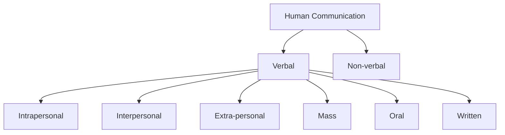
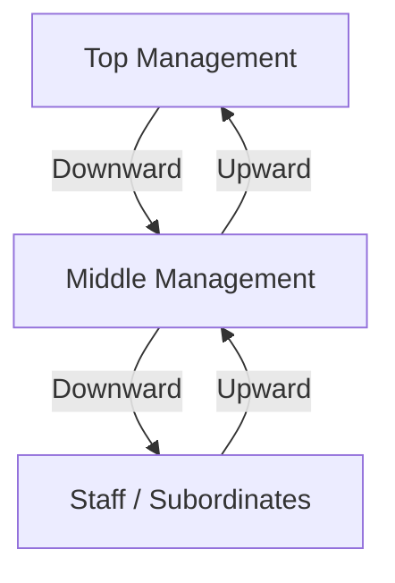
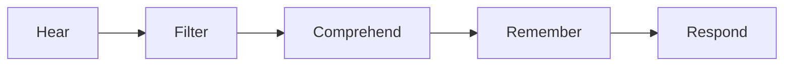
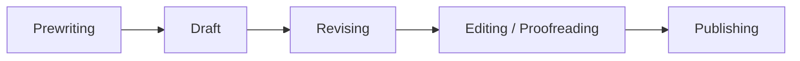
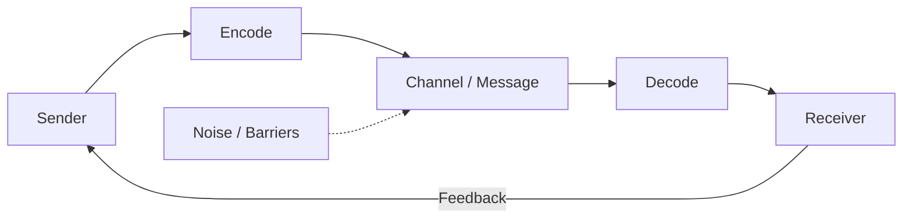

# English for Communication — Study Notes with PYQ

**Course Code:** B21EG01AC | **Semester:** II | **Programme:** BCA | **University:** Sreenarayanaguru Open University (SGOU)  
**Subject:** English for Communication | **Coverage:** Blocks 1–4, 16 Units (Theory)  
**Source:** Self Learning Material (SLM) — SGOU B21EG01AC | **PYQ Sources:** Aug 2023; May 2024; Dec 2024; Apr 2025; Aug 2025; SLM Model Set 1; SLM Model Set 2


### About These Notes

**Prepared by:** Abdul Vahab A A  
**Website:** https://abdulvahabaa.in

These notes were created for my personal study and revision. I am sharing them here because someone else might find them useful too.

**Wishing you all success** in your semester exams. Study with focus, practise writing and speaking, and stay consistent — success will follow.

**Dua mein Yaad Rakhna.**


## Index

Block 1: Communication and Language — Verbal/non-verbal, barriers, formal communication, LSRW + cultural awareness, English as global language  
Block 2: Receptive or Passive Skills — Listening process & types, media platforms, vocabulary & speed reading, print vs online reading  
Block 3: Productive or Active Skills — Speeches & audience, audio chats/VoIP, writing process & punctuation, social media writing  
Block 4: Communication and Technology — Printing & e-publishing, language & ICT/cyberspace, cyber laws & authenticity, social media best practices & health  

Quick Revision Sheets — Block 1 | Block 2 | Block 3 | Block 4 *(at the bottom)*

*(Detailed subsection numbers match SGOU SLM — see each unit heading in the notes.)*


## Block 1: Communication and Language

### Unit 1: Introduction to Communication


#### 1.1.1 Human Communication: Verbal and Non-verbal

**Theory**

Communication is the process of sharing information, emotions, thoughts and ideas between two or more beings. It is a basic need for survival. Human communication evolved from gestures, signs and sounds to language, and later from a primarily oral culture to a written culture. Early verbal communication is believed to have begun with **onomatopoeic** words (words that sound like their referents: buzz, hiss, meow, vroom).

Human communication is superior to animal communication mainly because humans can use symbols (words) for things that are absent, for abstract ideas, and for emotions and attitudes. Communication studies trace back to Greek thinkers like Plato and Aristotle. Effective communication happens only when the **receiver understands the message and responds accordingly**.

There are two broad types of human communication:

- **Verbal communication** — exchanging information using words / language
- **Non-verbal communication** — exchanging information through non-linguistic means (gestures, facial expression, body movement, tone, digital cues such as emojis)

Verbal communication can be classified by participants:

| Type | Who communicates | Example |
|------|------------------|---------|
| **Intrapersonal** | Self (sender = receiver) | Thoughts, interior monologue |
| **Interpersonal** | Two or more people | Conversation with family/friends |
| **Extra-personal** | Human ↔ non-human | Talking/touching a pet |
| **Mass communication** | One/few → many via media | Newspaper, TV, social media |

Communication may also be **formal** (classroom, seminar — decorum of language) or **informal** (peer group — casual flow of ideas).



**Important Points**

- Communication = sharing information; continuous process influenced by context
- Animal example: honey bee **waggle dance** (direction/distance to flowers)
- Verbal uses language; non-verbal uses cues
- Formal vs informal depends on setting and relationship
- Digital supplements (emojis, stickers, memes, GIFs) often act as non-verbal cues even in written chats

**For Exam**

Human communication is classified as verbal and non-verbal. Verbal communication uses words and includes intrapersonal, interpersonal, extra-personal and mass communication. Non-verbal communication uses gestures, expressions and other non-linguistic cues. Effective communication requires understanding plus appropriate response from the receiver.

**Previously Asked Questions**

- **Q40** (1 mark, Dec 2024 / Aug 2025) — What is non-verbal communication?
  - *Answer:* Exchange of meaning without words (gestures, expressions, tone, emojis).

- **Q68** (2 marks, Aug 2023) — Define extra personal communication.
  - *Answer:* Extra-personal communication is communication between a **human and a non-human** being (for example, a person interacting with a pet using touch, sounds and gestures).

- **Q105** (2 marks, Aug 2025) — List out the different types of verbal communication.
  - *Answer:* By participants: **intrapersonal, interpersonal, extra-personal and mass** communication. By form: **oral** and **written** (also visual/audio-visual modes).

- **Q148** (5 marks, Apr 2025) — Differentiate between Extrapersonal and Interpersonal communication with examples.
  - *Answer:*

    | Point | Interpersonal | Extra-personal |
    |-------|---------------|----------------|
    | Participants | Two or more **humans** | Human ↔ **non-human** |
    | Medium | Mainly language + non-verbal cues | Sounds, touch, gestures more than full language |
    | Example | Talking with a friend about studies | Calling a dog and petting it |
    | Purpose | Share ideas, emotions, information socially | Bonding / directing animal behaviour |

- **Q1** (1 mark, SLM Model Set 1) — How are human communications classified?
  - *Answer:* Verbal and non-verbal.

- **Q1** (1 mark, SLM Model Set 2) — What are the two types of human communication?
  - *Answer:* Verbal and non-verbal.

- **Q16** (2 marks, SLM Model Set 1) — What is interpersonal communication?
  - *Answer:* Interpersonal communication is communication between **two or more people**, where ideas, emotions and information are exchanged (face-to-face or mediated).

- **Q17** (2 marks, SLM Model Set 1) — What is extrapersonal communication?
  - *Answer:* Extra-personal communication is interaction between humans and **non-human** beings (e.g., pets), often through touch, sounds and gestures.


#### 1.1.2 Forms of Verbal Communication

**Theory**

Verbal communication takes several forms:

- **Oral** — face-to-face talk, telephone calls, meetings
- **Written** — letters, emails, WhatsApp messages, reports
- **Visual / audio-visual** — photos, charts, movies, smartphone video (combine image and sound)
- Digital messaging may add emojis, stickers, memes and GIFs as supporting cues

**Important Points**

| Form | Channel | Typical use |
|------|---------|-------------|
| Oral | Speech | Quick feedback, personal interaction |
| Written | Text | Permanent record, formal documents |
| Audio-visual | Sound + image | Films, video lessons, presentations |

**For Exam**

Verbal communication may be oral or written. Audio-visual communication uses both sound and sight (e.g., a movie or educational video). Digital chat often mixes verbal text with non-verbal digital cues.

**Previously Asked Questions**

- **Q2** (1 mark, SLM Model Set 1) — Give an example for audio-visual communication.
  - *Answer:* A movie / TV programme / video lecture.

- **Q11** (1 mark, SLM Model Set 1) — What is audio-visual communication?
  - *Answer:* Communication using both sound and sight.


#### 1.1.3 Non-Verbal Communication

**Theory**

Non-verbal communication does not rely primarily on written or spoken language (baby babble is an early example of non-linguistic vocalisation). In face-to-face interaction it includes gestures, facial expressions and body movement. Online, emojis, stickers and memes serve similar functions.

Two important cue types:

- **Emblems** — gestures with a **shared cultural meaning** (e.g., thumbs-up ≈ “well done”); culture-specific
- **Illustrators** — personal, often involuntary gestures that support speech; not strongly culture-bound

Functions of non-verbal cues relative to verbal messages: they may **contradict**, **substitute** or **emphasise** what is said.

**Important Points**

- Non-verbal = cues, not full language sentences
- Emblems = shared meaning; Illustrators = speech support
- Can replace, strengthen or clash with words
- Digital non-verbal: emoji, sticker, meme, GIF

**For Exam**

Non-verbal communication exchanges meaning without relying on language words. Emblems have shared cultural meanings; illustrators accompany speech. Non-verbal cues may contradict, substitute or emphasise verbal messages.

**Previously Asked Questions**

- **Q122** (5 marks, Aug 2023 / Apr 2025) — What are the different types of Non-verbal communication?
  - *Answer:*

    | Type | Examples |
    |------|----------|
    | Gestures | Emblems (thumbs-up) and illustrators |
    | Facial expressions | Smile, frown, surprise |
    | Body language / posture | Open vs closed stance |
    | Para-language | Pitch, volume, pauses |
    | Digital cues | Emojis, stickers, memes, GIFs |
    | Space / touch | Distance and haptics in face-to-face talk |

    
    These cues may **contradict**, **substitute** or **emphasise** verbal messages.


#### 1.1.4 Language

**Theory**

The exact origin of language is unknown, though paleolithic/neolithic evidence points to early language and scripts. One hypothesis is **imitation** (as babies imitate adults). Scripts/alphabets are largely **arbitrary** relative to meaning. Language is transmitted across generations; thousands of languages exist globally. Related modes include body language, sign language and animal communication systems.

Edward Sapir: language is “a purely human and non-instinctive method of communicating ideas, emotions and desires by means of voluntarily produced symbols.”

**Important Points**

- Language = human, non-instinctive, symbol-based
- Origin largely unknown; imitation is one hypothesis
- Related: body language, sign language, animal “language”

**For Exam**

Language is a human system of voluntarily produced symbols used to communicate ideas, emotions and desires. Its historical origin is uncertain; scripts are largely arbitrary conventions passed down generations.


#### 1.1.5 Features of Human Language

**Theory**

Four major features of human language (exam favourites):

1. **Creativity** — humans can produce infinite new utterances; animal signals are limited mainly to necessities (food, shelter, danger)
2. **Arbitrariness** — no necessary logical link between a word and its referent (exception: onomatopoeia)
3. **Reflexivity** — language enables message→response chains; meanings and usage evolve
4. **Displacement** — talk about past, present and future, and about absent or imaginary things

**Important Points**

| Feature | One-line meaning |
|---------|------------------|
| Creativity | Infinite novel sentences |
| Arbitrariness | Word–meaning link is conventional |
| Reflexivity | Language about language / evolving response chains |
| Displacement | Time/space beyond the here-and-now |

**For Exam**

Human language is creative, arbitrary, reflexive and capable of displacement. Displacement lets us discuss past/present/future and non-present referents — a key contrast with most animal communication.

**Previously Asked Questions**

- **Q8** (1 mark, Aug 2023) — What does 'displacement' as one of the features of language mean?
  - *Answer:* Displacement / talking about past, present, future or absent things.

- **Q51** (1 mark, Apr 2025) — Which is the feature of language that allows us to talk about the past, present and future?
  - *Answer:* Displacement / talking about past, present, future or absent things.

- **Q95** (2 marks, Dec 2024) — What are the features of human languages?
  - *Answer:* **Creativity, arbitrariness, reflexivity and displacement**.

- **Q127** (5 marks, May 2024) — What are the Features of Human Language?
  - *Answer:* 1. **Creativity** — unlimited new utterances beyond fixed signals. 2. **Arbitrariness** — no natural link word↔object (except onomatopoeia like *buzz*). 3. **Reflexivity** — language supports response chains and itself evolves in meaning/usage. 4. **Displacement** — reference to other times and absent/imaginary entities. Together these make human language systematic, flexible and far richer than animal communication.

- **Q18** (2 marks, SLM Model Set 1) — Which are the four features of human language?
  - *Answer:* Creativity, arbitrariness, reflexivity and displacement.

- **Q26** (5 marks, SLM Model Set 1) — Briefly comment on the four features of human language with examples.
  - *Answer:* Same four features as above with examples: creativity (*She may invent a new joke*); arbitrariness (*dog* vs Hindi *kutta* for same animal); reflexivity (clarifying “What do you mean by ‘soon’?”); displacement (“Yesterday I dreamed of Mars”).


#### 1.1.6 Origin of Language

**Theory**

Major theories of language origin (high-frequency exam topic):

1. **Bow-Wow theory** — language began by imitating natural sounds (**onomatopoeia**: cuckoo, buzz, hiss). Limitation: cannot explain the full vocabulary of a language.
2. **Ding-Dong theory** (Max Müller) — language arose from rhythm/sensory impressions of nature (bells, wind, rivers).
3. **Pooh-Pooh theory** — language from involuntary emotional interjections (*ha ha*, *ouch*); such sounds vary across languages.
4. **Yo-He-Ho theory** — rhythmic labour chants that reduced muscular effort during collective work.
5. **Gesture theory** — speech grew from gestures involving tongue, lips and jaw; associated with **Sir Richard Paget** (*Human Speech*; SLM objective key also links *Human Species*).

Yuval Noah Harari’s speculation: gossip aided social bonding in larger groups.

**Important Points**

| Theory | Core idea | Key name / cue |
|--------|-----------|----------------|
| Bow-Wow | Sound imitation | Onomatopoeia |
| Ding-Dong | Nature’s rhythm/sense | Max Müller |
| Pooh-Pooh | Emotional cries | Interjections |
| Yo-He-Ho | Work chants | Labour rhythm |
| Gesture | Gestures → speech organs | Sir Richard Paget |

**For Exam**

Five classical theories explain language origin: Bow-Wow (imitation), Ding-Dong (Max Müller — nature’s impressions), Pooh-Pooh (interjections), Yo-He-Ho (work chants) and Gesture (Paget). None alone fully explains language; exams often ask one theory in detail or all five briefly.

**Previously Asked Questions**

- **Q38** (1 mark, Dec 2024) — What is Ding Dong theory of Language origin?
  - *Answer:* Max Müller’s theory: language from nature’s rhythms/sounds.

- **Q72** (2 marks, Aug 2023) — What is 'Yo-He-Ho' theory of the origin of language?
  - *Answer:* Yo-He-Ho theory says language began as **rhythmic chants** used during collective physical labour to reduce muscular effort and coordinate work.

- **Q76** (2 marks, Aug 2023) — Who is the author of the book 'Human Species'?
  - *Answer:* **Sir Richard Paget** (as per SLM objective key linked to Gesture theory).

- **Q115** (5 marks, Aug 2023) — Discuss 'Bow-Vow' theory of the origin of language.
  - *Answer:* The Bow-Wow (Bow-Vow) theory claims that the earliest words were **imitations of natural sounds** — onomatopoeic forms such as *cuckoo, buzz, hiss, meow*. Humans supposedly copied sounds of animals and environment and used them as names/signals. **Strength:** explains onomatopoeic vocabulary. **Limitation:** cannot account for abstract words or the bulk of a language’s lexicon. Hence it is only a partial explanation of language origin.

- **Q136** (5 marks, Dec 2024) — Briefly mention the 5 major theories about the origin of language.
  - *Answer:* List and one line each for Bow-Wow, Ding-Dong (Max Müller), Pooh-Pooh, Yo-He-Ho and Gesture (Paget) as in the table above.

- **Q171 / Q180 / Q184** (10 marks, May 2024 / Apr 2025 / Aug 2025) — Explain the different theories on the origin of language.
  - *Answer:* Full essay answer — see **Theory (1.1.6 Origin of Language)** and Important Points above. Write ~3 pages with introduction, subheadings, examples and conclusion.

- **Q15** (1 mark, SLM Model Set 1) — What term is used to refer to the imitation of natural sounds in language?
  - *Answer:* Onomatopoeia.

- **Q3** (1 mark, Aug 2023) — Give a single word to refer to the system of words in a language.
  - *Answer:* Vocabulary.

- **Q38** (10 marks, SLM Model Set 1) — Explain in detail the different theories on the origin of human language.
  - *Answer:* Full essay answer — see **Theory (1.1.6 Origin of Language)** and Important Points above. Write ~3 pages with introduction, subheadings, examples and conclusion.


### Unit 2: Barriers of Communication


#### 1.2.1 Barriers of Communication

**Theory**

A **communication barrier** is anything that restricts the deliverer from sending the correct message to the right person at the right time. Barriers may occur at the sender, during transmission, at the receiver, or in feedback.

Seven major types (SLM):

1. **Psychological** — depression, phobia, speech anxiety, stage fright
2. **Emotional** — anger, impatience, humour imbalance; needs emotional maturity/IQ
3. **Physical** — noise, defective devices, enclosed cabins, physical distance
4. **Cultural** — differences in dress, religion, food, behaviour; needs **cultural sensitivity** (MNCs often run orientation programmes)
5. **Physiological** — dyslexia, shrill voice, speech/hearing-related physical conditions
6. **Organisational** — hierarchy, rules, superior–subordinate blocks; information gets distorted
7. **Semantic / language barrier** — unclear or complex message; **technical jargon** the receiver does not understand

```
Sender  -->  Encoding  -->  Channel  -->  Decoding  -->  Receiver
   ^                                                      |
   |____________________ Feedback ________________________|
              Barriers can strike any stage
```

**Important Points**

| Barrier | Quick cue | Exam example |
|---------|-----------|--------------|
| Psychological | Mental blocks | Stage fright |
| Emotional | Feeling-driven distortion | Anger clouds judgement |
| Physical | Environment/devices | Noise in hall |
| Cultural | Culture clash | Gesture meaning differs |
| Physiological | Body/ability | Dyslexia |
| Organisational | Structure/hierarchy | Message filtered upward |
| Semantic | Language/jargon | Technical words |

- Another term for language barrier = **semantic barrier**
- Cultural sensitivity = awareness and respect for cultural differences

**For Exam**

Barriers prevent correct message delivery. Memorise all seven types with one example each. Semantic barrier = language barrier (jargon). Organisational barriers arise from hierarchy and rules. Cultural barriers need sensitivity training.

**Previously Asked Questions**

- **Q6** (1 mark, Aug 2023) — Name a psychological barrier to communication.
  - *Answer:* Stage fright / anxiety / phobia (any one).

- **Q17** (1 mark, May 2024) — Name another term for language barrier.
  - *Answer:* Semantic barrier.

- **Q19** (1 mark, May 2024) — What are the mental issues that make it difficult to communicate effectively?
  - *Answer:* Psychological barriers (anxiety, stage fright, etc.).

- **Q31** (1 mark, Dec 2024) — Give two examples of psychological barriers to communication.
  - *Answer:* Stage fright / anxiety / phobia (any one).

- **Q60** (1 mark, Aug 2025) — Name the type of barrier that is created when an information is sent using technical words that the recipient does not understand.
  - *Answer:* Semantic barrier.

- **Q73** (2 marks, Aug 2023) — What is cultural sensitivity?
  - *Answer:* Cultural sensitivity is the ability to **recognise, respect and adapt** to cultural differences in dress, religion, food, behaviour and communication so that misunderstandings are avoided.

- **Q103** (2 marks, Aug 2025) — Explain the Organisational Communication barrier?
  - *Answer:* Organisational barriers arise from an organisation’s **structure, rules and hierarchy**. Superior–subordinate relations may block or **distort** information as it moves up or down the chain.

- **Q160** (5 marks, Aug 2025) — What is a communication barrier? Differentiate between Emotional barrier and Cultural barrier.
  - *Answer:* A communication barrier is anything that stops the correct message reaching the right person at the right time.
    
    | Emotional barrier | Cultural barrier |
    |-------------------|------------------|
    | Caused by feelings: anger, impatience, mood | Caused by cultural differences |
    | Affects decision and tone | Affects meaning of words/gestures/norms |
    | Needs emotional maturity | Needs cultural sensitivity |

- **Q173 / Q178 / Q181 / Q39–40** (10 marks, May 2024 / Dec 2024 / Apr 2025; SLM Model Sets) — Barriers to communication (full essay).
  - *Answer:* Full essay answer — see **Theory (1.2.1 Barriers of Communication)** and the Extended Essay Skeleton at the end. Write ~3 pages with introduction, subheadings, examples and conclusion.

- **Q18** (2 marks, SLM Model Set 2) — Define cultural barriers?
  - *Answer:* Cultural barriers are obstacles caused by differences in **culture** (dress, religion, food, behaviour, values) that hinder mutual understanding.


#### 1.2.2 Formal Communication

**Theory**

**Formal communication** (also called **official communication**) is the exchange of information through **proper organisational channels** in a structured and systematic way. SLM stresses it in academic and professional settings: conversations between superiors and subordinates; the main goals are that the message is **delivered accurately** and that conversation follows a clear path. Because of this structured flow, formal communication is seen as **time-saving and effective**.

**Examples (SLM):** reports, job descriptions, work orders, information about sales and inventories.

SLM lists four often-named types of formal communication as **upward, downward, vertical and horizontal**; **diagonal (crosswise / zig-zag)** is treated as another major organisational flow (neither purely vertical nor horizontal). Informal communication is contrasted as non-official.



```
Same level (Horizontal):  Peer A <----> Peer B
Across depts (Diagonal):  Marketing manager ---> Production staff
```

| Type | Direction / nature (SLM) | Purpose / examples |
|------|--------------------------|--------------------|
| **Vertical** | Information flows **up and down** the chain of command, following organisational structure | Superiors → subordinates (instructions) **and** subordinates → superiors (questions, concerns); general business practice |
| **Horizontal** | People / teams at the **same hierarchical level** exchange messages | Internal coordination among similar functional positions; Betty & Kay: “occurs between workers at generally equal levels in an organization” |
| **Diagonal / zig-zag / crosswise** | Flow that is **neither vertical nor horizontal** | Personnel from **various departments** communicate; e.g. a manager and a team from another line |
| **Upward** | Lower → higher; subordinate → superior | Raises **employee morale**; **not authoritative/directive**; purpose is **feedback** — complaints, requests, comments, reports, reactions, ideas valuable for management decisions |
| **Downward** | Top management → subordinate levels | Most prevalent along hierarchy / line of command; **instructions, orders, policies, information** |
| **Informal** (contrast, 1.2.2.6) | No established procedures, formalities, systems or organisational structures | Built on personal ties (friends, peers, family, clubs); **indefinite route** — information can originate anywhere; based on shared interests / likes / dislikes |

**Important Points**

- Formal = official channels + structured flow between superiors and subordinates
- SLM “four types” phrasing often = upward, downward, vertical, horizontal; exams also expect **diagonal / zig-zag / crosswise**
- **Vertical** = both directions along the hierarchy (covers the up/down idea as one structure)
- **Upward** ≠ orders; it is feedback-oriented and not authoritative
- **Downward** = instructions, orders, policies
- **Horizontal** = same level (Betty & Kay definition is exam-friendly)
- **Diagonal** = across departments / crosswise (objective key: “neither vertical nor horizontal”)
- Informal = no hierarchy route; social / grapevine-style
- Example of vertical: manager’s order to a subordinate **or** employee’s report/concern to the boss

**For Exam**

Formal communication uses official channels. Four often-asked forms: vertical, horizontal, diagonal and (as flows) upward/downward. Informal communication lacks fixed procedures and travels through social networks.

**Previously Asked Questions**

- **Q1** (1 mark, Aug 2023) — Cite an example of vertical communication.
  - *Answer:* Manager instructing a subordinate (or upward report).

- **Q39** (1 mark, Dec 2024) — What is horizontal communication in an organization?
  - *Answer:* Same-level organisational communication.

- **Q100** (2 marks, Apr 2025) — What is formal communication?
  - *Answer:* Formal communication is **structured, official communication** that follows proper organisational channels (reports, orders, job descriptions, etc.).

- **Q140** (5 marks, Dec 2024) — Explain the major forms of formal communication within an organisation.
  - *Answer:* Explain vertical, horizontal, diagonal, upward and downward with examples (see table). Stress that formal communication is planned and channelled.

- **Q153** (5 marks, Apr 2025) — Which are the four types of formal communication?
  - *Answer:* Commonly: **vertical, horizontal, diagonal (crosswise), and upward/downward** treated as key formal flows (SLM emphasises vertical, horizontal, diagonal, upward, downward).

- **Q172** (10 marks, May 2024) — What are different forms of formal communications?
  - *Answer:* Full essay answer — see **Theory (1.2.2 Formal Communication)** and Important Points above. Write ~3 pages with introduction, subheadings, examples and conclusion.

- **Q3** (1 mark, SLM Model Set 2) — What is the type of communication used in offices called?
  - *Answer:* Formal communication.

- **Q27** (5 marks, SLM Model Set 2) — What are different types of formal communication?
  - *Answer:* Vertical, horizontal, diagonal/zig-zag, upward and downward — with short examples for each.


#### 1.2.3 Communication Etiquette

**Theory**

**Etiquette** (Oxford Dictionary, quoted in SLM): the **conventional guidelines for conduct in polite society**. It means treating one another with **respect**, being **polite**, and having **good manners**.

**Communication etiquette** calls for actions and approaches that let you convey information **accurately** while keeping good ties with superiors, co-workers and clients. In the workplace, effective etiquette:

- helps the audience understand the message as intended
- reduces misunderstandings → stronger workplace interactions
- signals that you are a skilled communicator / potential leader and can open career prospects

Manners and etiquette have existed since early civilisation; even traditional societies follow norms of respect. Leadership, quality, business and professions are enhanced by good manners. The concept of **trust** should run through communication — communication should **foster confidence**, not destroy it.

Etiquette is not one fixed rulebook: communication is **personal and situation-dependent**. You may speak more freely with someone you know and trust than with a stranger.

**Building blocks of communication etiquette (SLM list — memorise for 5 marks):**

1. Responding quickly  
2. Expressing gratitude publicly  
3. Informing others  
4. Apologising publicly  
5. Displaying personal integrity  
6. Responding right away, even to decline  
7. Complimenting others  
8. Encouraging others  
9. Providing good feedback  
10. Maintaining (keeping) promises  
11. Being truthful, kind, and courteous  

**Important Points**

- Etiquette = conventional polite-conduct guidelines (Oxford)
- Goal = accurate message + healthy relationships + **trust**
- Not one rigid checklist — depends on relationship and context
- Exam favourite: list the **building blocks** with one line each
- Core behaviours: quick response, honesty, courtesy, public gratitude/apology, keep promises

**For Exam**

Communication etiquette means conventional polite guidelines for interaction. List several building blocks (quick response, gratitude, apology, integrity, encouragement, keeping promises).

**Previously Asked Questions**

- **Q53** (1 mark, Apr 2025) — Which term is used to describe 'conventional guidelines for conduct in polite methods'?
  - *Answer:* Communication etiquette.

- **Q130** (5 marks, May 2024) — What is meant by communication etiquette? Elucidate.
  - *Answer:* Define etiquette → list building blocks with brief explanation → link to trust and effective organisations.

- **Q149 / Q165** (5 marks, Apr 2025 / Aug 2025) — Explain communication etiquettes.
  - *Answer:* Same as above; stress respect, politeness, manners and concrete behaviours.

- **Q34** (5 marks, SLM Model Set 1) — Discuss the various building blocks of communication etiquette.
  - *Answer:* Enumerate SLM building blocks (respond quickly, gratitude, inform, apologise, integrity, respond to decline, compliment, encourage, feedback, keep promises, truthful/kind/courteous) with one line each.


#### 1.2.4 Oral or Written Communication

**Theory**

**Oral communication** = sending messages or reports **orally** from dispatcher to receiver.  
**Written communication** = sending messages/information in **written / drafted** form (letters, research papers, reports, memos, etc.).

SLM contrast: oral is typically used as a more **informal** mode in private and public conversations; written is employed as **formal** communication in schools, colleges and business.

| Aspect | Oral | Written |
|--------|------|---------|
| Medium | Spoken messages | Drafted / recorded text |
| Record | Lacks permanent record / drafting | Concrete recorded proof; can be referred to later |
| Cost / time to prepare | Inexpensive; less time to prepare and deliver | Involves some costs; more preparation |
| Feedback | **Very quick** responses | **Slower** feedback; no rapid clarification |
| Setting / tone | Less formal; more **personal touch**; pitch and tone | Formal settings; uniform message for all readers |
| Qualities needed | Clarity, conciseness, precision; avoid jargon; eye contact + body language; sometimes visual aids | Completeness, clarity, accuracy; detailed and error-free |
| Reach | Face-to-face / spoken audience | Easily circulated to a **large number** of people with the **same** accuracy |

**Advantages of oral (SLM):** appropriate pitch and tone; saves effort and time; personal touch; can generate trust and loyalty when used well; non-verbal cues (body language, tone) support meaning.

**Limitations of oral (SLM):** prone to misunderstanding / misinterpretation; needs a **high level of expertise** — not everyone communicates orally equally well.

**Advantages of written (SLM):** permanent record; same information for the whole audience (does not vary person to person); easy mass circulation.

**Limitations of written (SLM):** absence of immediate feedback; no effective sound modulation.

**Best practice (SLM):** combine written and spoken communication to bring together their advantages and reduce disadvantages.

**Important Points**

- Oral = spoken; Written = drafted/recorded
- Oral benefits: speed, personal touch, instant feedback, pitch/tone
- Written benefits: record, precision, uniform mass message
- Oral limitations: temporary, skill-dependent, easy to mishear
- Written limitations: slow feedback, less personal warmth / no voice tone
- Effectiveness rule: oral needs clarity + non-verbals; written needs completeness + accuracy
- Exam essays: always end with “combine both”

**For Exam**

Compare oral vs written on feedback, record, formality and clarity needs. Mention combining both for effective organisational communication.

**Previously Asked Questions**

- **Q108** (2 marks, Aug 2025) — What are the main benefits of oral communication?
  - *Answer:* **Quick feedback**, personal/direct interaction, useful for clarification, and often faster than writing.

- **Q125** (5 marks, May 2024) — Compare and contrast oral and written communications.
  - *Answer:* Use the comparison table above; conclude that both are complementary.


### Unit 3: Four Skills of Communication


#### 1.3.1 Listening

**Theory**

**Hearing** is passive perception of sound; **listening** is a **conscious effort** to understand. **Active listening** needs voluntary effort: take notes, pre-read the topic, avoid distraction, use mind maps, identify new terms.

Factors affecting listening: interest, speaker competence, incomplete utterances, pauses, distractions, speech speed, jargon, non-verbal noise, assumed prior knowledge, and the gap between speaking and listening capacity.

**Important Points**

- Hearing ≠ Listening
- Active listening = voluntary, focused effort
- Distraction and jargon are major barriers to listening

**For Exam**

Listening is conscious; hearing is passive. Active listening requires effort and strategies (notes, focus, mind maps). Many exam questions ask factors affecting listening or active listening.

**Previously Asked Questions**

- **Q49** (1 mark, Apr 2025) — What is the type of listening that needs voluntary effort from the part of the listener called?
  - *Answer:* Active listening.

- **Q99** (2 marks, Apr 2025) — What are the non-verbal cues involved in active listening?
  - *Answer:* **Eye contact** (“listen with your eyes”), **open body posture**, and backchannel cues such as nods / “Mm” / “I hear you” (non-stone-faced attention).

- **Q123** (5 marks, Aug 2023 / Apr 2025 / Aug 2025) — What are the factors that affect active listening?
  - *Answer:* Interest; speaker’s competence; incomplete utterances; pauses; distractions; speed of speech; jargon; noise; assumed knowledge; capacity gap between speaking and listening — explain each briefly.


#### 1.3.2 Speaking

**Theory**

Speaking functions fall into four categories:

1. **Informative** — introduce self, report events, give opinions/routines
2. **Instructive** — instructions, directions, explain, describe, commands
3. **Persuasive** — advertise, sell, reason, convince, requests
4. **Integrative** — greet, advise, enquire, sympathise, compliment, encourage

Effective speaking steps: know purpose; begin well; switch formal/informal appropriately; be spontaneous when needed; listen to feedback; end gracefully.

Register examples: *Good morning / How do you do* (formal) vs *Hi / Hey / Wassup* (informal). Closings: *Thank you, Good day* vs *Bye*.

**Important Points**

- Four function groups: informative, instructive, persuasive, integrative
- Match formality to context
- Self-introduction is a common 2-mark task

**For Exam**

Speaking serves informative, instructive, persuasive and integrative purposes. Use appropriate greetings and closings; practise clear purpose and graceful endings.

**Previously Asked Questions**

- **Q70** (2 marks, Aug 2023) — Introduce yourself in one or two sentences.
  - *Answer:* - *Answer (model):* “Good morning. I am **Abdul Vahab**, a second-semester BCA student at Sreenarayanaguru Open University.

- **Q67** (2 marks, Aug 2023) — Answer to the question, 'Do you mind shutting the window?' politely.
  - *Answer:* “**Not at all — I’ll shut it right away.**” / “**Of course, I’d be happy to.**”


#### 1.3.3 Reading

**Theory**

Reading is decoding written data — an interaction of language and thought that yields socio-cultural/contextual meaning. An efficient reader has purpose, comprehension and memory; vocabulary improves speed.

- **Silent vs oral** reading
- **Scanning** — look for specific information
- **Skimming** — quick reading for overall essence
- Overcome problems by practice, dictionary/teacher help and linguistic competence

**Important Points**

| Method | Goal |
|--------|------|
| Skimming | Essence / overview |
| Scanning | Specific fact |
| Focused reading | Deeper thinking/comprehension |

**For Exam**

Skimming = essence; scanning = specific detail. Efficiency depends on purpose, comprehension, memory and vocabulary.

**Previously Asked Questions**

- **Q42** (1 mark, Dec 2024) — What is scanning in reading?
  - *Answer:* Scanning.

- **Q47** (1 mark, Apr 2025) — What is a quick reading to get the essence called?
  - *Answer:* Skimming.

- **Q44** (1 mark, Apr 2025) — What are the two methods of speed reading?
  - *Answer:* Skimming and scanning.

- **Q74** (2 marks, Aug 2023) — What is efficiency of reading dependent upon?
  - *Answer:* Upon **purpose, comprehension and memory** (vocabulary also aids speed).


#### 1.3.4 Writing

**Theory**

Francis Bacon (16th c., SLM): “Reading maketh a full man; conference a ready man; and writing an exact man.” A speech may be forgotten if unrecorded; **writing documents a lasting record**. Literary works of the past survive because they were written. Writing provides **physical evidence** of content.

In language use, writing combines symbols into meaningful words and sentences by convention. Good writing communicates with **clarity and ease**. Writing skills are **dynamic**, not static: they include a mechanical process (handwriting or typing) where **spelling**, **punctuation**, **legibility**, **logic** and **tone** matter — wrong spelling or punctuation can change meaning. Written communication can address a **larger audience** than face-to-face or telephone talk; vocabulary expertise helps the writing process.

**Five stages of the writing process (SLM Fig. 1.3.7 — bottom → top: Prewriting → Drafting → Revising → Editing → Publishing):**

| Stage | What you do (SLM detail) |
|-------|---------------------------|
| **1. Prewriting** | Organise your topic; **brainstorm** ideas; **collect data** / material |
| **2. Drafting** | Create a **rough copy**; arrange ideas; get feedback on the topic (writer-centred; do not over-fix spelling yet) |
| **3. Revising** | **Improve** the writing; check vocabulary; spell-check; improve structure, flow, transitions |
| **4. Editing** | **Proofread** the work; ensure the document is **original** (grammar, punctuation, accuracy) |
| **5. Publishing** | Create a **clean and final copy** shared/submitted — **final stage** |

Sentence types (basic building blocks of written communication):

| Type | Function | Example |
|------|----------|---------|
| **Declarative / Assertive** | Affirmative or negative statement; conveys information | This is my pen. / This is not my pen. |
| **Interrogative** | Asks a question (ends with ?) | Would you like a cup of tea? |
| **Imperative** | Order, instruct, request, or advice | Give me the pen. / Please buy me a cake. |
| **Exclamatory** | Strong feeling/emotion (ends with !) | You are so pretty! |

**Parts of a paragraph (SLM):**

- **Topic sentence** — first sentence; main idea; tells what the paragraph is about  
- **Supporting sentences** — develop the topic; more information; examples, charts, diagrams  
- **Concluding sentence** — last sentence; restates topic; summarises the main point  

All sentences should connect; order matters — one sentence should lead naturally to the next. A paragraph should be comprehensible in isolation; the central idea should tune with the whole document.

**Important Points**

- Five stages end with **publishing** (final clean copy)
- Prewriting = brainstorm / organise / collect (objective: brainstorm stage → Prewriting)
- Drafting = rough copy; Revising = improve; Editing = proofread + originality
- Declarative = statement sentence (assertive)
- Paragraph = topic + support + conclusion
- Words of reason: because, since, therefore, as, hence (exam: “two words that convey reason”)
- Writing = lasting record; needs correct spelling, punctuation, legibility, tone

**For Exam**

Memorise five writing stages and four sentence types with examples. Know paragraph structure for 2-mark/5-mark questions.

**Previously Asked Questions**

- **Q4** (1 mark, Aug 2023) — Give an example of a Declarative Sentence.
  - *Answer:* A sentence that states a fact.

- **Q5** (1 mark, Aug 2023) — Give at least two words that convey the idea of reason.
  - *Answer:* Because / since / therefore (any two).

- **Q52** (1 mark, Apr 2025) — Which is the final stage of writing?
  - *Answer:* Publishing.

- **Q71** (2 marks, Aug 2023) — What are the parts of a paragraph?
  - *Answer:* **Topic sentence, supporting sentences and concluding sentence**.

- **Q116** (5 marks, Aug 2023) — Discuss the four different types of sentences in English, with suitable examples for each.
  - *Answer:* Declarative, interrogative, imperative, exclamatory — define + one example each (table above). 
  

- **Q128 / Q137 / Q167 / Q186** (5–10 marks, May 2024 / Dec 2024 / Aug 2023 / Aug 2025) — Five steps of writing process. 
  - *Answer:* Detail prewriting → drafting → revising → editing → publishing with purpose of each stage.

- **Q129** (5 marks, May 2024) — What are the parts of a paragraph?
  - *Answer:* Expand topic/supporting/concluding with mini-examples.

- **Q25** (1 mark, May 2024) — What is the fifth skill necessary for communication?
  - *Answer:* Cultural awareness.

- **Q32** (1 mark, Dec 2024) — What are the four skills of communication?
  - *Answer:* Listening, speaking, reading and writing.

- **Q15** (1 mark, Aug 2023) — Which language skills are known as receptive or passive skills?
  - *Answer:* Listening and reading.

- **Q56** (1 mark, Aug 2025) — Mention two receptive skills in language learning.
  - *Answer:* Listening and reading.

- **Q18** (1 mark, May 2024) — Name the process of converting a text from a source language to a target language.
  - *Answer:* Translation.


#### 1.3.5 Cultural Awareness (5th Skill)

**Theory**

Beyond LSRW, **cultural awareness** is treated as a fifth skill: ability to **perceive/recognise**, **accept**, and **appreciate/value** cultural differences. Culture is fluid compared with more concrete grammar/vocabulary rules; cultural relativity matters for effective communication.

**Important Points**

- Fifth skill = cultural awareness
- Three abilities: perceive, accept, appreciate differences

**For Exam**

Cultural awareness helps communicators avoid misunderstanding across cultures; it complements linguistic skills.

**Previously Asked Questions**

- **Q33** (5 marks, SLM Model Set 2) — Discuss the role of cultural awareness in effective communication.
  - *Answer:* Define cultural awareness → three abilities → link to reducing cultural barriers → example (gesture/dress norms differ) → conclude it is essential in global/MNC settings.


#### 1.3.6 Bilingualism

**Theory**

- **Bilingualism** = fluency in two languages
- **Multilingualism** = fluency in more than two
- Bilingual education supports integration and marginalised communities
- **Translation** bridges cultures; needs knowledge of both source and target cultures (machine tools like Google Translate help but are imperfect)

**Important Points**

- Bi = two; Multi = more than two
- Translation = source → target language

**For Exam**

Define bilingualism/multilingualism; explain translation as cultural as well as linguistic transfer.


### Unit 4: Significance of English as a Global Language


#### 1.4.1 Significance of English as a Global Language

**Theory**

A **global language** is widespread geographically and bridges different language groups. **Lingua franca** (Latin phrase) means a common bridge language. English spread through British colonisation (from the 16th century), schooling and administration, and persists post-colonially. Globalisation reinforces English in business, WHO, UN, IMF, WTO, IELTS/TOEFL, journals and entertainment. English uses 26 letters and is often considered easier to access than languages with very complex scripts; Mandarin has the most native speakers but a complex writing system.

**Important Points**

- Global language = geographically widespread bridge language
- Lingua franca = common language
- English dominant in science, diplomacy, business, exams, internet

**For Exam**

Explain English as global/lingua franca: colonial spread + globalisation + institutional use. Contrast native-speaker numbers (Mandarin) vs global utility of English.

**Previously Asked Questions**

- **Q33** (1 mark, Dec 2024) — What is a global language?
  - *Answer:* Language used widely across countries.

- **Q26** (1 mark, May 2024) — What is the Latin phrase that refers to a common language?
  - *Answer:* Lingua franca.

- **Q14** (1 mark, Aug 2023) — What is meant by the statement that English functions as a common language in India?
  - *Answer:* English is India’s link language / lingua franca.

- **Q175** (10 marks, Dec 2024) — Discuss the significance of English as a global language.
  - *Answer:* Full essay answer — see **Theory (1.4.1 Significance of English as a Global Language)** and Important Points above. Write ~3 pages with introduction, subheadings, examples and conclusion.

- **Q14** (1 mark, SLM Model Set 2) — What is the Latin phrase for a common language?
  - *Answer:* Lingua franca.

- **Q30** (5 marks, SLM Model Set 2) — Write a short note on English as a global language.
  - *Answer:* Condensed version of the 10-mark essay.


#### 1.4.2–1.4.3 Communication in English / English in India

**Theory**

**Communication in English** is essential for global citizens. SLM examples:

- **Internet:** most online information and stored data are in English; knowing English expands access to any topic (regional languages exist, but English dominates).
- **User manuals:** product instructions (e.g. mobile phone) are usually in English, or at least include an English version.
- Even **within India**, English is a common language across states.

**English in India (1.4.3):**

India is **multilingual**. After independence (1947), states were largely organised by language (Malayalam–Kerala, Tamil–Tamil Nadu, Assamese–Assam, Telugu–Andhra Pradesh, Gujarati–Gujarat, Punjabi–Punjab, etc.). Travelling across states creates a communication problem → need for a **common / link language**.

- **Hindi** has the largest speaker base, but for a pan-Indian common language many prefer **English** (especially speakers from **South Indian** states).
- Colonial legacy: under British rule English was used for official purposes and taught as a second language → familiarity remained after independence.
- English is the **official language of the Indian judiciary** and of some States / Union Territories.
- Official status partly = colonialism; adoption as common language also = **globalisation** (diaspora, jobs, education abroad, travel professions needing English).

**Hybrid / Indian English varieties (SLM):**

A **hybrid language** (also called **“chutnification”** in SLM) mixes two languages. Examples of Indian hybrids with English:

| Hybrid | Mix |
|--------|-----|
| **Hinglish** | Hindi + English |
| **Tanglish** | Tamil + English |
| **Kanglish** | Kannada + English |
| **Tenglish** | Telugu + English |
| **Punglish** | Punjabi + English |
| **Manglish** | Malayalam + English (e.g. typing Malayalam words in English alphabets / transliteration on social media) |

**Indian English** = variety of English spoken by Indians; local language influence appears in pronunciation and usage (Tamil Nadu English ≠ Punjab English) — an **Indianised** English appropriated to local linguistic culture.

**Important Points**

- Hybrid language = mixture of two languages (“chutnification”)
- Hinglish = Hindi + English (most common 1-mark answer)
- Indian English = English as used by Indians with local features
- English in India = colonial schooling/admin + link language (esp. South) + judiciary / some states/UTs + diaspora/jobs/travel
- Internet + manuals show why English communication skills matter
- Objective MCQ often lists Kanglish / Punglish / Hinglish / Tanglish as hybrid options

**For Exam**

English in India = colonial legacy + link language + hybrid forms (Hinglish etc.).

**Previously Asked Questions**

- **Q9** (1 mark, Aug 2023 / May 2024 / Dec 2024 / Aug 2025) — What is 'Hybrid Language'? / mixture of two languages / hybrid of Hindi and English?
  - *Answer:* Mixture of two languages (e.g. Hinglish).

- **Q75** (2 marks, Aug 2023) — What was the context of the introduction of English in India?
  - *Answer:* English was introduced in the **colonial** context — British administration, education and offices (“white man’s burden” schooling ideology in historical narrative) and continued as a link/official language after independence.


#### 1.4.4 The Inhibited Introvert — Overcoming Barriers to English

**Theory**

Public communication in English often triggers stammering/stuttering from **lack of confidence / fluency**. SLM groups problems that inhibit English use into **physical, social and economic** barriers (psychological barriers may show up as physical symptoms). These factors can make a learner an **inhibited introvert**.

| Barrier type | SLM meaning | Examples / effect |
|--------------|-------------|-------------------|
| **Physical** | Barriers affecting foreign-language users especially | **Lisping, stammering, stuttering, deafness** — foreign tongue is acquired, so fluency takes time |
| **Social** | Divide based on proficiency; company of more skilled speakers | Vernacular-medium learner may know English as L2 but feel **diffident** with English-medium peers |
| **Economic** | English seen as a language of **prestige**; social position judged by English skill | People from low-income backgrounds feel **inhibited** |

**Methods to overcome inhibition (SLM — core 4 + creative application):**

1. **Practice on one’s own** — record one’s voice on a mobile phone; replay; self-correct mistakes and improve.  
2. **Non-correctional method** — encourage **fluency first**; do **not** correct mistakes immediately (that increases inhibition); note errors and correct **later**.  
3. **Peer practice** — use English in peer groups **without** the obtrusive presence of a teacher/adult; peers review and improve together.  
4. **Exposure** — real + **virtual** environments to enhance language and communication skills.

**Literature as creative application of language:** blogs and social media as creative writing platforms; literature grabs attention and differs from everyday language. Scaffolded practice: **story building, paraphrasing, translation** — builds proficiency/fluency and helps overcome inhibition.

**Important Points**

- Inhibition types: physical, social, economic
- Physical list for 1-mark: lisping, stammering, stuttering, deafness
- Non-correctional method = no immediate correction (exam favourite)
- Peer practice = English among peers without teacher hovering
- Remedies: self-recording practice, delayed correction, peers, exposure + creative tasks
- Low financial background → economic barrier

**For Exam**

For “overcome inhibition” questions, list physical/social/economic causes and the four remedy methods with short explanation.

**Previously Asked Questions**

- **Q119** (5 marks, Aug 2023) — Mention some methods to overcome the inhibition in the use of English.
  - *Answer:* Self-recording practice; non-correctional method; peer practice; real/virtual exposure; creative tasks (paraphrase, translation, social writing).

- **Q152** (5 marks, Apr 2025) — Steps to overcome inhibitions while addressing the public while speaking?
  - *Answer:* Prepare purpose; practise (mirror/self-record); start with familiar topics; use peer practice; accept delayed correction; seek exposure; focus on message not perfection. - **Q118 / Q185** (5–10 marks, Aug 2023 / Aug 2025) — Develop learning skills / strategies for English learning. - *Answer:* Integrate LSRW + cultural awareness; vocabulary habits; listening via media; speaking practice; reading techniques; writing process; overcome inhibition methods; use ICT/social.


## Block 2: Receptive or Passive Skills

### Unit 1: Learning to Listen


#### 2.1.1 Learning to Listen

**Theory**

Much of what we “hear” enters one ear and exits the other — that is **passive listening**: we assume the brain will capture important parts later, but a lot gets lost. For effective communication, **active listening** is crucial.

An **active listener** concentrates on the speaker, shows curiosity, and conveys a response. Practising active listening improves interpersonal relationships, leadership qualities, and the ability to recollect/retrieve information. Being a **good listener** is essential in interpersonal communication.

**Five-step listening process (SLM — understand each step to fine-tune listening):**

| Step | What happens |
|------|----------------|
| **1. Hear** | Perceive sound; pay attention and concentrate on what the speaker is saying |
| **2. Filter** | Concentrate on words needed; filter out what is not needed; retain **relevant** content; stay **non-judgmental** about the speaker |
| **3. Comprehend** | Understand the retained message from your perspective; **absorb and assimilate** |
| **4. Remember** | Store content for **future** use (lecture notes / long-term need). In casual face-to-face talk, memory may be short-term unless needed later |
| **5. Respond** | **Last step** — give feedback on what you understood; ask questions; clarify doubts |



Listener mood matters: communication succeeds only when sender and receiver are ready to speak and listen. **Attentive listening** builds a bond, improves work/life conditions, reduces miscommunication, resolves conflicts, and creates an encouraging workplace.

**Types of listening (SLM):**

| Type | Focus / when used |
|------|-------------------|
| **Appreciative** | Pleasure — music, poetry, podcasts, other audio; little pressure; may or may not attend to words |
| **Comprehensive** | Learning — lectures; take notes; organise ideas into **main points and sub-points** |
| **Empathetic** | Emotions of others — family/friends; deeper listening strengthens relationships |
| **Critical** | Scrutinise / **pick apart** a message; listen for what matters most |
| **Active** | Informed **back-and-forth** responses — ask, listen fully, reply on the speaker’s message (not hijacking the topic) |

**Active listening cues (SLM):**

- Verbal backchannels: “I hear you,” “yeah, that makes sense,” “Mm,” “Ah”
- Non-verbal: **eye contact** (“listen with your eyes” — notice nervous/frustrated/annoyed mood); **open, oriented body posture**
- Do **not**: stone-face / blank stare; jump to conclusions; switch to your favourite subject mid-turn

**Important Points**

- Passive = weak / autopilot attention; Active = concentrate + curiosity + response
- 5 steps end with **Respond** (objective: last step → Respond)
- Comprehensive = learning / lecture contexts (main + sub points)
- Critical = evaluate / pick apart
- Appreciative = pleasure; Empathetic = emotions
- Good / attentive listener = key interpersonal + workplace skill
- Non-verbal exam answers: eye contact, open posture, backchannels

**For Exam**

Memorise five steps in order and five listening types with one-line definitions. Active listening combines attention + response + non-verbal cues.

**Previously Asked Questions**

- **Q144 / Q150** (5 marks, Dec 2024 / Apr 2025) — What are the steps involved in listening? / 5 steps of listening process?
  - *Answer:* Hear → Filter → Comprehend → Remember → Respond (explain each). - **Q107 / Q126** (2–5 marks, Aug 2025 / May 2024) — What are the different types of listening? - *Answer:* Appreciative, comprehensive, empathetic, critical and active — with brief cues as in the table.

- **Q89** (2 marks, Dec 2024) — Mention 5 don'ts in listening etiquette.
  - *Answer:* Do **not**: interrupt; judge hastily; use phone/distract; side-talk; barge into the speaker’s turn.

- **Q24** (2 marks, SLM Model Set 1) — Which are the five constituent steps in the listening process?
  - *Answer:* Hearing, filtering, comprehending, remembering and responding.

- **Q32** (5 marks, SLM Model Set 1) — Briefly explain the five types of listening.
  - *Answer:* Expand the five-type table with examples (music; lecture; comforting a friend; debating a claim; interactive meeting).


#### 2.1.2 Listening Skills in Synchronous Communication

**Theory**

| Mode | Timing | Examples |
|------|--------|----------|
| **Synchronous** | Real time; same time (and often shared space/session) | Live video class, phone call |
| **Asynchronous** | Not real time; delayed; not time-bound | Email, recorded lecture, forum posts |

Online learning uses both: sync ≈ live classroom feel; async ≈ learn anytime. Tips: stay focused; identify speaker emotion; ask questions; give feedback; use polite words; keep eye contact (on camera when relevant).

Lecture etiquette — avoid interrupt, judgment, phone distraction, side talk, barging in.

**Important Points**

- Async = not time-bound
- Sync = real-time only
- Both used in modern education

**For Exam**

Contrast sync vs async with examples; link listening tips to live (sync) sessions.

**Previously Asked Questions**

- **Q27** (1 mark, May 2024) — What kind of interactions are not time-bound?
  - *Answer:* Not real-time / not time-bound communication.

- **Q37** (1 mark, Dec 2024) — What is asynchronous communication?
  - *Answer:* Not real-time / not time-bound communication.

- **Q113** (5 marks, Aug 2023) — Contrast between Synchronous and asynchronous interactions.
  - *Answer:* Use the comparison table; give classroom video vs email examples; note online courses combine both.

- **Q29** (5 marks, SLM Model Set 1) — What are synchronous and asynchronous communications? Give examples.
  - *Answer:* Same contrast with examples (Zoom class vs recorded NPTEL video / email).


#### 2.1.3 Problems Affecting Learning / Learning Disabilities

**Theory**

Learning is affected by social/cultural background, peer pressure, poverty, access, travel barriers, emotional barriers (confidence, negative experiences), and unidentified learning disabilities.

**Learning disability (LD):** genetic/neurobiological differences affecting learning — **not** simply the same as visual/hearing/emotional/mental disability alone.

| Disability | Difficulty with |
|------------|-----------------|
| **Dyscalculia** | Numbers / calculation |
| **Dysgraphia** | Handwriting / written expression |
| **Non-verbal LD** | Facial/body coordination cues |
| **Oral/written language disorder / specific reading comprehension deficit** | Understanding what one reads / language processing |
| **Dyslexia** (related reading disorder often asked) | Reading decoding/understanding |

Also: **first-generation learner** (no family academic support); linguistic barrier (English medium vs varied mother tongues); physical barriers (distance, transport, finance); technological unawareness.

**Important Points**

- Dyscalculia = numbers
- Reading comprehension disorder = difficulty understanding what one reads
- LD ≠ laziness; needs support strategies

**For Exam**

Define LD; list types with one-line meanings; mention first-generation and linguistic barriers in learning contexts.

**Previously Asked Questions**

- **Q59** (1 mark, Aug 2025) — Name the learning disability in which a person has difficulty learning with numbers.
  - *Answer:* Dyscalculia.

- **Q12** (1 mark, SLM Model Set 2) — What is the disorder to understand what one reads called?
  - *Answer:* Specific reading comprehension deficit** / reading disorder (dyslexia-related as framed in papers).

- **Q20** (2 marks, SLM Model Set 2) — What is meant by ‘Dyscalculia’?
  - *Answer:* Dyscalculia is a learning disability involving difficulty learning and working with **numbers**.

- **Q162 / Q35** (5 marks, Aug 2025; SLM Model Set 2) — Learning disabilities and types.
  - *Answer:* Define LD → list dyscalculia, dysgraphia, non-verbal LD, oral/written language / reading comprehension issues → note support needs.


### Unit 2: Listening Skills and the Media


#### 2.2.1–2.2.2 Media and Digital Platforms for Listening

**Theory**

L2 (second-language) listening improves with media strategy: radio broadcasts, videos, news, films, documentaries and songs. Media = platforms we can **listen and watch**.

**Traditional media for listening practice:**

| Medium | SLM points |
|--------|------------|
| **Radio** | Sound only; conversations, interviews, plays, music, broadcasts; builds vocabulary and pronunciation; useful for **illiterate** and **visually challenged** listeners; portable and inexpensive today |
| **Television** | **Sound + sight** (ears and eyes); images + written words; reaches remote locations; educational / language-learning channels |
| **Internet / YouTube / mobile** | Vast async resources; e.g. **BBC Learning English** pronunciation videos — produced once, used anytime (asynchronous) |

**Digital platforms (2.2.2):**

The Internet is called the **“network of networks”** — vast data accessible from anywhere; listening to English audio/audio-visual content builds proficiency.

| Platform | Role (SLM detail) |
|----------|-------------------|
| **YouTube** | Online **audio-visual archive**; practise pronunciation and vocabulary; dedicated English-listening exercise channels for non-native learners |
| **Vimeo** | Similar audio-visual collection; **asynchronous** — use at learner’s convenience; even entertainment videos (movies, songs) can train listening |
| **TED** | **Technology, Entertainment, Design**; global community of views/ideas; founded by **Harry Marks (1984)**; began as a conference, now Science to Business in **100+ languages**; online talks from inspiring thinkers; excellent for **listening comprehension**, pronunciation, vocabulary, concepts; varied difficulty levels |
| **NPTEL** | **National Programme on Technology Enhanced Learning** — joint venture of **IISc** and the **IITs**; funded by **MHRD** (Govt. of India); free video lectures by institute faculty; YouTube channel publicly accessible; English-learning courses **and** academic/technical lectures for listening practice |
| **Subtitled videos** | Self-test listening, **verify**, and **correct** yourself when pronunciation/ideas are hard; not interactive (cannot ask questions) but still highly useful |

**Important Points**

- TV senses = **sound and sight**
- Radio relies on **sound** → helps illiterate / visually challenged
- Internet = “network of networks”
- TED expansion = Technology, Entertainment, Design; founder Harry Marks, 1984
- NPTEL = IISc + IIT; MHRD-funded free lectures
- Subtitles = self-test / verify / self-correct
- YouTube / Vimeo = async audio-visual practice

**For Exam**

Name platforms and one benefit each. TED year/founder and NPTEL stewardship are frequent 1-markers.

**Previously Asked Questions**

- **Q7** (1 mark, Aug 2023) — What are the senses involved in watching television?
  - *Answer:* Sight and hearing.

- **Q13** (1 mark, Aug 2023) — What is known as 'network of networks'?
  - *Answer:* The Internet.

- **Q41** (1 mark, Dec 2024) — What is NPTEL?
  - *Answer:* National Programme on Technology Enhanced Learning.

- **Q58** (1 mark, Aug 2025) — Name the global community which was founded by Harry Marks in the year, 1984.
  - *Answer:* TED (Technology, Entertainment, Design).

- **Q87** (2 marks, Dec 2024) — Explain the significance of TED talks.
  - *Answer:* TED talks provide high-quality, idea-focused speeches useful for **listening comprehension**, vocabulary, pronunciation models and exposure to global topics.

- **Q6** (1 mark, SLM Model Set 2) — What does TED stand for?
  - *Answer:* TED (Technology, Entertainment, Design).

- **Q35** (5 marks, SLM Model Set 1) — Digital platforms/resources for English listening skills.
  - *Answer:* Discuss YouTube, Vimeo, TED, NPTEL, subtitled videos, radio/TV — how each builds listening.


#### 2.2.3 Audio File Formats and Codecs

**Theory**

Common audio formats: **MP3, AAC, Vorbis, FLAC, Opus, LDAC**. Codecs compress/decompress audio; **LAME** converts WAV → MP3.

**Important Points**

- MP3 = commonly used audio format
- LAME = WAV to MP3 codec tool

**For Exam**

MP3 is the usual 1-mark answer for “common audio format.” Mention formats vs codecs if asked in 5 marks.

**Previously Asked Questions**

- **Q9** (1 mark, SLM Model Set 2) — Which is the commonly used audio file format?
  - *Answer:* MP3.

- **Q124** (5 marks, May 2024) — Briefly mention different audio file formats and codecs.
  - *Answer:* List MP3, AAC, Vorbis, FLAC, Opus, LDAC; explain codec role; mention LAME for WAV→MP3.


### Unit 3: Ready to Read


#### 2.3.1 Ready to Read

**Theory**

Reading = process of comprehending meaning of written work. Reasons: information, instruction, communication, pleasure. Path: alphabets → words → sentences. Reading may be aloud or silent. **Phonetics** and **phonology** concern pronunciation, arrangement and use of speech sounds/words.

**Important Points**

- Reading is meaning-making, not mere word calling
- Phonetics = study of speech sounds (pronunciation focus in exams)

**For Exam**

Define reading; state purposes; distinguish silent/oral; define phonetics briefly.

**Previously Asked Questions**

- **Q6** (1 mark, SLM Model Set 1) — What is phonetics?
  - *Answer:* Study of speech sounds.


#### 2.3.2 Enhancing Vocabulary

**Theory**

**Vocabulary** = the words / system of words in a language. A strong vocabulary is essential for **reading and writing** and for clear communication of thoughts.

How vocabulary grows (SLM path):

- In the mother tongue we first pick words from **spoken** exposure, then learn to read/write them at school.
- For a **foreign** language, early vocabulary is weak because spoken exposure is limited → first **listen**, then read.
- Unfamiliar words: guess from **context**; **repetition** across readings helps; otherwise use a **dictionary**.
- Each time we read, vocabulary improves; good vocabulary unlocks both expression and comprehension.

**Methods to build vocabulary (SLM numbered list — use for 5-mark answers):**

1. **Using a dictionary** — meanings, syllables, pronunciation, part of speech  
2. **Using a thesaurus** — gives **synonyms** of a word  
3. Subscribe to online feeds like **“A word a day”**  
4. Play **word games** — Wordle; crossword puzzles  
5. Learn **roots** of words and meanings of **prefixes / suffixes**  
6. Understand meaning by **context** (reading habit supports this)  
7. Keep a **notebook** for new words you come across  
8. **Start using** newly learnt words (active practice)

**Important Points**

- Vocabulary = words of a language (system of words)
- Thesaurus → synonyms (highest-frequency 1-mark)
- Dictionary → meaning, syllables, POS, pronunciation
- Eight SLM methods: dictionary, thesaurus, word-a-day, games, roots/affixes, context, notebook, use new words
- Regular reading raises both vocabulary and reading speed
- Foreign-language tip: listen first, then read

**For Exam**

List at least five vocabulary methods for 5-mark questions; thesaurus/dictionary for 1-mark.

**Previously Asked Questions**

- **Q10** (1 mark, Aug 2023) — What is a 'Thesaurus' used for?
  - *Answer:* To find synonyms.

- **Q21 / Q35** (1 mark, May 2024 / Dec 2024) — What gives you synonyms / source of synonyms?
  - *Answer:* Thesaurus.


#### 2.3.3–2.3.4 Speed Reading, Scanning and Skimming

**Theory**

**Speed-reading** = read quickly while identifying important ideas. Regular reading increases speed.

- **Skimming** — quick overview / general understanding / essence
- **Scanning** — hunt for specific facts
- **Topic sentences** introduce a passage’s main idea
- **Signposts** mark important parts
- **Linking words** connect ideas

**Important Points**

| Term | Function |
|------|----------|
| Skimming | Essence |
| Scanning | Specific detail |
| Signposts | Highlight important parts |
| Topic sentence | Introduces main idea |
| Linking words | Connect ideas |

**For Exam**

Skimming vs scanning is a highest-frequency contrast. Signposts help locate key parts.

**Previously Asked Questions**

- **Q22** (1 mark, May 2024 / Apr 2025) — What helps you find the important parts of a text?
  - *Answer:* Signposts.

- **Q62** (1 mark, Aug 2025) — What are signposts?
  - *Answer:* Markers of important parts in a text.

- **Q93** (2 marks, Dec 2024) — What are signposts in reading?
  - *Answer:* Signposts are textual markers that help readers **locate and recognise important ideas** in a passage.

- **Q77** (2 marks, May 2024 / Apr 2025) — Give two techniques to improve reading process.
  - *Answer:* **Skimming and scanning** (also: vocabulary building, regular practice, using signposts).

- **Q98** (2 marks, Apr 2025) — What are the factors affecting reading?
  - *Answer:* Purpose, vocabulary, concentration, background knowledge, text difficulty, reading method (skim/scan/intensive), and environment.

- **Q170** (10 marks, Aug 2023) — Elaborate on reading techniques that help us read better.
  - *Answer:* Full essay answer — see **Theory (2.3.3–2.3.4 Speed Reading, Scanning and Skimming)** and Important Points above. Write ~3 pages with introduction, subheadings, examples and conclusion.

- **Q30 / Q26** (5 marks, SLM Model Set 1 / Set 2) — Scanning and skimming.
  - *Answer:* Define both; contrast goals; give examples (skim a news article for gist; scan a timetable for a train time).

- **Q36** (5 marks, SLM Model Set 1) — Techniques for improving reading skills.
  - *Answer:* Combine methods above into a half-page note.


#### 2.3.5 Decoding the Dictionary

**Theory**

A dictionary entry typically gives syllables, pronunciation, part of speech and meaning(s). Use a dictionary after a first reading pass or to confirm a context-based guess.

**Important Points**

- Dictionary ≠ thesaurus (meaning vs synonyms focus)
- Confirm guesses; don’t stop at every unknown word while skimming

**For Exam**

State what a dictionary provides; when to use it while reading.


### Unit 4: Print Reading and Online Reading


#### 2.4.1 Print vs Online / Digital Reading

**Theory**

**Print reading** = reading things **printed on paper**. Libraries (school/public) and reading rooms support this; we also borrow hard copies. Materials: hard copies of books, journals, magazines.

**Online / digital reading** = reading content available on the **internet** (screens). Soft copy = electronic copy readable online. Options include buying hard or soft copies via Amazon/Flipkart; many free online sources too.

| Aspect | Print reading | Online / digital reading |
|--------|---------------|--------------------------|
| Medium | Paper book in hand | Screen (phone, laptop, tablet, e-reader) |
| Reading path | Often start → finish systematically | Often **skim**; search bar (e.g. in a **PDF**) finds a word/phrase quickly |
| Portability | Heavy bags of textbooks | One laptop/tablet can hold many books — lighter school bag |
| Access speed | Shelf search by book number takes time | Find a title in **seconds** |
| Meaning of hard words | Look up a print dictionary | Tap/click the word for meaning |
| Sharing | Hand over physical book when you meet | Share files online; **same e-book** usable by many at once |
| Sources | Library / bookshop | Websites, blogs (web logs), journals, newspapers, free + paid resources |

**Internet basics for digital reading (SLM 2.4.2):**

- **Internet** = global system of interconnected computer networks (“network of networks” idea continues here for access to world books/magazines).
- Access via **browsers**: Google Chrome, Internet Explorer/Edge, Mozilla Firefox, Apple Safari, Opera.
- Information lives on **websites** (URLs); **search engines** (Google, Yahoo, Bing, Baidu, AOL, Ask) help locate sites.
- Devices: desktop, laptop, tablet, smartphone, **Amazon Kindle** (specially designed e-reader).
- **Hyperlink** — clickable reference to digital data  
- **Hypertext** — text containing multiple links; documents connected by hyperlinks  
- **PDF** = Portable Document Format  
- **E-book** = digital/electronic version of a book  

**Online literary resources (SLM / exams):** Poetry Foundation, **JSTOR**, Classic Literature, Bartleby, **Project Gutenberg**, Poets.org

**Important Points**

| Term | Meaning |
|------|---------|
| Browser | Software to access web (Chrome etc.) |
| Search engine | Finds websites (Google etc.) |
| Hyperlink | Clickable link |
| Hypertext | Linked text network / system of linked documents |
| JSTOR | Digital library of academic journals |
| Project Gutenberg | Archive of digitised cultural/literary works |
| Kindle | E-reader device |
| E-book | Digital version of a book |
| PDF | Portable Document Format |

- Print = paper; Online = screen + search + share + tap-for-meaning
- Online advantages for 5 marks: speed, portability, search, dictionary-on-tap, multi-user sharing, free/paid variety
- Do not confuse browser (access tool) with search engine (finds sites)

**For Exam**

Contrast print vs online advantages; define hyperlink/hypertext carefully (often confused); remember PDF, JSTOR, Gutenberg, Kindle.

**Previously Asked Questions**

- **Q2** (1 mark, Aug 2023 / Apr 2025 / Aug 2025) — Expand PDF.
  - *Answer:* Portable Document Format.

- **Q11** (1 mark, Aug 2023) — What is Google Chrome an example of?
  - *Answer:* Web browser.

- **Q12** (1 mark, Aug 2023) — What is JSTOR?
  - *Answer:* Digital library of academic journals.

- **Q34** (1 mark, Dec 2024) — What is a Search Engine?
  - *Answer:* Tool to find websites (e.g. Google).

- **Q45** (1 mark, Apr 2025) — What connects hypertext documents?
  - *Answer:* Hyperlinks.

- **Q50** (1 mark, Apr 2025) — Which is the electronic device specially designed for e-reading?
  - *Answer:* Amazon Kindle.

- **Q55** (1 mark, Aug 2025) — Digital Version of books are termed as __________
  - *Answer:* E-books.

- **Q61** (1 mark, Aug 2025) — Name two internet browsers used to search online.
  - *Answer:* Chrome and Firefox (any two).

- **Q111** (2 marks, Aug 2025) — Differences between hyperlinks and hypertexts.
  - *Answer:* Hyperlink Hypertext ----------- ----------- A single clickable reference Text system containing many links Points to a target resource Organisation of linked documents Example: a URL button Example: a Wikipedia article body

- **Q80** (2 marks, May 2024) — Advantages of e-publishing over traditional print?
  - *Answer:* Faster distribution, lower printing cost, easy updates, searchable text, global reach, lighter storage.

- **Q164** (5 marks, Aug 2025) — Advantages of digital/online reading.
  - *Answer:* Instant access/sharing; search within PDF; dictionaries on tap; portability; free/paid variety; multiple users can access same e-book.

- **Q20** (2 marks, SLM Model Set 1) — What are search engines? Give an example.
  - *Answer:* Programs/websites that locate online information; e.g., **Google**.

- **Q21** (2 marks, SLM Model Set 1) — What are electronic books? Give an example.
  - *Answer:* Books in digital form readable on screens/e-readers; e.g., a **Kindle e-book** / Project Gutenberg title.

- **Q22** (2 marks, SLM Model Set 1) — Define hyperlink and hypertext.
  - *Answer:* As in the contrast table above.

- **Q2** (1 mark, SLM Model Set 2) — Which is an archive of digitized cultural works?
  - *Answer:* Project Gutenberg.

- **Q10** (1 mark, SLM Model Set 2) — What is a PDF?
  - *Answer:* Portable Document Format.

- **Q16** (2 marks, SLM Model Set 2) — What is an e-book?
  - *Answer:* An **electronic/digital book** designed to be read on computers or e-readers.

- **Q22** (2 marks, SLM Model Set 2) — What is JSTOR?
  - *Answer:* An online digital library of academic journals and scholarly resources.


## Block 3: Productive or Active Skills

### Unit 1: Speaking


#### 3.1.1 Types of Speeches According to Delivery

**Theory**

Speaking is a highly effective productive skill interrelated with LSRW. Public speaking needs a clear objective and is more formal than casual talk (presentation, grooming, body language). Benefits: inform/convince/direct; career and leadership; vocabulary/fluency; social connections; critical thinking.

| Delivery type | Description |
|---------------|-------------|
| **Impromptu** | No prior preparation; spontaneous; challenging |
| **Extemporaneous** | Prepared/planned but delivered without full notes at short notice |
| **Manuscript** | Read from a script; least engaging; used when exact wording is required (e.g., vision statement) |
| **Memorised** | Recitation from memory; risk of mechanical delivery if poorly done |

**Important Points**

- Unplanned speech = **impromptu**
- Manuscript = exact wording needed
- Extemporaneous ≠ impromptu (prepared vs unprepared)

**For Exam**

Classify four delivery types with pros/cons. Differentiate manuscript vs memorised and impromptu vs extemporaneous.

**Previously Asked Questions**

- **Q84 / Q112** (2–5 marks, May 2024 / Apr 2025 / Aug 2023) — Types of speeches according to delivery / classify by delivery.
  - *Answer:* Explain impromptu, extemporaneous, manuscript, memorised with examples.

- **Q139** (5 marks, Dec 2024) — Distinguish between manuscript speaking and memorised speaking.
  - *Answer:*
  
    | Manuscript | Memorised |
    |------------|-----------|
    | Read from written script | Delivered from memory |
    | Exact wording preserved | Exact wording memorised |
    | Can feel less engaging | Risk of blanking / sounding mechanical |
    | Official statements | Contests, short formal pieces |

- **Q11** (1 mark, SLM Model Set 2) — What is an unplanned speech called?
  - *Answer:* Impromptu speech.

- **Q31** (5 marks, SLM Model Set 1) — Differentiate between impromptu and extemporaneous speaking.
  - *Answer:* Impromptu = no preparation; extemporaneous = planned content but flexible delivery without reading a full script.


#### 3.1.2 Types of Speeches According to Purpose

**Theory**

Every speech has a particular purpose. Without a clear purpose, the speech design fails. Based on purpose, SLM lists four kinds:

| Purpose type | What the speaker does | Exam cue |
|--------------|----------------------|----------|
| **Persuasive** | Tries to persuade/convince with personal beliefs; earnest attempt to change the audience’s **beliefs, values or views** | Hardest (people resist changing perspectives) yet **most influential** |
| **Informative** | Informs about a region, person, problem or subject by **narrating, explaining and describing** | Supplies useful knowledge so the audience can comprehend |
| **Demonstrative** | Demonstrates a specific action; explains **how** something is executed in **step-by-step** order | Focus on performance/action (how-to) |
| **Entertaining** | Meant to entertain; major purpose is **pleasure** and making the audience laugh | Amusement / recreation |

Primary purpose of a speech (overall) = **deliver a message to an audience**.

**Important Points**

- Persuasive vs informative is a favourite contrast (change attitude vs explain facts)
- Demonstrative = show how; Entertaining = amuse
- Persuasive asks people to challenge current beliefs — hence difficulty
- Example pair: sales/vote appeal (persuasive) vs lecture on climate facts (informative)

**For Exam**

List four purpose types; expand persuasive vs informative with examples (sales talk vs lecture on climate facts).

**Previously Asked Questions**

- **Q82 / Q151** (2–5 marks, May 2024 / Apr 2025) — Types of speeches according to purpose.
  - *Answer:* Persuasive, informative, demonstrative, entertaining — with one example each.

- **Q156** (5 marks, Aug 2025) — Differentiate between persuasive speech and informative speech.
  - *Answer:*
  
    | Persuasive | Informative |
    |------------|-------------|
    | Aims to change belief/attitude/action | Aims to explain/describe facts |
    | Uses appeals to logic/emotion/credibility | Uses clear explanation and data |
    | Example: vote for a candidate | Example: explain how photosynthesis works |

- **Q10** (1 mark, SLM Model Set 1) — What is the primary purpose of a speech?
  - *Answer:* To deliver a message to an audience.

- **Q41** (10 marks, SLM Model Set 2) — Types of speeches according to delivery and purpose.
  - *Answer:* Full essay answer — see **Theory (3.1.2 Types of Speeches According to Purpose)** and Important Points above. Write ~3 pages with introduction, subheadings, examples and conclusion.


#### 3.1.3 Special Occasion Speeches

**Theory**

Special-occasion speeches either **entertain** or **commemorate** a day/event. They are prepared to suit the occasion; **no fixed format**. Occasions may include felicitating someone, bidding farewell, a birthday party, or even a funeral.

Eight common types (SLM):

| Type | Description |
|------|-------------|
| **Introduction** | Introduces the main speaker; invites audience attention; usually **short and brief** |
| **Presentation** | At award functions when presenting an award/prize; moment of **recognition** of the recipient’s achievements |
| **Toast** | Brief **commendation** to a person or event; delivered to appreciate or honour people |
| **Roast** | Speech of **tribute and humorous teasing** of the honoured person, while also praising noteworthy achievements |
| **Acceptance** | Delivered by the person who has just accepted an award/prize; expresses **gratitude** |
| **Commemorative** | At conferences, conclaves, seminars or meetings; an address that **complements/applauds** someone or something |
| **Farewell** | When someone leaves an institution/organisation; a planned **“goodbye”** speech |
| **Eulogy** | At funeral/memorial ceremonies to **glorify/eulogise** the deceased; expresses condolences to the family |

**Important Points**

- Eulogy = funeral / glorify deceased + condolence
- Toast = brief honouring speech (often with a raised glass in practice)
- Roast = humour + tribute (not pure insult)
- Introduction ≠ presentation (speaker intro vs award presentation)

**For Exam**

List special-occasion speeches; define toast, roast, eulogy clearly.

**Previously Asked Questions**

- **Q97 / Q174** (2–10 marks, Apr 2025 / May 2024) — Speeches according to special occasions.
  - *Answer:* List and briefly explain all eight types.

- **Q4** (1 mark, SLM Model Set 2) — Which type of speech is delivered at funeral ceremonies to glorify a person?
  - *Answer:* Eulogy.

- **Q7** (1 mark, SLM Model Set 1) — What is a toast?
  - *Answer:* Brief speech honouring someone.

- **Q17** (2 marks, SLM Model Set 2) — What is meant by ‘Toast’?
  - *Answer:* A short ceremonial speech expressing honour, goodwill or celebration toward a person/group.


#### 3.1.4 Audience Types and Overcoming Inhibitions

**Theory**

Before speaking, study the audience’s values, beliefs, characteristics, age, gender and class. Prepare interactive questions. Audience factors that shape strategy:

- Familiarity with the subject (expert / manager / layperson)
- Task or role (what they will do with the information)
- Position relative to the organisation
- Relation to the speaker (**peer / superior / subordinate**)

Audience may be face-to-face or mediated (computer, phone). Size may be small or large. In public speaking, speaking time is often unequal — speaker talks; audience mostly listens (sometimes with Q&A).

| Audience type | Nature | Strategies (SLM) |
|---------------|--------|------------------|
| **Hostile** | Does not like listening; may be disinterested or resistant (e.g., wants to leave; dislike of organisation) | Use **humour**; ask questions; use plenty of **references and facts**; work hard to build **trust and interest** |
| **Critical** | Common at technical conferences; keen to prove the speaker wrong | Present **evidence** and strong references; argue **both sides** (pros/cons); **avoid exaggeration**; stick to facts |
| **Uninformed** | Most common; little prior knowledge of the topic | Start with **questions** to gauge level; explain **basics**; simple language; avoid unexplained acronyms; **relate** to familiar ideas |
| **Sympathetic / favourable** | Positive, interested, curious; emotional attachment; easiest to convince | Deepen engagement; build on goodwill; still stay clear and purposeful |

**Speaking to the mirror (Mirror Technique):** Stand before a (preferably large) mirror; straighten back; inhale deeply; look yourself in the eyes; light smile; make affirmative statements (“I believe in myself”, “I can”); practise 5–10 minutes, then move to the subject and watch gestures. Benefits: self-esteem boost, optimism, reduced inferiority, firm eye contact, higher aims, greater self-opinion, reduced stage fear.

**Overcoming inhibitions:** Shyness that blocks clear, open speech is not purely innate; surroundings and practice can change it. Mirror practice, preparation and audience analysis reduce inhibition.

**Important Points**

- Hostile audience = resistant/disinterested — humour + facts + trust
- Critical = evidence, both sides, no exaggeration
- Uninformed = basics + simple language + diagnostic questions
- Sympathetic = favourable / easiest to convince
- Mirror technique builds confidence for public speaking
- Self-recording (see 3.2) also improves awareness of tone/grammar

**For Exam**

Define four audience types + strategies; explain mirror method for speaking skill.

**Previously Asked Questions**

- **Q43** (1 mark, Dec 2024) — Who is hostile audience?
  - *Answer:* Opposed or uninterested listeners.

- **Q101** (2 marks, Apr 2025) — Who is a sympathetic audience?
  - *Answer:* An audience that is **favourable / supportive** toward the speaker or topic.

- **Q78** (2 marks, May 2024) — What are different types of audiences?
  - *Answer:* Hostile, critical, uninformed and sympathetic/favourable.

- **Q96** (2 marks, Dec 2024) — Why is it important to understand your audience?
  - *Answer:* So you can **adapt content, tone and strategy** for clarity, persuasion and engagement.

- **Q7** (1 mark, SLM Model Set 2) — What is a hostile audience?
  - *Answer:* Opposed or uninterested listeners.

- **Q29** (5 marks, SLM Model Set 2) — Speaking to the Mirror as a method for improving speaking skill.
  - *Answer:* Explain practice before a mirror for posture, eye contact, gestures, affirmations; 5–10 min routine; outcomes = confidence and reduced stage fear.

- **Q104** (2 marks, Aug 2025) — How is the self-recording technique effective in improving speaking skills?
  - *Answer:* Self-recording lets learners **replay and evaluate** tone, intonation, grammar and clarity, then correct mistakes consciously.


#### 3.1.5 Significance of Speaking (essay hooks)

**Theory**

Speaking is the most effective everyday way to communicate thoughts, opinions and feelings. It is interrelated with listening, reading and writing. Historically, oratory was central in Greece and Rome (Pericles, Demosthenes; Corax’s forensic oratory principles: apt opening mood, clear facts and inferences, persuasive close). Modern landmark oratory (e.g., Martin Luther King Jr.’s “I Have a Dream”) shows speech’s power to mobilise and inspire. In India, reformers and freedom-movement leaders used speeches to shape public will.

Significance of speaking as a skill:

- Inform, convince and direct others
- Career enhancement and leadership
- Vocabulary, fluency and critical thinking
- Social connections and personal satisfaction
- Formal public speaking demands objective, presentation skill and confidence

**Important Points**

- Primary purpose of a speech = deliver a message
- Confidence is essential — purpose is lost without stage confidence
- Link speaking to LSRW; use mirror / self-recording to overcome inhibition

**For Exam**

10-mark essays: define speaking → benefits → formal vs informal → overcoming fear → English as global career skill.

**Previously Asked Questions**

- **Q41** (10 marks, SLM Model Set 1) — Elaborate on the significance of speaking as an essential communication skill in English.
  - *Answer:* Full essay answer — see **Theory (3.1.5 Significance of Speaking (essay hooks))** and Important Points above. Write ~3 pages with introduction, subheadings, examples and conclusion.


### Unit 2: Audio Chats to Enhance Speaking


#### 3.2.1 Audio Communication, VoIP, Telephone, Podcasts

**Theory**

**Audio communication** relies on hearing (radio, music, phone). **Audio-visual** adds sight (film, TV, video chat).

| Advantages of audio | Disadvantages of audio |
|---------------------|------------------------|
| Faster mode of communication | Possibility of wrong interpretation |
| Reaches several people simultaneously | Only within a certain radius at a time (traditional/non-digital) |
| Instant receiving of messages | May distract people’s attention |

**VoIP (Voice over Internet Protocol) / Internet telephony:** Alternative way of making phone calls that can be cheap or free. The “physical phone” may be absent — you communicate via an internet-connected **computer, laptop, tablet or smartphone**.

**Telephone conversation:** Still the most popular audio chat form — immediate response, highly interactive, long-distance, can share confidential information; widely used in business/marketing (e.g., DTH reminders, bank loan schemes).

**Telephone / audio-chat etiquette (SLM protocols):**

- Both speaker and listener must be **receptive** for meaning to form
- Ask whether the other person has **enough time** to talk
- Stay active; handle interruptions openly; solve interruption first
- Record your voice later to check tone, vocal quality, intonation, words and grammar

**Telephone tips (no visual cues):**

- Communicate everything **verbally** — no smile/nod visible (unlike video)
- Watch **tone of voice** (disinterested tone kills communication)
- Voicemails/audio clips: **clear and brief**; use email for long detail; say how to respond
- **Summarise** at the end what was discussed/agreed
- **Ask** if you don’t understand (accent, noise, etc.)

**Self-recording:** Helps vocabulary, grammar and pronunciation problems through self-analysis. Record 5–10 minutes on a smartphone (or ask a friend to record). Then check: speed/pace match; hesitation fillers (*um*, *ahh*); intonation vs emotion; appropriate responses; turn-taking; apt/diverse vocabulary.

**Podcasts:** Episodic series of spoken words / digital audio files downloadable to a personal device — models for listening and speaking; like on-demand radio shows.

**Online pronunciation aids:** Videos (mouth positions — YouTube), audio lessons, podcasts, voice recorders; shadowing and repetition. Beware **spelling traps** — English is not phonetic; relying only on spelling causes mispronunciation.

**Important Points**

- VoIP = Voice over Internet Protocol = **Internet telephony**
- Podcasts = on-demand / downloadable digital audio programmes
- Self-recording improves speaking awareness (tone, grammar, fluency)
- Telephone needs clear articulation + active listening because visual cues are absent
- Tools: phonetics apps, YouTube pronunciation videos, shadowing

**For Exam**

Define VoIP; list audio advantages/disadvantages; explain self-recording, telephone etiquette and podcasts.

**Previously Asked Questions**

- **Q63** (1 mark, Aug 2025) — What is another word for Voice over Internet Protocol (VoIP)?
  - *Answer:* Internet telephony.

- **Q88** (2 marks, Dec 2024) — Explain VoIP and its use.
  - *Answer:* VoIP sends voice as data over the **internet**, enabling cheap/free calls via apps/devices connected online.

- **Q79** (2 marks, May 2024) — Advantages and disadvantages of audio communication.
  - *Answer:* Adv: speed, wide reach, instant. Disadv: misinterpretation, fewer visual cues, possible distraction/limited range (traditional audio).

- **Q8** (1 mark, SLM Model Set 1) — What are podcasts?
  - *Answer:* Downloadable/streamable digital audio programmes.

- **Q25** (2 marks, SLM Model Set 1) — What is VoIP?
  - *Answer:* **Voice over Internet Protocol** — voice communication transmitted over the internet.

- **Q15** (1 mark, SLM Model Set 2) — What is VOIP?
  - *Answer:* Voice over Internet Protocol**.


### Unit 3: The Written Word


#### 3.3.1 Elements and Importance of Writing

**Theory**

Writing is a form of human communication that uses **signs and symbols** to communicate language and emotion. It typically **supplements spoken language**. Writing is a cultural technique dependent on a system of signs (as speech depends on vocabulary, grammar and semantics). A **text** is the product of writing; a **reader** interprets it.

Purposes of writing include: publication, narrative, correspondence, journaling, and legal/historical record. Good writing reaches a wider audience and builds **credibility** (CV, reports, web content); errors damage trust. Audience and purpose guide register, tone and structure.

**Important Points**

- Writing = exactness and permanence relative to fleeting speech
- Audience and purpose guide style
- Accuracy protects credibility in academic and professional contexts

**For Exam**

State purposes of writing; stress accuracy for credibility.


#### 3.3.2 Writing Process (Detailed)

**Theory**



ASCII writing pipeline:

```
Ideas/Research → Outline → Rough Draft → Revise Flow → Edit Mechanics → Final Copy
```

SLM five-stage process:

1. **Prewriting** — whatever you do before a draft: contemplation, notes, conversing with others, idea-generating, outlining, information gathering (interviews, library research, data analysis). Though first in sequence, idea discovery is **ongoing**.
2. **Draft** — organise thoughts into sentences/paragraphs; focus on thoroughly articulating and supporting arguments; **don’t fix spelling yet** (writer-centred first version).
3. **Revising** — structure, flow, transitions; read aloud; improve organisation and clarity of ideas.
4. **Editing & proofreading** — grammar, punctuation, spelling (after revision of content).
5. **Publishing** — share/submit the final copy.

**Writing plan ideas:** planning → organising → draft → revision/editing.

| Editing type | Who corrects |
|--------------|--------------|
| **Self-editing** | Writer revises/corrects own draft |
| **Peer-editing** | Others review the draft |

**Diction** = word choice; two types often asked: **formal diction** and **informal diction**. Diction sets tone, clarity, audience fit and persuasion.

**Rhythm of writing** is influenced by **sentence length/structure and punctuation patterns**. Conciseness depends on **word choice / avoiding unnecessary words**. **Spelling traps** = commonly misspelled or confused words (also linked to pronunciation traps when relying only on spelling).

**Online tools for error-free content (SLM):** Grammarly (grammar, tone, style suggestions); Hemingway Editor (simpler, more concise writing — flags complex phrases, long sentences, passive voice); **ZenPen** (distraction-free writing space); Lately + Hootsuite (AI social captions); Ginger (writing assistance).

**Important Points**

- Self-editing = writer corrects own work; peer-editing = others review
- Conciseness linked to word choice / unnecessary words
- Spelling traps = commonly confused/misspelled words
- Em dash = longer dash (name often asked); en dash shorter
- Formal vs informal diction
- ZenPen = distraction-free writing space (exam 1-mark)

**For Exam**

Five-stage process is core. Define self-editing; explain diction’s role; know punctuation categories and tools.

**Previously Asked Questions**

- **Q12** (1 mark, SLM Model Set 1) — What is self-editing?
  - *Answer:* Editing one’s own writing.

- **Q13** (1 mark, SLM Model Set 1) — What determines the rhythm of writing?
  - *Answer:* Sentence length/structure and punctuation patterns** (as discussed in SLM).

- **Q46** (1 mark, Apr 2025) — What determines the conciseness of a sentence?
  - *Answer:* Sentence length / wordiness.

- **Q48** (1 mark, Apr 2025) — What is the name given to the longer dash?
  - *Answer:* Em dash.

- **Q36** (1 mark, Dec 2024) — What is a spelling trap?
  - *Answer:* Commonly confused spellings/word pairs.

- **Q83** (2 marks, May 2024 / Apr 2025) — What is meant by spelling traps?
  - *Answer:* Spelling traps are words that learners frequently misspell or confuse (e.g., *receive/recieve*, *their/there*), requiring careful proofreading.

- **Q66** (1 mark, Aug 2025) — Write the two types of diction in writing.
  - *Answer:* Formal and informal diction.

- **Q146** (5 marks, Dec 2024) — What is the role of diction in writing?
  - *Answer:* Diction = word choice. It sets tone, clarity, audience fit and formality; poor diction confuses or offends; precise diction improves style and persuasion.

- **Q33** (5 marks, SLM Model Set 1) — Short notes on prewriting and draft.
  - *Answer:* Prewriting gathers/organises ideas; draft is the first continuous version without over-editing.

- **Q57** (1 mark, Aug 2025) — Name the error-free content creation tool that provides a simple writing space where you can shut out all distractions and focus on what matters.
  - *Answer:* FocusWriter.

- **Q142 / Q179** (5 marks, Dec 2024 / Apr 2025) — Online tools for error-free content.
  - *Answer:* Grammarly, Hemingway Editor, and similar grammar/clarity checkers; spell-checkers; thesaurus tools — explain how each helps.


#### 3.3.3 Punctuation

**Theory**

Punctuation marks organise meaning and rhythm in formal writing. Common marks include full stop/period, comma, question mark, exclamation mark, apostrophe, quotation marks, colon, semicolon, hyphen, en/em dash, parentheses, ellipsis, etc.

| Mark | Main use (SLM) | Example cue |
|------|----------------|-------------|
| **Comma** | Join independent clauses with conjunctions; series; introductory phrases; separate dependent/independent clauses; interjections; **Oxford comma** before coordinating conjunction in a list | *I have a phone, a laptop, and a tablet.* |
| **Apostrophe** | Possession and contractions; also quotations within quotations — **not** ordinary plurals | *Mary’s pen*; *don’t* |
| **Quotation marks** | Direct speech/copy; special attention/irony | “…” |
| **Question / Exclamation** | Interrogative and exclamatory statements (rare in academic prose) | *?* / *!* |
| **Hyphen** | Join compound terms | *mother-in-law*, *long-term* |
| **En dash / Em dash** | En ≈ length of *n*; **em dash** longer (≈ *m*). Dashes mark divergent thought; can replace commas/semicolons sparingly | *I think he is a fool—but doesn’t everybody?* |
| **Colon** | “Consider what follows”; list or justification after a complete clause | Introduces list/explanation |
| **Semicolon** | Links related main clauses; used with conjunctive adverbs (*however*, *moreover*, *thus*) | Clause A; clause B |

**Important Points**

- Punctuation organises meaning and rhythm
- Apostrophe: possession/contraction — not plural
- Em dash = longer dash (exam favourite)
- Avoid overusing dashes despite versatility

**For Exam**

For “various punctuation marks,” define major marks with one example each.

**Previously Asked Questions**

- **Q158** (5 marks, Aug 2025) — Explain the various types of punctuation marks.
  - *Answer:* List major marks with function + example (period ends statement; comma separates; ? asks; ! exclaims; ’ shows possession/contraction; “ ” quotes; : introduces; ; links related clauses; — emphasises).


### Unit 4: Conventions of Social Media Writing


#### 3.4.1 Significance, Framework and Tools

**Theory**

Social media platforms (Facebook, Instagram, Twitter/X, YouTube, LinkedIn and others) support marketing, communities, and news teasers + links. Writing for social media must be **platform-aware**, audience-centred, concise and authentic.

**Ideal content order (Why → How → What):**

1. **Why** are you doing this?
2. **How** exactly would this benefit the audience?
3. **What** exactly are you offering?

Never open with “what you offer” alone — audiences don’t yet care about your product. Speak from audience needs first (why/how), then the offer.

Funnel for creative social writing: **Knowledge → Consideration → Decision**.

**Forms / types of social media (SLM six categories):**

| Form | Idea | Examples |
|------|------|----------|
| **Social Networking Sites** | Connect people with shared interests; profiles, groups | Facebook, Instagram, LinkedIn |
| **Bookmarking Sites** | Save, organise, tag links | StumbleUpon, Delicious |
| **Social News** | Vote on / post news links; community ranks stories | Reddit, Digg |
| **Media Sharing** | Post images/videos + likes/comments | YouTube, Flickr |
| **Microblogging** | Very short updates to followers | Twitter/X |
| **Blog Comments & Forums** | Discussion under posts / community boards | Blog comment threads |

**Linguistic checks:** Avoid text-speak in brand writing (*u*, *4* for *for*) unless platform-appropriate; moderate exclamation marks; keep grammar professional.

**Tools:** Grammarly, Hemingway Editor, ZenPen, Lately + Hootsuite, Ginger.

**Advantages:** reach, engagement, conversions. **Problems:** misinformation, tone misreads, reputation damage. Writing focus: brevity, hashtags, captions, reels, LinkedIn long-form.

**Important Points**

- Why-How-What content order (audience-first)
- Knowledge–Consideration–Decision funnel
- Tools catch grammar/readability issues
- Social writing ≠ casual texting for professional brands
- Six platform forms often asked in 5–10 mark questions

**For Exam**

Discuss social platforms with examples; explain creative social writing; list error-free tools.

**Previously Asked Questions**

- **Q155** (5 marks, Apr 2025) — Short note on creative writing for social media platforms.
  - *Answer:* Audience-first; Why-How-What; brevity; visuals; platform conventions; authenticity; avoid harmful text-speak in formal brand contexts. - **Q176 / Q182** (10–5 marks, Dec 2024 / Apr 2025) — Types/forms of social media platforms. - *Answer:* Describe Facebook, Instagram, Twitter/X, YouTube, LinkedIn (and similar) with primary use-cases.

- **Q183** (10 marks, Aug 2025) — Social media for language enhancement.
  - *Answer:* Full essay answer — see **Theory (3.4.1 Significance, Framework and Tools)** and Important Points above. Write ~3 pages with introduction, subheadings, examples and conclusion.


## Block 4: Communication and Technology

### Unit 1: Evolution of Printing and Language Technologies


#### 4.1.1 From Oral Culture to Print

**Theory**

Human communication moved from oral tradition to **writing** (Mesopotamia ~3500 BCE). Early writing: **cuneiform** (wedge-shaped marks). Later: **Phoenician alphabet**; paper from China; **Gutenberg printing press** (15th century) sparked a literacy boom and mass spread of knowledge. English alphabet: Latin/Roman base → **26 letters** (historical additions such as w, j, v). The **base of any language that has a script** = its **writing system**.

**Print history highlights**

| Stage / tech | Detail |
|--------------|--------|
| Woodblock (China) | Early mass reproduction of text/images |
| Movable type / Gutenberg | Mass production of books; literacy explosion |
| **Lithography** | Invented by **Alois Senefelder**; based on principle that **oil and water do not mix**; image on limestone/metal plate; ink sticks to image areas; water protects non-image areas; high-quality image+text printing |
| **Offset printing** | Ink from plate → **rubber blanket** → paper (not direct plate-to-paper); common for books/magazines since early 20th c. |
| **Digital printing** | Digital file printed directly to substrate (inkjet/laser/electrostatic); no traditional plates |
| **E-publishing / e-books** | Digital content creation → conversion → distribution → marketing |

**Traditional offset steps (SLM):**

1. **Pre-press** — prepare design/digital file; plates; choose paper/ink  
2. **Printing plates** — usually aluminium/plastic; one plate per colour  
3. **Ink and fountain solution** — ink on image areas; fountain solution repels ink on non-image areas  
4. **Printing** — plate → rubber blanket → paper; repeat per colour  

**Digital printing steps (SLM):**

1. **Pre-press** — create/edit digital file  
2. **Printing** — send file to digital printer; print directly on substrate  
3. **Finishing** — cutting, binding, laminating  

Advantages of digital vs traditional: **speed**, no plate/setup time, flexible short runs.

**E-publishing process (SLM):**

1. **Content creation** — write, edit, format for electronic publication  
2. **Digital conversion** — PDF, EPUB, MOBI (device-dependent)  
3. **Distribution** — e-bookstores, websites, social platforms; distributors or self-publishing  
4. **Marketing** — ads, social promotion, SEO  

**E-publishing advantages over print:** cost-effectiveness (no print/ship/store); convenience (anytime/anywhere); accessibility (including assistive tech); interactivity (hyperlinks, multimedia, social integration).

**Important Points**

| Landmark | Cue |
|----------|-----|
| Cuneiform | Early wedge writing (Mesopotamia) |
| Base of scripted language | Writing system |
| Gutenberg | Movable-type press; mass literacy |
| Lithography | Senefelder; oil/water principle |
| Offset | Plate → blanket → paper |
| Digital print | File → printer (no traditional plates) |
| E-publishing | Create → convert → distribute → market |
| E-book | Digital book |

**For Exam**

Trace oral → writing → print → digital. Define cuneiform; name Senefelder for lithography; list offset, digital and e-publishing steps.

**Previously Asked Questions**

- **Q5** (1 mark, SLM Model Set 1) — What is cuneiform?
  - *Answer:* Early Mesopotamian wedge writing.

- **Q14** (1 mark, SLM Model Set 1) — What is the base of any language that has a script?
  - *Answer:* Writing system / script.

- **Q28** (1 mark, May 2024 / Aug 2025) — Who invented lithography?
  - *Answer:* Alois Senefelder.

- **Q138** (5 marks, Dec 2024) — How did printing technology help writing systems?
  - *Answer:* Mass reproduction of texts → cheaper books → wider literacy → standardisation of scripts/orthography → faster spread of knowledge and literature.

- **Q141** (5 marks, Dec 2024) — Steps in traditional offset printing process.
  - *Answer:* Prepare content → create plates → ink transfer via offset cylinder to paper → dry/finish (describe SLM sequence: plate-making, inking, offset transfer, impression).

- **Q85** (2 marks, May 2024 / Apr 2025) — Steps involved in the digital printing process.
  - *Answer:* Digital file preparation → RIP/processing → direct print to media (no traditional plates) → finishing.

- **Q81** (2 marks, May 2024) — Processes involved in e-publishing.
  - *Answer:* Content creation → digital formatting → conversion (e.g., EPUB/PDF) → distribution online → updates/maintenance.

- **Q28** (5 marks, SLM Model Set 2) — What are the processes involved in printing?
  - *Answer:* Survey traditional (offset/lithography) and digital processes; mention historical movable type and modern e-publishing.


#### 4.1.2 Technology in Language Learning

**Theory**

Technology supports language via **speech recognition**, **translation software**, digital media/blogs, and classroom/social tools. SLM examples: EdPuzzle, Flipgrid, Padlet, WhatsApp, Discord, Prezi, Canva, podcasts, YouTube pronunciation videos, Grammarly/Hemingway for writing, VoIP for speaking practice, e-libraries (JSTOR, Project Gutenberg) for reading.

How ICT multiplies LSRW practice:

| Skill | Sample tech uses |
|-------|------------------|
| Listening | YouTube/TED/podcasts, audio lessons |
| Speaking | VoIP, self-recording, pronunciation apps, Flipgrid |
| Reading | E-books, JSTOR, Project Gutenberg, hyperlinked texts |
| Writing | Grammarly, blogs, Padlet, collaborative docs |

Combine tools with **human feedback**; avoid over-reliance on machine translation alone.

**Important Points**

- ICT multiplies practice opportunities (listen/speak/read/write)
- Combine tools with human feedback for best results
- Print → digital arc enables mass access to language resources

**For Exam**

Essay: role of technology/ICT in language learning — tools + skills practised + caution about over-reliance.

**Previously Asked Questions**

- **Q177** (10 marks, Dec 2024) — How ICT can be used for improving language skills.
  - *Answer:* Full essay answer — see **Theory (4.1.2 Technology in Language Learning)** and Important Points above. Write ~3 pages with introduction, subheadings, examples and conclusion.

- **Q38** (10 marks, SLM Model Set 2) — Role of technology in language learning.
  - *Answer:* Full essay answer — see **Theory (4.1.2 Technology in Language Learning)** and Important Points above. Write ~3 pages with introduction, subheadings, examples and conclusion.


### Unit 2: The Intersection of Language and Technology


#### 4.2.1 Evolution of Electronic / Digital Technology

**Theory**

Path of electronic/digital media transforming communication:

**Telegraph → telephone → radio → TV → internet → PCs (Altair 8800, 1975) → mobiles → social media → cloud computing → AI** (Siri, Alexa).

Impacts: e-commerce and business; research via supercomputing and global data access; education and everyday interpersonal communication across distance.

| Landmark | Cue |
|----------|-----|
| Altair 8800 (1975) | Often cited first personal computer |
| Cloud computing | Remote servers to store, manage and process data |
| AI assistants | Language + tech interface (voice commands, translation, recommendations) |

**Important Points**

- First PC often cited: **Altair 8800 (1975)**
- Cloud = remote servers for store/manage/process data
- AI assistants = language+tech interface
- Digital tech accelerates research through computation, collaboration and data access

**For Exam**

Sketch evolution with landmark devices; define cloud computing and AI briefly.

**Previously Asked Questions**

- **Q54** (1 mark, Apr 2025) — Which was the first personal computer introduced in 1975?
  - *Answer:* Altair 8800.

- **Q23** (1 mark, May 2024) — Type of computing using remote servers to store, manage and process data?
  - *Answer:* Cloud computing.

- **Q3** (1 mark, SLM Model Set 1) — How has digital technology revolutionised various research fields?
  - *Answer:* By enabling **fast computation, global data access, collaboration and supercomputing-scale analysis**.

- **Q37** (5 marks, SLM Model Set 2) — Evolution of electronic and digital media.
  - *Answer:* Narrate telegraph→AI timeline with social/educational effects.

- **Q145** (5 marks, Dec 2024) — Role of Cloud computing and AI in the present-day world.
  - *Answer:* Cloud: scalable storage/apps anytime; AI: assistants, translation, recommendations — benefits + ethics/privacy concerns.


#### 4.2.2 Language and Cyberspace

**Theory**

**Cyberspace** = the virtual networked environment created by computers and the internet where online communication and data exchange occur (written, audio and visual forms). Email, IM and social media make real-time global talk possible; language online tends to be **casual, brief and fast**. New forms: emojis, hashtags, memes, netspeak.

| Feature | Emoticons | Emojis |
|---------|-----------|--------|
| Form | Combinations of **keyboard characters** | Standardised **pictorial images/icons** |
| Origin cue | Early text-based internet emotion cues | Developed in Japan (late 1990s); Unicode-style standards |
| Cross-platform | Typed the same (`:)`) | Same emoji concept across iPhone/Android/PC (rendering may vary slightly) |
| Examples | `:)` `:(` `:D` | 😊 ❤️ animals/food icons |
| Use | Show facial expression/emotion in text | Humour, personality, context; wide range of emotions/objects |

**Text abbreviations / netspeak (examples):** LOL, BRB, OMG, IDK, BTW, TTYL, IMO, LMK.

**Microblogging:** publishing very short posts online (e.g., **Twitter/X**).

**Common cyberspace abuses (for listing):** phishing, cyberbullying, hacking, fake news/forwards, identity theft, trolling, morphing, spoofing, cyber defamation.

**Important Points**

| Emoticon | Emoji |
|----------|-------|
| Made from keyboard characters | Ready-made image icons |
| Older text tradition | Graphical standard (Japan → global) |
| :) | 😊 |

- Cyberspace = virtual networked communication space
- Microblogging example = Twitter/X
- Netspeak + memes + hashtags reshape everyday digital English

**For Exam**

Define cyberspace; contrast emoji vs emoticon with examples; list netspeak abbreviations and five abuses.

**Previously Asked Questions**

- **Q91 / Q114 / Q102** (2–5 marks, Dec 2024 / Aug 2023 / Aug 2025) — Emoticons / differentiate emojis and emoticons.
  - *Answer:* Use comparison table with examples.

- **Q4** (1 mark, SLM Model Set 1) — What is an emoticon?
  - *Answer:* Text facial cue like :) or :(

- **Q19** (2 marks, SLM Model Set 1) — Define cyberspace.
  - *Answer:* Cyberspace is the **virtual networked environment** created by computers and the internet for communication and information exchange.

- **Q23** (2 marks, SLM Model Set 1) — What is microblogging? Give an example.
  - *Answer:* Publishing very short posts online; e.g., **Twitter/X**.

- **Q23** (2 marks, SLM Model Set 2) — What are emoticons?
  - *Answer:* Text-based emotion symbols such as `:)`, `:(`, `:D`.

- **Q161** (5 marks, Aug 2025) — What is Cyber space? List five commonly occurring abuses.
  - *Answer:* Define cyberspace; abuses: phishing, cyberbullying, hacking, fake news/forwards, identity theft / trolling / morphing (any five).


#### 4.2.3 Impact of Internet on Language / ICT Merits & Demerits

**Theory**

**Internet impact on language:** online learning; machine translation; language communities; endangered-language preservation; new genres (netspeak, memes, hashtags). Challenges: hate speech, cyberbullying, loss of tone/body language, pressure on formal standards.

**ICT (Information and Communication Technologies) — positive implications for language:**

- Distance / real-time communication (email, IM, social media) across geography
- Translation software/apps reducing language barriers
- Blogs, wikis, websites — anyone can create and share globally
- Online libraries and digital archives (e.g., JSTOR) for multilingual access

**ICT — negative implications:**

- Text abbreviations, emojis and slang may erode **standard language forms**
- Possible **homogenisation** of language and culture via dominant online media
- Risk to linguistic/cultural diversity as dominant languages amplify online
- Distraction, authenticity issues, unequal access

Useful ICT terms: algorithm, cloud computing, cybersecurity, encryption, firewall, HTML, JavaScript, OS, server, VR.

**Boolean operators** (AND, OR, NOT, parentheses) refine search results (e.g., “dog AND cat”).  
**NLP** = Natural Language Processing (AI/computational techniques for understanding and generating human language).

**Important Points**

- Boolean operators refine search
- NLP = Natural Language Processing
- Balance ICT gains (access, practice, translation) vs risks (slang overuse, homogenisation)
- Merits/demerits essays need both sides with examples

**For Exam**

Write balanced merits/demerits; define Boolean operators and NLP; list ICT terms.

**Previously Asked Questions**

- **Q13** (1 mark, SLM Model Set 2) — Words or symbols used to refine search results?
  - *Answer:* Boolean operators (AND, OR, NOT).

- **Q65** (1 mark, Aug 2025) — Expanded form of NLP?
  - *Answer:* Natural Language Processing.

- **Q21** (2 marks, SLM Model Set 2) — What is NLP? (Block 4)
  - *Answer:* **Natural Language Processing** — AI/computational techniques for understanding and generating human language.

- **Q27** (5 marks, SLM Model Set 1) — Impact of the internet on language.
  - *Answer:* New genres (netspeak, memes); global English spread; translation tools; learning communities; risks to formal standards and civility.

- **Q28** (5 marks, SLM Model Set 1) — Merits and demerits of ICT for language development.
  - *Answer:* Merits: access, practice, libraries, translation. Demerits: slang overuse, distraction, inequality of access, authenticity issues.

- **Q166** (5 marks, Aug 2025) — Technical terms commonly used in ICT.
  - *Answer:* Define algorithm, cloud, cybersecurity, encryption, firewall, HTML, JavaScript, OS, server, VR (pick five+).


### Unit 3: Authenticity, Linguistic Errors, Laws and Misuse


#### 4.3.1 New Media Features and Authenticity

**Theory**

New media characteristics (SLM):

| Feature | Meaning |
|---------|---------|
| **Interactivity** | Comments, tweets, live feedback — audience talks back |
| **Convergence** | One device does TV, music, social, e-library |
| **Accessibility** | Relatively low cost; ads/subscriptions |
| **Audience power** | Users as **prosumers** (producer + consumer) |

**Authenticity:** Online, the user is often their own editor. Fake news and careless forwards can cause rumour-led harm, communal violence and reputation damage. Habit: **verify before sharing**.

**Common linguistic errors online:** capitalisation & end punctuation; apostrophe plurals; to/too; it's/its; your/you're; then/than; I/me; i.e. vs e.g.; *alot* vs *a lot*. Small grammar errors damage credibility.

**Misuse/abuse themes:** phishing, spoofing, identity theft, trolling, morphing, cyberbullying, hate speech, fake news — report to cyber cell; verify sources.

**Important Points**

- Verify before forward
- Prosumer = producer + consumer
- Four new-media features: interactivity, convergence, accessibility, audience power
- Small grammar errors damage credibility

**For Exam**

List four new-media features; discuss authenticity and fake forwards; give error examples.

**Previously Asked Questions**

- **Q163** (5 marks, Aug 2025) — Problems associated with forwarding/sharing messages on social media.
  - *Answer:* Spread of fake news, rumour-led harm, privacy leaks, defamation risk, loss of context, legal consequences — stress verify-first habit.

- **Q31** (5 marks, SLM Model Set 2) — Misuse and abuse of cyberspace.
  - *Answer:* Phishing, spoofing, identity theft, trolling, morphing, cyberbullying, hate speech, fake news — social and legal responses.


#### 4.3.2 Cyber Law and Cybercrime

**Theory**

**Cyber law** is the legal framework governing cyberspace; it protects internet users and organisations and links **cybercrime** with **cybersecurity**. Purpose: regulate online conduct, provide justice for victims, and build trust in the IT sector.

**Three cybercrime categories (SLM):**

| Category | Examples |
|----------|----------|
| **Against people** | Cyber harassment & stalking; child pornography distribution; spoofing; credit/debit card fraud; **phishing**; **cyberbullying** |
| **Against property** | DoS attacks; virus transmission; **hacking**; copyright infringement; IPR violations |
| **Against government** | Cyber terrorism; cyber warfare; accessing confidential/classified information (treated as attack on sovereignty) |

**Phishing** = extracting personal sensitive information from victims in the cyber domain.  
**Cyberbullying** = using the internet to harm/frighten someone with unpleasant messages.  
Hacking endangers accounts, data, identity and reputation of social media users.

**India — Information Technology Act, 2000** (passed 2000; effective **17 Oct 2000**): legal recognition of transactions via electronic data exchange, electronic communication and e-commerce; supports EDI, electronic records, digital signatures; amends related laws (IPC, Evidence Act, etc.). Originally associated with a large sectional framework (SLM notes key sections).

**IT Amendment Act, 2008 (ITAA 2008)** — effective **27 Oct 2009**. Key features:

- Priority to **data privacy**
- Focus on **information security**
- Defining **cyber café**
- Inclusion of offences such as child pornography and cyber terrorism
- Authorising an **Inspector** to investigate cyber offences (earlier DSP-level)
- Recognising **ICERT** (Indian Computer Emergency Response Team)

Selected sections (exam cues from SLM table):

| Section | Offence cue |
|---------|-------------|
| **66B** | Dishonestly receiving a **stolen computer resource / communication device** |
| 66C | Identity theft |
| 66D | Cheating using computer resource |
| 66E | Violation of privacy |
| 66F | Cyber terrorism |
| 67 / 67A / 67B | Obscene / sexually explicit / child sexual content in electronic form |

**Important Points**

| Item | Answer cue |
|------|------------|
| IT Act year | **2000** (eff. 17 Oct 2000) |
| IT Amendment | **2008** (eff. 27 Oct 2009) |
| 66B | Stolen computer resource |
| ICERT | Indian Computer Emergency Response Team |
| Cybercrime categories | People / Property / Government |
| Phishing | Steal personal sensitive info |
| Cyberbullying | Harm via unpleasant online messages |

**For Exam**

Define cyber law; three categories with examples; IT Act 2000 + Amendment 2008 significance; Section 66B and ICERT.

**Previously Asked Questions**

- **Q16** (1 mark, May 2024) — Extracting personal sensitive information from victims in cyber domain is known as:
  - *Answer:* Phishing.

- **Q20** (1 mark, May 2024 / Apr 2025) — Section 66B of IT Act 2000 deals with?
  - *Answer:* Dishonestly receiving stolen computer resource/device.

- **Q24** (1 mark, May 2024 / Apr 2025) — Expansion of ICERT?
  - *Answer:* Indian Computer Emergency Response Team.

- **Q30** (1 mark, Dec 2024) — Give an example of a cybercrime.
  - *Answer:* Phishing / hacking / cyberbullying (any one).

- **Q64** (1 mark, Aug 2025) — Using internet to harm/frighten someone with unpleasant messages?
  - *Answer:* Cyberbullying**.

- **Q86** (2 marks, May 2024 / Apr 2025) — Three main categories of cyber laws/crimes?
  - *Answer:* Crimes against **persons**, against **property**, and against **government**.

- **Q94** (2 marks, Dec 2024) — Dangers of hacking?
  - *Answer:* Data theft, identity misuse, financial loss, account takeover, privacy breach, organisational damage.

- **Q109** (2 marks, Aug 2025) — What is Cyber law? What is its purpose?
  - *Answer:* Cyber law is the legal framework governing cyberspace; purpose = **protect users/organisations, regulate online conduct, and provide justice** against cybercrime.

- **Q110** (2 marks, Aug 2025) — Why is hacking a serious threat for social media users?
  - *Answer:* Hackers can **steal personal data, hijack accounts, blackmail, spread malware and damage reputation**. - **Q147 / Q169 / Q157** (5–10 marks, Dec 2024 / Aug 2023 / Aug 2025) — Cyber laws / three categories of cyber crimes.

- **Q5** (1 mark, SLM Model Set 2) — In which year was the IT act passed?
  - *Answer:* 2000.

- **Q37** (5 marks, SLM Model Set 1) — Role of cyber laws in regulating security in cyberspace.
  - *Answer:* Provide legal recognition of electronic acts; define offences; enable investigation/prosecution; protect privacy/security; build trust in IT sector.


### Unit 4: Best Practices in Social Media


#### 4.4.1 Effective Contribution and Appropriate Conduct

**Theory**

**Contributing effectively on social media (SLM):**

- Know your **audience**
- Maintain **consistency** in posting
- Engage (comments/DMs)
- Add value; stay **authentic**
- Use quality multimedia (images/video)

**Appropriate conduct / netiquette:**

- Polite, non-offensive language
- Block/report abuse
- Use privacy settings; protect credentials/passwords
- Do not spread fake news or hate content
- Practise **cybersecurity** awareness as a responsible netizen
- Link personal responsibility to cyber law (prevent bullying; report crimes)

**Important Points**

- Audience + authenticity + consistency
- Privacy and password hygiene
- Report/block harmful behaviour
- Etiquette online mirrors expected civil behaviour offline

**For Exam**

List etiquette/ethics points; link to cyber law and personal responsibility.


#### 4.4.2 Health Hazards of Electronic Tools

**Theory**

Electronic tools keep us socially connected, but excess use harms health. Mental health = emotional well-being; physical health = bodily comfort and fitness.

**Mental health hazards**

| Hazard | How it appears |
|--------|----------------|
| Stress / anxiety / depression | Work pressure before screens; failure to keep pace; prolonged overload |
| **FOMO** (Fear of Missing Out) | Comparing self with others online; questioning abilities |
| Isolation / alienation | Self-absorbed virtual connections replace real-world contact |
| Cyberbullying trauma | Harmful messages → fear, low self-worth |
| Loneliness / boredom loop | Using gadgets to escape stress can worsen isolation |

**Remedy cues:** digital breaks; time for self outside the virtual world; healthier stress management; real-world interaction.

**Physical health hazards**

| Hazard | Cause / note |
|--------|--------------|
| Eye strain / pain in the eyes | Long screen time |
| Headache | Prolonged device use |
| Backache / musculoskeletal pain | Poor posture; sitting long hours |
| Lack of sleep / sleep disruption | Late-night screens |

**Remedy cues:** control screen time; ergonomics; physical workouts/exercise (many IT workplaces provide fitness facilities for this reason); balanced offline activity.

**Social media risks (examples):** addiction, privacy loss, cyberbullying, misinformation.

**Important Points**

| Mental | Physical |
|--------|----------|
| Anxiety, FOMO, depression | Eye strain, headache |
| Isolation, bullying trauma | Backache, sleep loss |

- Excess of anything is harmful — gadgets included
- Separate mental vs physical in 5–10 mark answers; always add prevention tips

**For Exam**

Separate mental vs physical hazards; suggest remedies (breaks, ergonomics, limits, real-world interaction).

**Previously Asked Questions**

- **Q29** (1 mark, May 2024) — Write one risk involved in using social media.
  - *Answer:* Privacy breach / cyberbullying / misinformation (any one).

- **Q90** (2 marks, Dec 2024) — Physical and mental health hazards of using electronic tools excessively.
  - *Answer:* Physical: eye strain, backache, sleep loss. Mental: anxiety, depression, FOMO, stress.

- **Q133 / Q134** (5 marks, May 2024) — Effects on mental / physical health.
  - *Answer:* Expand respective columns with prevention tips.

- **Q168** (10 marks, Aug 2023) — Health hazards posed by electronic tools.
  - *Answer:* Full essay answer — see **Theory (4.4.2 Health Hazards of Electronic Tools)** and Important Points above. Write ~3 pages with introduction, subheadings, examples and conclusion.

- **Q39** (10 marks, SLM Model Set 1) — Electronic gadgets’ impact on mental and physical health.
  - *Answer:* Full essay answer — see **Theory (4.4.2 Health Hazards of Electronic Tools)** and the Extended Essay Skeleton at the end. Write ~3 pages with introduction, subheadings, examples and conclusion.

- **Q34** (5 marks, SLM Model Set 2) — Effects of electronic tools on physical health.
  - *Answer:* Eye strain, headaches, musculoskeletal pain, sleep disruption — with ergonomic remedies.

- **Q24** (2 marks, SLM Model Set 2) — What is meant by figurative language?
  - *Answer:* Language that uses **figures of speech** (metaphor, simile, etc.) for imaginative/non-literal effect.

- **Q25** (2 marks, SLM Model Set 2) — What is Rosetta Stone?
  - *Answer:* A famous ancient inscription / also known as a **language-learning software/platform** name (contextualise as language-learning tech tool in Block 4 ICT discussions).


### Additional Practice Items (Conversations / Application)

**Previously Asked Questions**

- **Q131** (5 marks, May 2024) — Conversation between two friends planning a trip.
  - *Answer:* - *Answer (model):* A: Hi! Free this weekend? B: Yes. Any plan? A: Shall we go to Munnar? B: Great idea. Bus or car? A: Let’s take the early bus and book a homestay. B: Perfect. I’ll check the weather and pack light jackets.

- **Q132** (5 marks, May 2024) — Paragraph on 'Youth and Cinema'.
  - *Answer:* - *Answer (model):* Youth and cinema share a dynamic bond. Films shape dreams, fashion and social views of young people, while youth energy drives new genres and online film culture. Responsible viewing can inspire creativity; blind imitation of screen violence or luxury can mislead. Balanced engagement makes cinema a tool for learning and healthy entertainment.

- **Q135** (5 marks, May 2024) — Telephonic conversation booking a resort room.
  - *Answer:* - *Answer (model):* You: Good morning. I’d like to book a room for this weekend. Receptionist: Certainly. For which dates and how many guests? You: Friday to Sunday, two adults. Receptionist: A deluxe room is available. May I have your name and phone number? You: Abdul Vahab, 9xxxxxxxxx. Please confirm by SMS. Receptionist: Booked. We look forward to your stay.

- **Q154** (5 marks, Apr 2025) — Conversation with a new colleague at workplace.
  - *Answer:* - *Answer (model):* Greet → introduce yourself/role → show facilities (desk, pantry, reporting officer) → offer help → exchange contacts politely.

- **Q117** (5 marks, Aug 2023) — Frame five comprehension questions from Wordsworth’s “My heart leaps up…”.
  - *Answer:* - *Answer (samples):* 1. What natural sight makes the poet’s heart leap? 2. How does the poet connect childhood and manhood? 3. What does “The child is the father of man” suggest? 4. What wish does the poet express about his days? 5. What attitude to nature does the poem reveal?


## Extra Exam Anchors and Worked Answers

### Communication Process (exam diagram)



```
Sender -> Encoding -> Message on Channel -> Decoding -> Receiver
                              ^
                         Noise/Barriers
Receiver -------------------- Feedback -----------------> Sender
```

**For Exam:** Effective communication needs a clear sender purpose, accurate encoding, suitable channel, correct decoding, and useful feedback. Barriers (noise) can hit any stage.


### Formal Communication Types — One Map

```
                    TOP MANAGEMENT
                   /       |        \
              Downward  Vertical   Downward
                 /         |          \
         MIDDLE MGMT <---Horizontal---> MIDDLE MGMT
                 \         |          /
              Upward    Diagonal   Upward
                   \       |        /
                    OPERATING STAFF
```


### Worked 1-mark Bank (quick confirm)

| Cue | Answer |
|-----|--------|
| Hybrid Hindi+English | Hinglish |
| PDF | Portable Document Format |
| Lingua franca | Common / bridge language |
| Displacement | Talk about past/present/future & absent things |
| Semantic barrier | Language / jargon barrier |
| Active listening | Listening needing voluntary effort |
| Publishing | Final stage of writing |
| Skimming | Quick reading for essence |
| Scanning | Reading for specific facts |
| TED | Technology, Entertainment, Design |
| IT Act year | 2000 |
| ICERT | Indian Computer Emergency Response Team |
| Section 66B | Dishonestly receiving stolen computer resource |
| Altair 8800 | First PC (1975) |
| Lithography inventor | Alois Senefelder |
| ZenPen | Distraction-free simple writing space |
| Eulogy | Funeral glorifying speech |
| Impromptu | Unplanned speech |
| Cloud computing | Remote servers store/manage/process data |
| NLP | Natural Language Processing |
| Boolean operators | Refine search results |
| Vocabulary | System of words in a language |
| Thesaurus | Synonyms |
| Signposts | Markers of important parts in a text |
| Kindle | E-reader device |
| Project Gutenberg | Archive of digitised cultural works |
| JSTOR | Academic digital library |
| Phishing | Stealing sensitive personal info online |
| Cyberbullying | Harming/frightening via unpleasant online messages |
| Emoticon | Keyboard emotion symbol, e.g. :) |
| Emoji | Pictorial emotion icon |
| VoIP | Voice over Internet Protocol |
| MP3 | Common audio file format |
| Dyscalculia | Number learning disability |
| Fifth skill | Cultural awareness |
| Receptive skills | Listening and reading |
| Etiquette | Conventional polite conduct guidelines |


### Worked 2-mark Patterns

**Extra-personal vs interpersonal:** Extra-personal = human↔non-human (pet); interpersonal = human↔human conversation.

**Upward communication:** Subordinate to superior — feedback, complaints, suggestions; not an order.

**Cultural sensitivity:** Awareness and respectful adaptation to cultural differences to avoid misunderstanding.

**Sync vs async:** Sync = same-time interaction (live class); async = delayed/not time-bound (email).

**Hyperlink vs hypertext:** Hyperlink = one clickable reference; hypertext = text network with many links.

**Manuscript vs memorised:** Script-read vs memory-recited delivery.

**Persuasive vs informative:** Change belief/action vs explain facts.

**Self-recording benefit:** Replay to notice tone, grammar, clarity and improve consciously.

**Cyber law purpose:** Legal protection and regulation of cyberspace; enable justice against cybercrime.


### Extended Essay Skeleton — Origin of Language (10 marks)

1. **Introduction:** Define language (Sapir); origin unknown; several theories.
2. **Bow-Wow:** Sound imitation / onomatopoeia; limits.
3. **Ding-Dong (Max Müller):** Nature’s rhythm/impressions.
4. **Pooh-Pooh:** Emotional interjections.
5. **Yo-He-Ho:** Labour chants coordinating effort.
6. **Gesture (Paget):** Gestures involving speech organs.
7. **Conclusion:** Each theory partial; language uniquely human, creative and symbolic.


### Extended Essay Skeleton — Barriers (10 marks)

1. Definition + stages affected (sender/channel/receiver/feedback).
2. Seven types with examples.
3. Organisational impact of poor communication.
4. Remedies: clarity, feedback, etiquette, cultural training, simpler language, better channels.
5. Conclusion: barrier-awareness improves effectiveness.


### Extended Essay Skeleton — Writing Process (10 marks)

1. Importance of writing for exactness/record.
2. Prewriting (brainstorm/research/outline).
3. Drafting (writer-centred first version).
4. Revising (structure/flow).
5. Editing/proofreading (mechanics).
6. Publishing (final share/submit).
7. Diction, punctuation, self/peer editing.
8. Conclusion: recursive process, not one-shot.


### Extended Essay Skeleton — Cybercrime Categories (10 marks)

1. Define cybercrime and cyber law.
2. Against people (phishing, bullying, stalking, fraud).
3. Against property (hacking, DoS, IP theft).
4. Against government (cyber terror, classified theft).
5. IT Act 2000 & Amendment 2008.
6. User precautions + conclusion on trust/security.


### Extended Essay Skeleton — English as Global Language (10 marks)

1. Define global language / lingua franca.
2. Historical colonial spread.
3. Globalisation: UN/WHO/business/exams/internet.
4. English in India as link language; hybrids (Hinglish).
5. Opportunities + need for cultural awareness.
6. Conclusion.


### Extended Essay Skeleton — Health Hazards of Gadgets (10 marks)

1. Ubiquity of devices.
2. Mental: stress, anxiety, depression, FOMO, isolation, bullying trauma.
3. Physical: eye strain, headache, backache, sleep loss.
4. Social risks: addiction, misinformation.
5. Remedies: digital detox, ergonomics, time limits, verify content, offline ties.
6. Conclusion.


# Quick Revision Sheets


## Block 1 Quick Revision Sheet
*(Communication and Language)*

| Must-remember | Cue |
|---------------|-----|
| Two types of human communication | Verbal & Non-verbal |
| Verbal by participants | Intrapersonal, Interpersonal, Extra-personal, Mass |
| Extra-personal | Human ↔ non-human |
| Non-verbal cue types | Emblems (shared), Illustrators (speech support) |
| Language features | Creativity, Arbitrariness, Reflexivity, Displacement |
| Displacement | Talk about past/present/future & absent things |
| Origin theories | Bow-Wow, Ding-Dong (Max Müller), Pooh-Pooh, Yo-He-Ho, Gesture (Paget) |
| Onomatopoeia | Imitation of natural sounds |
| Communication barrier | Blocks correct message to right person/time |
| 7 barriers | Psychological, Emotional, Physical, Cultural, Physiological, Organisational, Semantic |
| Semantic barrier | Language / jargon barrier |
| Formal communication types | Vertical, Horizontal, Diagonal, Upward, Downward |
| Etiquette | Conventional polite conduct guidelines |
| Oral vs Written | Fast feedback vs permanent record |
| Four skills | LSRW; receptive = Listening + Reading |
| Fifth skill | Cultural awareness |
| Writing stages | Prewriting → Drafting → Revising → Editing → Publishing |
| Sentence types | Declarative, Interrogative, Imperative, Exclamatory |
| Paragraph parts | Topic + Supporting + Concluding |
| Skimming / Scanning | Essence / Specific detail |
| Lingua franca | Common bridge language |
| Hybrid language | Mixture of two languages (Hinglish) |
| Overcome English inhibition | Self-practice, non-correctional, peer practice, exposure |


## Block 2 Quick Revision Sheet
*(Receptive or Passive Skills)*

| Must-remember | Cue |
|---------------|-----|
| Listening steps | Hear → Filter → Comprehend → Remember → Respond |
| Listening types | Appreciative, Comprehensive, Empathetic, Critical, Active |
| Active listening cues | Eye contact, open posture, backchannels |
| Synchronous | Real-time (live class/call) |
| Asynchronous | Not time-bound (email, recorded video) |
| Dyscalculia | Difficulty with numbers |
| TED | Technology Entertainment Design; Harry Marks, 1984 |
| NPTEL | IISc + IIT free lectures |
| Internet | Network of networks |
| TV senses | Sight + Sound |
| Common audio format | MP3 |
| Vocabulary | System of words |
| Thesaurus | Synonyms |
| Signposts | Mark important parts of text |
| Speed-reading methods | Skimming & Scanning |
| PDF | Portable Document Format |
| Browser examples | Chrome, Firefox, Safari, Edge |
| Search engine | Google, Bing, Yahoo… |
| Hyperlink | Clickable reference |
| Hypertext | Text with multiple links |
| JSTOR | Academic digital library |
| Project Gutenberg | Digitised cultural works archive |
| Kindle | E-reader device |
| E-book | Digital version of a book |


## Block 3 Quick Revision Sheet
*(Productive or Active Skills)*

| Must-remember | Cue |
|---------------|-----|
| Delivery types | Impromptu, Extemporaneous, Manuscript, Memorised |
| Impromptu | Unplanned / spontaneous |
| Purpose types | Persuasive, Informative, Demonstrative, Entertaining |
| Special occasion | Introduction, Presentation, Toast, Roast, Acceptance, Commemorative, Farewell, Eulogy |
| Eulogy | Funeral speech glorifying deceased |
| Toast | Brief honouring speech |
| Audience types | Hostile, Critical, Uninformed, Sympathetic |
| Mirror technique | Practice posture/eye contact/gestures |
| VoIP | Voice over Internet Protocol / internet telephony |
| Podcast | Downloadable/streamable digital audio show |
| Self-recording | Review tone, intonation, grammar |
| Writing process | Prewriting → Draft → Revise → Edit → Publish |
| Self-editing | Writer corrects own draft |
| Diction types | Formal & Informal |
| Em dash | Longer dash (—) |
| Spelling traps | Commonly confused/misspelled words |
| Social writing frame | Why → How → What |
| Error-free tools | Grammarly, Hemingway Editor |
| Social platforms | FB, IG, X/Twitter, YouTube, LinkedIn |


## Block 4 Quick Revision Sheet
*(Communication and Technology)*

| Must-remember | Cue |
|---------------|-----|
| Cuneiform | Early wedge-shaped writing |
| Lithography inventor | Alois Senefelder |
| First PC (1975) | Altair 8800 |
| Cloud computing | Remote servers store/manage/process data |
| Cyberspace | Virtual networked environment |
| Emoticon vs Emoji | Keyboard chars vs image icons |
| Microblogging example | Twitter/X |
| Boolean operators | Refine search results |
| NLP | Natural Language Processing |
| New media features | Interactivity, Convergence, Accessibility, Audience power |
| Cybercrime categories | Against people, property, government |
| IT Act | **2000** (Amendments 2008) |
| Section 66B | Dishonestly receiving stolen computer resource |
| ICERT | Indian Computer Emergency Response Team |
| Phishing | Steal sensitive personal info online |
| Cyberbullying | Harm/frighten via unpleasant online messages |
| Cyber law purpose | Protect users; regulate cyberspace; enable justice |
| Mental e-hazards | Anxiety, depression, FOMO, stress |
| Physical e-hazards | Eye strain, headache, backache, sleep loss |
| Social media best practice | Audience, consistency, authenticity, privacy, verify before share |

